# 1. 概要
## 1.1 什么是Internet？
*网络(Network)*：由若干个节点(Node)和连接这些节点的链路(Link)组成。

*互联网(Internet)*：网络的网络(网际)，将许多网络通过网络互联设备连接在一起组成的巨型网络称为互联网。
* 从内部具体*构成角度*：
    * 节点：
        * ~方框~ 主机节点(源节点)：主机及其上运行的应用程序。
        * ~圆形~ 数据交换节点:中继器，交换机，路由器等网络交换设备。
        > **方框**：端系统 (end System / host)。
        > **圆圈**：按照不同层次分为switch，rounter(网络层)，负载均衡设备。
    * 边：通信链路
        * 接入网链路(Access)：主机连接到互联网的链路(圆与方框连接)。
        * 主干链路(Backbone)：路由器间的链路(圆与圆的连接)。
    * 协议：对等层的实体(相同层次)，在通信过程中遵守的规范(标准)。
    > 根据不同层次有不同种，根据每个层次又有不同类型。
    > 遵守相同协议的网络实体才能通信。
    > **网络协议三要素**：语法，语义，时许(同步)，(动作)
    * Internet标准：
        * RFC文档
        * IETF-互联网工程任务组
* 从*服务角度*：
    * 使用通信设施进行通信的**分布式应用**：是互联网存在的理由。
    * **通信基础设施**为apps提供编程接口(通信服务)
        * 将发送和接收数据的应用与互联网连接起来
        * 为应用提供服务选择：无连接不可靠服务(TCP/IP)，面向连接可靠服务(UDP)
* 从*组成类型*分：
    * **网络边缘**：边缘系统
        * 端系统(主机)：
            * 应用程序(客户端和服务器)
            * 在网络的边缘
        * 模式分为：
            * C/S模式
            * 对等(peer-peer)模式：P2P模式下，每个节点即是服务器又是客户端。   
    * **网络核心**：路由器的网状网络
        * 作用：(数据交换)切换开关
        * 互联着的路由器,交换机
        * 网络的网络
    * **接入网**、物理媒介：接入系统
        * 有线或者无线通信链路
> 互联网有：公共Internet vs. 专用intranet(内部互联网)

## 1.2 网络边缘
*网络边缘*：边缘系统
### 端系统(主机)：
* 应用程序(客户端和服务器)
* 在网络的边缘
### 模式分为：
* C/S模式
> 可扩展性等问题：服务器达到一定阈值，会产生宕机，出现断崖式下降
* 对等(peer-peer)模式：P2P模式下，每个节点即是服务器又是客户端。
> 可以用多个节点同时进行请求数据。
> 例如下载，下载分布式应用，多个节点同时下载。
### 采用网络设施的**面向连接**服务：
* 目标：在端系统之间传输数据
* TCP –传输控制协议（Transmission Control Protocol ）： Internet上面向连接的服务
> * TCP服务 
> 可靠地、按顺序地传送数据确认和重传
> * 流量控制
> 发送方不会淹没接收方，保证接收两端的平衡
> * 拥塞控制
> 当网络拥塞时，发送方降低发送速率
### 采用基础设施的**无连接**服务：
* 目标：在端系统之间传输数据
> 无连接服务

* UDP–用户数据报协议(User Datagram Protocol) [RFC 768]: 
    > * 无连接
    > * 不可靠数据传输
    > * 无流量控制
    > * 无拥塞控制
### 两种服务对应应用：
* 使用TCP的应用：
    > HTTP (Web), FTP (文件传送), Telnet (远程登录), SMTP (email)
* 使用UDP的应用：
    > 流媒体、远程会议、DNS、Internet电话

## 1.3 网络核心
*网络核心*：路由器的网状网络
### 数据通过网络进行传输方式：
* **电路交换**：为每个呼叫预留一条专有电路
    * 端到端的**资源**被分配给从源端到目标端的**呼叫**"call"
        * 为呼叫预留端-端资源
        > 链路带宽、交换能力
        > 专用资源：不共享
        > 保证性能
        > 要求建立呼叫连接
    * 将每段链路(link)分为若干个线路(piece)
        * 将带宽分成片，复用技术有：
            * 频分(Frequency-division multiplexing)
            * 时分(Time-division multiplexing)
            * 波分(Wave-division multiplexing)
            * 码分(CDM)
        > 
        > 
    > 网络资源（如带宽）被分成片
    > * 为呼叫分配片
    > * 如果某个呼叫没有数据，则其资源片处于空闲状态（不共享）
    * 独享资源：不同享
    > 每个呼叫一旦建立起来就能够**保证性能**
    > 如果呼叫没有数据发送，被分配的资源就会被**浪费**(no sharing)
    * 电路交换**不适合**计算机之间的通信
    > * 连接建立时间长
    > * 计算机之间的通信有突发性，如果使用线路交换，则浪费的片较多
    >   * 即使这个呼叫没有数据传递，其所占据的片也不能够被别的呼叫使用
> 通常被传统的电话网采用

* **分组交换**(Package Switch)：
    * 统计多路复用：分组没有固定的模式
    * 以分组为单位存储-转发
        * 网络带宽资源不再分分为一个个片，传输时使用全部带宽 
        * 主机之间传输的数据被分为一个个分组
    * 共享性：节点间的链路在存储完分组后空闲时，可以被其他
    * 存储-转发：分组每次移动一跳（hop）
        * 在转发之前，节点必须收到整个分组
        * 延迟比线路交换要大
        * 排队时间
    * 每段(跳)：采用链路的最大传输能力（带宽）
    > *排队和延迟*：
    > 如果到达速率>链路的输出速率(传入比传出要快):
    > * 分组将会排队，等待传输
    > * 如果路由器的缓存用完了，分组将会被抛弃
    * 按照**有无网络层的连接**，分成：
        * **数据报(datagram)网络**：
            * 无网络层连接
            * 分组的目标地址决定下一跳，在不同的阶段，路由可以改变
            > *工作原理*：
            > * 在通信之前,无须建立起一个连接,有数据就传输
            > * 每一个分组都独立路由(路径不一样,可能会失序)
            > * 路由器根据分组的目标地址进行路由
        * **虚电路网络**：
            * 有网络层的连接
            * 分组根据虚电路号决定下一跳
            > 
### 分组交换 与 线路交换：
* 同样的网络资源，分组交换允许更多用户使用网络
* 过度使用分组交换会导致网络拥塞和丢失
### 网络核心**两个关键功能**：路由-转发
* 路由：决定分组采用的源到目标的**路径**
* 转发：将分组从路由器的输入链路转移到输出链路

## 1.4 接入网和物理媒介
### 接入网: digital subscriber line (DSL)：把网络边缘接入网络核心
> - 采用现存的到交换局DSLAM的电话线 
>   - DSL线路上的数据被传到互联网    （>4kHz，上行、下行再分频率）
>   - DSL线路上的语音被传到电话网    （< 4kHz）
> - < 2.5 Mbps上行传输速率(typically < 1 Mbps) 
> - < 24 Mbps下行传输速率(typically < 10 Mbps)

* 接入网形式：
    * **线缆网络**
    有线电视信号线缆双向改造 
    采用FDM: 在不同频段传输不同信道的数据， 数字电视和上网数据（上下行）
        - HFC: hybrid fiber coax(光纤同轴混合网)
            - 非对称: 最高30Mbps的下行传输速率, 2 Mbps 上行传输 速率 
        - 线缆和光纤网络将个家庭用户接入到 ISP 路由器 
        - 各用户共享到线缆头端的接入网络 
            - 与DSL不同, DSL每个用户一个专用线路到CO（central office）
    * **家庭网络**
    > router, firewall, NAT
### 将端系统和边缘路由器连接
* **住宅接入网络**：
    * 住宅接入：modem(猫)
    * *方式*：将上网数据调制加载音频信号上，在电话线上传输，在局端将其中的数据解调出来；反之亦然。
    > 拨号调制解调器 56Kbps的速率直接接入路由器(通常更低) 不能同时上网和打电话
* **单位接入网络** （学校、公 司） 
    * 企业接入网络(Ethernet)
    > 经常被企业或者大学等机构采用 
    > 10 Mbps, 100Mbps, 1Gbps, 10Gbps传输率 
    > 现在，端系统经常直接接到以太网络交换机上
* **无线接入网络** 
    * 各无线端系统共享无线接入网络(端系统到无线路由器)
    > 通过基站或者叫接入点
### 物理媒体
* Bit: 在发送-接收对间传播 
* 物理链路：连接每个发送-接 收对之间的物理媒体
* 物理媒介分为：
    * *导引型媒体:信号沿着固体媒介被导引*
        * **双绞线 (TP)**
        两根绝缘铜导线拧合 
        5类：100Mbps 以太网 ，Gbps 千兆位以太网
        6类：10Gbps万兆以太网
        * **同轴电缆**
        两根同轴的铜导线 
        双向 
        > 基带电缆： 电缆上一个单个信道 Ethernet 
        > 宽带电缆： 电缆上有多个信道 HFC
        * **光纤**
        光脉冲，每个脉冲表示一个 bit，在玻璃纤维中传输 
        > * 高速：点到点的高速传输（如10 Gps-100Gbps传输速率 ） 
        > * 低误码率：在两个中继器之 间可以有很长的距离，不受 电磁噪声的干扰 
        > * 安全
    * *非导引型媒体:开放的空间传输电磁波或者光信号*
        * 开放空间传输电磁波，携带要传输的数据 
        > 无需物理“线缆” 双向 

        > 传播环境效应: 反射, 吸收, 干扰
        * 无线链路类型: 
            * 地面微波 e.g. up to 45 Mbps channels 
            * LAN (e.g., WiFi) 11Mbps, 54 Mbps,540Mbps… 
            * wide-area (e.g., 蜂窝) 
            3G cellular: ~ 几Mbps 
            4G 10Mbps 
            5G 数Gbps 
            * 卫星 
            每个信道Kbps 到45Mbps (或者 多个聚集信道) 270 msec端到端延迟 
            同步静止卫星和低轨卫星
    > 在电磁或者光信号中承载数字数据(无线链路)

## 1.5 Internet结构和ISP
- 端系统通过接入ISPs (Internet Service Providers)连接到互联网
  - 住宅，公司和大学的ISPs
- 接入ISPs相应的必须是互联的
  - 因此任何2个端系统可相互发送分组到对方
- 导致的“网络的网络”非常复杂
  - 发展和演化是通过**经济的和国家的政策**来驱动的
- 让我们**采用渐进方法**来描述当前互联网的结构

中心：第一层ISP（如UUNet, BBN/Genuity, Sprint, AT&T）国家/国际覆盖，速率极高 

- 直接与其他第一层ISP相连 
- 与大量的第二层ISP和其他客户网络相连

第二层ISP: 更小些的 (通常是区域性的) ISP 

- 与一个或多个第一层ISPs，也可能与其他第二层ISP

第三层ISP与其他本地ISP 

- 接入网 (与端系统最近)

> * 很多内容提供商(如：Google, Akamai )可能会部署自己的网 络,连接自己的在各地的DC（数据中心），走自己的数据 
> * 连接若干local ISP和各级（包括一层）ISP,更加靠近用户

* **POP**: 高层ISP面向客户网络的接入点，涉及费用结算 
    > 如一个低层ISP接入多个高层ISP，多宿（multi home） 
* **对等接入**：2个ISP对等互接，不涉及费用结算 
* **IXP(Internet exchange point)**：多个对等ISP互联互通之处，通常不涉及费用结算 
* **ICP**:自己部署专用网络，同时和各级ISP连接
## 1.6 分组延时、丢失和吞吐量
### *分组丢失和延时的**发生***：
* 分组到达链路的速率超过了链路输出的能力 
* 分组等待排到队头、被传输
> 在路由器缓冲区的分组队列 
### *四种分组延时*
* **节点处理延时**：
    * 检查bit级差错
    * 检查分组首部和决定将分组导向何处
* **排队延时** 
    * 在输出链路上等待传输的时间
    * **依赖于路由器的拥塞程度**
        * R=链路带宽 (bps) 
        * L=分组长度 (bits) 
        * a=期望每秒内传输的分组数
        * **流量强度** = La/R 
        **La/R ~ 0: 平均排队延时很小** 
        **La/R -> 1: 延时变得很大，趋近无穷** 
        **La/R > 1: 比特到达队列的速率超过了从该队 列输出的速率，平均排队延时将趋向无穷大！**
        > 注意：**设计系统时流量强度不能大于1！**
* **传输延时**:
    * 存储转发延时
        * R=链路带宽(bps) 
        * L=分组长度(bits) 
        * **将分组发送到链路上的时间= L/R存储转发延时**
* **传播延时**:
    * d = 物理链路的长度
    * s = 在媒体上的传播速度 (~2x10^8 m/sec) 
    * **传播延时 = d/s**
>
* *Internet的延时和路由*
    * Traceroute 诊断程序: 提供从源端，经过路由器，到目的的延时测量
    * Traceroute 是 利用 ICMP协议 运作的
    > 在Windows系统的命令行中，使用该程序查看延时
### 分组丢失
* 产生原因：
    * 链路的队列缓冲区容量有限 
    * 当分组到达一个满的队列时，该分组将会丢失 
    * 丢失的分组可能会被前一个节点或源端系统重传，或根本不重传

### 吞吐量
* *吞吐量*: 在源端和目标端之间传输的速率（数据量/单位时间） 
	* 瞬间吞吐量: 在一个时间点的速率 
	* 平均吞吐量: 在一个长时间内平均值
> **瓶颈链路：端到端路径上，限制端到端吞吐的链路(吞吐量最小的链路)**
> 在互联网中，瓶颈路径是看每个路由器间的链路吞吐量最小的链路
> **(该链路吞吐量/正在使用该链路的数量)**

## 1.7 协议层次及服务模型
**层次化方式实现复杂网络功能:** 将网络复杂的功能分层功能明确的层次，每一层实现了其中一个或一组功能。
**功能中有其上层可以使用的功能：服务（垂直关系）** 
**本层协议实体相互交互执行本层的协议动作（水平关系）**，目的是实现本层功能， 通过接口**为上层**提供更好的服务 
* 在实现本层协议的时候，直接**利用了下层**所提供的服务 
> 本层的服务：**借助下层服务实现的本层协议实体之间交互带来的新功能**（上层可以利用的）+**更下层所提供的服务**

### 服务

1. *服务和服务访问点*

    * 服务( Service)：**低层实体向上层实体提供它们之间的通信的能力** 
    * 服务用户(service user) 
    * 服务提供者(service provider ) 
    * 原语(primitive)：上层使用下层服务的形式，高层使用低层提供的服务，以及低层向高层提供服务都是通过服务访问原语来进行交互的。
    > 形式:	**比如socket API（一些类型的函数）**
    * 服务访问点 SAP (Services Access Point) ：**上层使用下层提供的服务通过层间的接口地点**； 
        * **地址(address)：下层的一个实体支撑着上层的多个实体， SAP有标志不同上层实体的作用** 
        > 可以有不同的实现，如:队列

        > **例子:传输层的SAP: 端口(port)**

2. 服务的类型
    面向连接的服务和无连接的*服务方式*:
   - **面向连接的服务(Connection-oriented Service)**
     - 连接(Connection):两个通信实体为进行通信而建立的一种结合
     - 面向连接的服务通信的过程:建立连接，通信，拆除连接
     > 面向连接的服务的**例子**: 网络层的连接被称为虚电路
     - 适用范围:对于大的数据块要传输;不适合小的零星报文
     - **特点**: 保序
     - 服务类型:
       - 可靠的信息流传送页面(可靠的获得,通过接收方的确认)
       - 可靠的字节流远程登录
       - 不可靠的连接数字化声音
   - **无连接的服务(Connectionless Service)**
     - 无连接服务:两个对等层实体在通信前不需要建立一个连接，不预留资源;不需要通信双方都是活跃;
     > 例: 寄信
     - **特点**: 不可靠、可能重复、可能失序
     - IP分组，数据包;
     - 适用范围:适合传送零星数据;
     - 服务类型:
       - 不可靠的数据报电子方式的函件
       - 有确认的数据报挂号信
       - 请求回答信息查询

3. 服务和协议
   服务与协议的**区别**:
    * ​服务(Service)：**低层实体向上层实体**提供它们之间的 通信的能力，是通过**原语**(primitive)来操作的，**垂直** 
    * 协议(protocol): **对等层实体**(peer entity)之间在相互通信的过程中，需要遵循的规则的集合，**水平**

   服务与协议的**联系** 
   * ​本层**协议的实现**要靠下层提供的服务来实现 
   * ​本层实体通过协议为上层**提供更高级的服务**

* **数据单元(DU)**

> SDU：服务数据单元
> PDU: 协议数据单元
> ICI(*Interface Control Information*): 接口控制信息

> **上层的SDU+Head=本层的PDU**
> Head： 上层的ICI(接口控制信息) + 本层接口的一些控制信息
* 两者的封装**关系**：
    * 一对一
    > 一个上层SDU封装成一个PDU
    * 一对多
    > 一个SDU(较大)分成多个再进行封装成多个PDU
    * 多对一
    > 多个SDU(很小)封装成一个PDU

**分层处理和实现复杂系统的好处**
对付复杂的系统 
* **概念化**：结构清晰，便于标示网络组件，以及描述其相互关系 
	* 分层参考模型 
* **结构化**：模块化更易于维护和系统升级 
	* 改变某一层服务的实现不影响系统中的其他层次 
		* 对于其他层次而言是透明的 
	* 如改变登机程序并不影响系统的其它部分 
		* 改变2个秘书使用的通信方式不影响2个翻译的工作 
		* 改变2个翻译使用的语言也不影响上下2个层次的工作 
* 分层思想被认为有害的地方
	* 效率相对较低

### Internet 协议栈

- **应用层**:网络应用（实现网络应用）
  为人类用户或者其他应用进程提供网络应用服务
  > FTP,SMTP,HTTP,DNS
- **传输层**:主机之间的数据传输（区分进程，把不可靠变为可靠）
  **在网络层提供的端到端通信基础上，细分为进程到进程**，将不可靠的通信变成可靠地通信
  > TCP , UDP
- **网络层**:为数据报从源到目的**选择路由**（转发、路由）
  **主机主机之间的通信，端到端通信，不可靠**
  > IP,路由协议
- **链路层**:相邻网络节点间的数据传输（相邻两点间，以帧位单位的传输）
  **2个相邻2点的通信，点到点通信，可靠或不可靠**
  > 点对对协议PPP,802.11(wifi),Ethernet
- **物理层**:在线路上传送bit（相邻两点间电磁波的承载，以bit的传输）

**ISO/OSI 参考模型** 
* 应用层
* **表示层: 允许应用解释传输的数据, e.g., 加密，压缩，机器相关的表示转换** 
* **会话层: 数据交换的同步，检查点，恢复** 
* 传输层
* 网络层
* 链路层
* 物理层
> 互联网(Internet)协议栈没有*表示层*,*会话层*这两层! **（在Internet协议栈中在应用层实现）**
> 这些服务，如果需要的话，必须被应用实现 

### 封装与解封装


> **链路层交换机主要用于组建局域网，而路由器则主要负责连接外网并寻找网络中最合适数据传输的路径。**
>
> 最后需要说明的是：路由器一般都具有防火墙功能，能够对一些网络数据包选择性的进行过滤。现在的一些路由器都具备交换机的功能，也有具备路由器功能的交换机，称为三层交换机。相比较而言，路由器的功能较交换机要强大，但是速度也相对较慢，价格较为昂贵，而三层交换机既有交换机的线性转发报文的能力，又有路由器的路由功能，因此得到了广泛的应用。

### 各层次的协议数据单元

* **应用层**：报文(message) 
* **传输层**：报文段(segment)：TCP段，UDP数据报 
* **网络层**：分组packet（如果无连接方式：数据报 datagram） 
* **数据链路层**：帧(frame) 
* **物理层**：位(bit)

> 应用层：**报文**根据MSS(最大报文段大小)分成一个个报文段向传输层发送
> 传输层：接收到应用层发送的**报文段**，在头部添加TCP头部（20字节）形成TCP段，并向网络层发送
> 网络层：接收到传输层发送来的TCP报文段，在头部添加IP头部（20字节），形成对应**分组packet**，向链路层发送
> 链路层：接收到分组，将其封装为 **帧**向物理层发送
> 物理层：将接收到的帧解封装为对应的**电信号**。。。

> 其中传输层与网络层根据对应的**有无连接方式**划分

## 1.8 历史
**1961-1972: 早期的分组交换概念**

**1972-1980: 专用网络和网络互联**
> * Cerf and Kahn 网络互联原则:
**定义了今天的Internet体系结构**
    * 极简、自治
    * 尽力而为（best 
    * effort）服务模型
    * 无状态的路由器
    * 分布控制

**1980-1990: 体系结构变化, 网络数量激增，应用丰富**
* **1983**: TCP/IP部署，标记日 
	* NCP分化成2个层次，TCP/IP， 从而出现UDP 
	* 覆盖式IP解决网络互联问题 
	* 主机设备和网络交换设备分开 
        * **1982**: smtp e-mail协议定义 
        * **1983**: DNS 定义，完成域名 到IP地址的转换 
* **1985**: ftp 协议定义 
* **1988**: TCP拥塞控制

* 其他网络形式的发展 
	* 新的国家级网络: Csnet, BITnet, NSFnet, Minitel 
	* **1985**年：ISO/OSI提出， 时机不对且太繁琐， 
> 100,000主机连接到网络联邦

**1990, 2000’s: 商业化, Web, 新的应用**
* TCP/IP体系结构的包容性，在其上部署应用便捷，出现非常多的应用
* 新一代杀手级应用（即时讯息，P2P 文件共享，社交网络等）更进一步促进互联网的发展
* 安全问题不断出现和修订（互联网的补丁对策）
* 2001网络泡沫，使得一些好公司沉淀下来（谷歌，微软，苹果，Yahoo，思科）
* 主干网的速率达到Gbps

### 小结
* 组成角度看什么是互联网
> 边缘:端系统(包括应用)+接入网
> 核心:网络交换设备+通信链路
> 协议:对等层实体通信过程中遵守的规则的集合:·**语法，语义，时序**

* 为了实现复杂的网络功能，采用分层方式设计、实现和调试
>    应用层，传输层，网络层，数据链路层，物理层
* 协议数据单位:
>    报文，报文段，分组，帧，位
* 从服务角度看互联网
>    通信服务基础设施
* 提供的通信服务:
> 面向连接无连接·应用
* 应用之间的交互 
> C/S模式 P2P模式
* 数据交换
> 分组数据交换
> 线路交换
* 线路交换和分组交换分组交换的2种方式
>    虚电路
>    数据报
* 接入网和物理媒介
    * 接入网技术:
    > 住宅:ADSL，拨号，cable modem单位:以太网
    * 无线接入方式物理媒介
    > 光纤，同轴电缆，以太网，双绞线,
    * ISP层次结构
* 分组交换网络中延迟和丢失是如何发生的
> 延迟的组成:处理、传输、传播、排队
   
* 网络的分层体系结构
* 分层体系结构
* 服务
* 协议数据单元封装与解封装历史


### UDP发送数据在各层的称谓
在OSI模型或TCP/IP协议栈中，数据在发送过程中会经过不同的层次，并在每一层添加相应的头部信息。
**以下是UDP发送数据时在各层的称谓**：
- 应用层：数据在应用层被封装成**应用层协议数据单元（PDU）**，对于UDP来说，这些数据通常是用户希望发送的原始数据。
- 传输层：在传输层，UDP协议将应用层数据封装成**用户数据报（Datagram）**。用户数据报包括**UDP头部和载荷（payload）**，其中载荷就是应用层数据。UDP头部包含**源端口号、目的端口号、长度和校验和等信息**。
> 传输层：TCP在传输层，TCP协议将应用层数据封装成**TCP报文段（Segment）**。TCP报文段包括**TCP头部和数据部分**，其中TCP头部包含**源端口号、目的端口号、序列号、确认应答号、窗口大小、校验和等**用于确保数据可靠传输的字段。数据部分则是应用层传递下来的原始数据。
- 网络层：在网络层，用户数据报被封装成**IP数据包（Packet）**。IP数据包包括**IP头部和用户数据报**。IP头部包含**源IP地址、目的IP地址、协议号（标识上层协议是UDP还是TCP等）、总长度等信息**。
> 网络层：TCP在网络层，TCP报文段被封装成IP数据包（Packet）。IP数据包包括**IP头部和TCP报文段**。IP头部包含源IP地址、目的IP地址、协议号（标识上层协议是TCP还是UDP等）、总长度等信息。这一层负责数据的路由和转发。
- 数据链路层：在数据链路层，IP数据包被封装成**帧（Frame）**。帧包括**帧头部、帧尾部和IP数据包**。帧头部和帧尾部用于数据链路层的控制和错误检测。
- 物理层：在物理层，帧被转换成**比特流（Bit Stream）**，并通过物理介质（如光纤、电缆等）进行传输。

---

# 2 Application layer应用层

> **Principles of network applications**

**为不同网络应用的应用进程之间的通信提供了规则**
> 交换应用报文

### 2.1.1 网络应用程序体系结构

> Network application structure

**应用程序体系结构**`(application architecture)`由应用程序研发者设计，规定了如何在各种端系统上组织该应用程序。现代网络应用程序中所使用的两种主流体系结构：

#### 客户-服务器体系结构

> Client-server architecture

1. Server

   - 总是在线（always on host）；
   - 永久的IP地址（permanent IP address）；
   - 配置在数据中心（often in data centers）；

2. Client

   - 与服务器沟通联系；
   - 被间歇性（intermittently）的连接；
   - 拥有动态地址；
   - 客户之间不直接联系；

   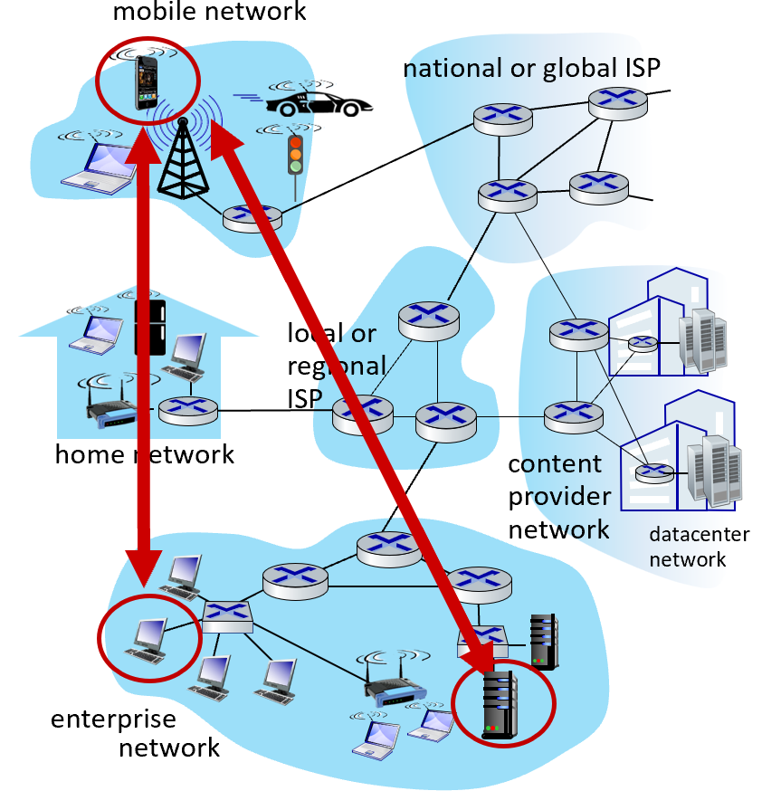


#### P2P体系结构

> Peer-peer architecture

- 没有一直在线的服务器；
- 端与端之间直接进行连接；
- **自拓展性（self-scalability）**，每个对等方通过向其他对等方分发文件为系统提供服务能力；
- 对等方可间歇性的被连接并且可以改变IP地址；

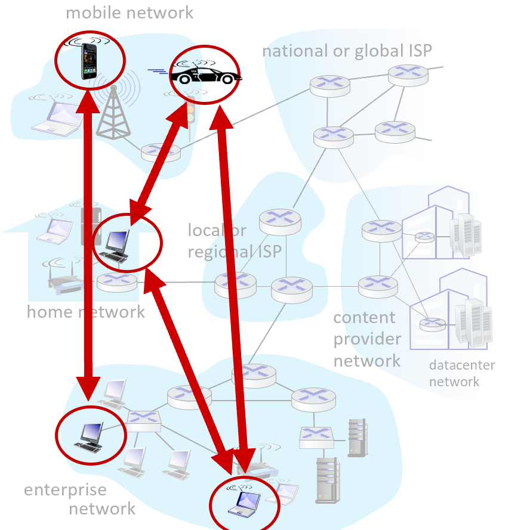

### 2.1.2 进程通信

> Process communicating

用操作系统的术语来说，进行通信的实际上是**进程**（process）而不是程序；在两个不同端系统上的进程，通过跨越计算机网络交换**报文**（message）而相互通信。

#### 客户和服务器进程

- 客户进程：发起通信的进程；
- 服务进程：在会话开始时等待联系的进程；

#### 进程与计算机网络之间的接口

> Socket

进程通过一个称为**套接字**（Sockets）的软件接口向网络发送报文和从网络接受报文。由于该套接字是建立网络应用的可编程接口，因此套接字被称为应用程序和网络之间的**应用程序编程接口**（Application Programming Interface，API）。

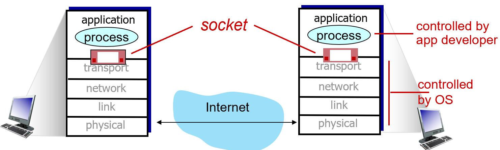

#### 进程寻址

> Addressing processes

- 主机地址👉**IP地址**（IP address）标识；
- 目的主机指定**接受进程**的标识符👉目的地**端口号**（port number）；

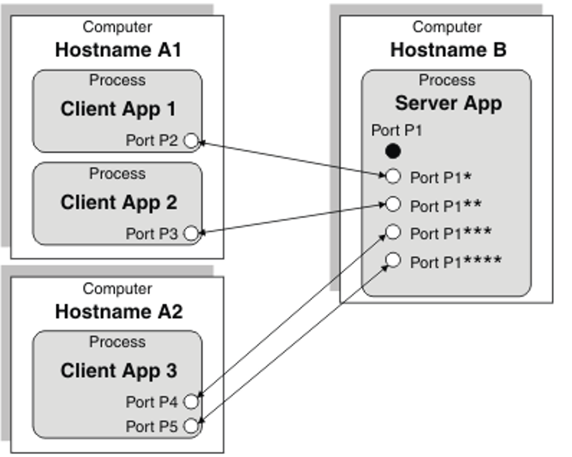

### 2.1.3 可供应用程序使用的运输层服务

> Transport service used in application

传输层向应用层提供的服务：  

1. **可靠数据传输（reliable data transfer）**
   - 一些应用需要100%可靠数据传输；
   - 一些应用允许丢包（loss）；
2. **吞吐量（Throughout）**
   - 具有吞吐量要求是应用程序被称为**带宽敏感的应用**（bandwidth-sensitive application）；
   - **弹性应用**（elastic application）能够根据当时可用的带宽或多或少地利用可供使用的吞吐量；
3. **定时（Timing）**
   - **低延时**（low delay）要求；
4. **安全（Security）**
   - 加密技术（encryption）、数据完整性（data integrity）；

### 2.1.4 因特网提供的运输服务

> Transport protocols services

#### TCP服务

- 面向连接的服务（connection-oriented）：报文开始流动之前，TCP让客户和服务器互相交换运输层控制信息（握手阶段），握手阶段后，一条TCP连接（TCP connection）就在两条进程的套接字之间建立；
- 可靠的数据传送服务（reliable transport）：无差别、按适当顺序交付所有发送的数据；
- 拥塞控制机制（congestion control）；

**<u>*==TCP安全==：*</u>**
> TCP&UDP 都没有安全性 （没有加密，密码等明文传输）

**安全套接字层**（Secure Sockets Layer，SSL）提供了关键的进程到进程的安全性服务。
* 在TCP上面实现，提供加密的TCP连接
* 私密性
* 数据完整性
* 端到端的鉴别
> SSL在应用层（也可说为在传输层，因为为应用层提供服务）

> 应用采用SSL库，SSL库使用TCP通信

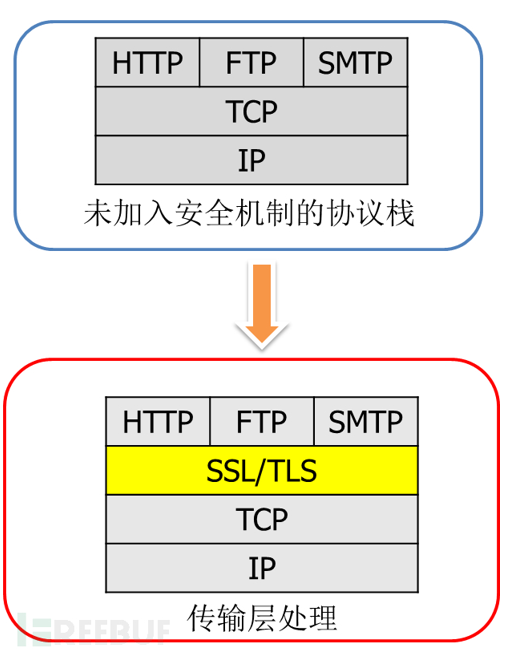

我们平时上网冲浪时，网址前面的`http`与`https`的关系其实就是`http + SSL = https`🫡

#### UDP服务

- 提供一种不可靠数据传送服务（unreliable data transfer）；
- 当进程将报文发送至UDP套接字时，UDP并不能保证该报文将到达接收进程；

**UDP存在的必要性**：
* 能够**区分不同的进程**，而IP服务不能
    * 在IP提供的主机到主机端到端功能的基础上，区了主机的应用进程
* **无需建立连接**，省去了建立连接时间，适合事务的应用
* 不做可靠性的工作，例如检错重发，适合那些**对时性要求比较高**而对正确性要求不高的应用
    * 因为为了实现可靠性（准确性、保序等），必须出时间代价（检错重发）
* **没有拥塞控制和流量控制**，应用能够按照设定的速度发送数据
    * 而在TCP上面的应用，应用发送数据的速度和主向网络发送的实际速度是不一致的，因为有流量控制和拥塞控制


### 2.1.5 应用层协议

> Application-layer protocol

**应用层协议**（Application-layer protocol）定义了运行在不同端系统上的应用程序**进程**如何相互传递报文。
* 公开协议：
    * 由RFC文档定义
    * 允许互操作
> 如HTTP, SMTP

* 专用（私有）协议：
    * 协议不公开
> 如：Skype

> 应用协议仅仅是应用的一个组成部分

### 2.1.6 网络应用

- Web
- 电子邮件
- 目录服务
- 流式视频
- P2P
- 。。。


## 2.2 Web和HTTP

> **Web and http**

### 2.2.1 HTTP概况

> HTTP overview

Web的==应用层协议==是**超文本传输协议（HyperText Transfer Protocol，HTTP）**，它是Web的核心。。

- **Web页面**（Web page）（也叫文档）是由对象组成。一个对象（object）只是一个文件，诸如一个HTML文件、一个JPEG图片、一个Java小程序等等；
- 多数Web页面包含**HTML基本文件**（base HTML）以及几个引用对象；
- **Web浏览器**（Web browser）实现了HTTP的客户端；**Web服务器**（Web server）实现了HTTP的服务器端；
- HTTP使用TCP作为它的支撑运输协议；
- 因为HTTP服务器并不保存关于客户的任何信息，所以我们会说HTTP是一个**无状态协议**（stateless protocol）；

> 默认端口号为80

>

### 2.2.2 非持续连接和持续连接

> Non-persistent HTTP and Persistent HTTP

#### 非持续(非持久)连接 HTTP1.0

1. TCP连接开启；
2. 最多一个对象通过该TCP连接发送；
3. 该TCP连接关闭；

> 每个对象都需要2RTT

#### 持续(持久)连接 HTTP1.1

1. TCP连接开启；
2. 多个对象通过该TCP连接发送；
3. 该TCP连接关闭；

> 一次连接

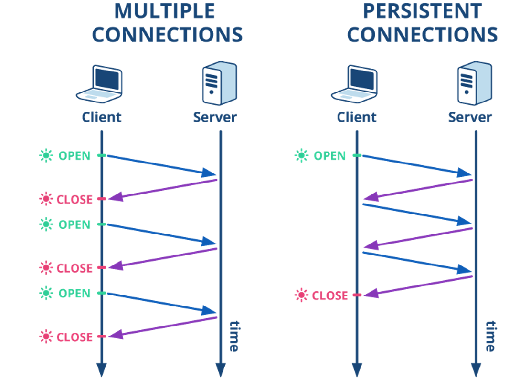

- **往返时间**（Round-Trip Time，RTT）定义：该时间是指一个短分组从客户到服务器然后在返回客户所需要的时间；

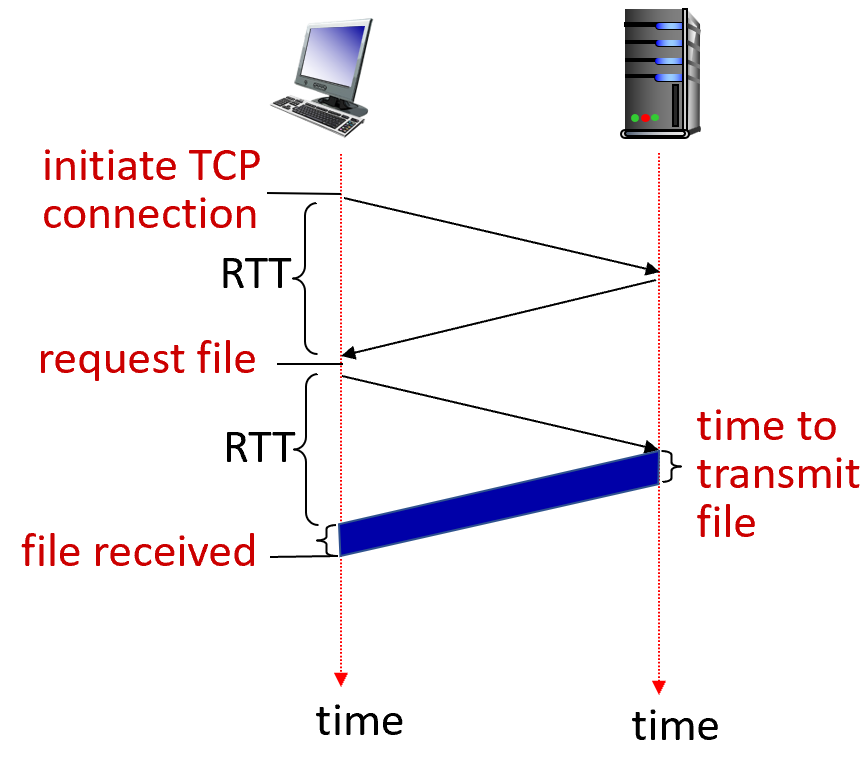

**响应时间**：2RTT+文件传输时间
> 1RTT=TCP连接，1RTT=HTTP请求与响应，文件传输时间

### 2.2.3 HTTP报文格式

> HTTP message format

#### HTTP请求报文

```http
GET /index.html HTTP/1.1\r\n
Host: www-net.cs.umass.edu\r\n
User-Agent: Firefox/3.6.10\r\n
Accept: text/html,application/xhtml+xml\r\n
Accept-Language: en-us,en;q=0.5\r\n
Accept-Encoding: gzip,deflate\r\n
Accept-Charset: ISO-8859-1,utf-8;q=0.7\r\n
Keep-Alive: 115\r\n
Connection: keep-alive\r\n
\r\n
```

- 请求报文的第一行叫做**请求行（request line）**，其后继的行叫作**首部行（header line）**；
- 请求行有3个字段：方法字段、URL字段和HTTP版本字段；
  - 方法可取`GET,POST,HEAD,PUT,DELETE`；
- 首部行`HOST:`指明了对象所在的主机；首部行`User-Agent:`指明了用户代理，即浏览器类型；。。。

**<u>*HTTP请求报文通用格式：*</u>**

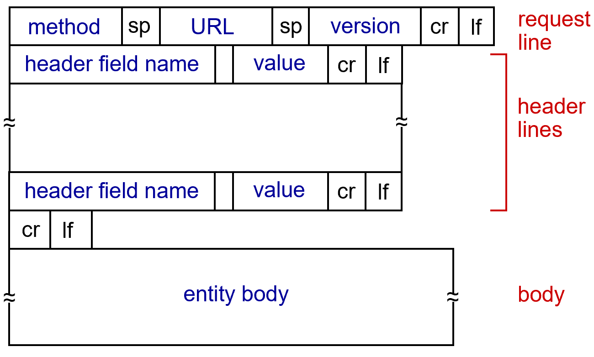

#### HTTP响应报文

```http
HTTP/1.1 200 OK\r\n
Date: Sun, 26 Sep 2010 20:09:20 GMT\r\n
Server: Apache/2.0.52 (CentOS)\r\n
Last-Modified: Tue, 30 Oct 2007 17:00:02 GMT\r\n
ETag: "17dc6-a5c-bf716880"\r\n
Accept-Ranges: bytes\r\n
Content-Length: 2652\r\n
Keep-Alive: timeout=10, max=100\r\n
Connection: Keep-Alive\r\n
Content-Type: text/html; charset=ISO-8859-1\r\n
\r\n
(data data data data data ... )
```

- 上例响应报文包括一个**初始状态行（status line）**，9个**首部行（header line）**，然后是**实体体（entity boby）**；
- 状态行有3个字段：协议版本字段、状态码和状态信息；
  - `200 OK`：请求成功；
  - `301 Moved Permanently`：请求对象以及被永久转移；
  - `400 Bad Request`：一个通用差错代码，该请求不能被服务器理解；
  - `404 Not Found`：被请求的文档不在服务器上；
  - `505 HTTP Version Not Support`：服务器不支持请求报文使用的HTTP协议版本；

### 2.2.4 用户与服务器的交互：cookie🍪

> Maintaining user/server state: cookies🍪

前面提到**HTTP服务器为无状态**的，而一个Web站点通常希望能够识别用户，可能是因为服务器希望限制用户的访问，或者因为它希望把内容与用户身份联系起来。为此，HTTP使用了cookie🍪。

cookie技术有4个组件：

- HTTP响应报文的cookie首部行；
- HTTP请求报文的cookie首部行；
- 用户端系统中保留一个cookie文行；
- 位于Web站点的一个后端数据库；

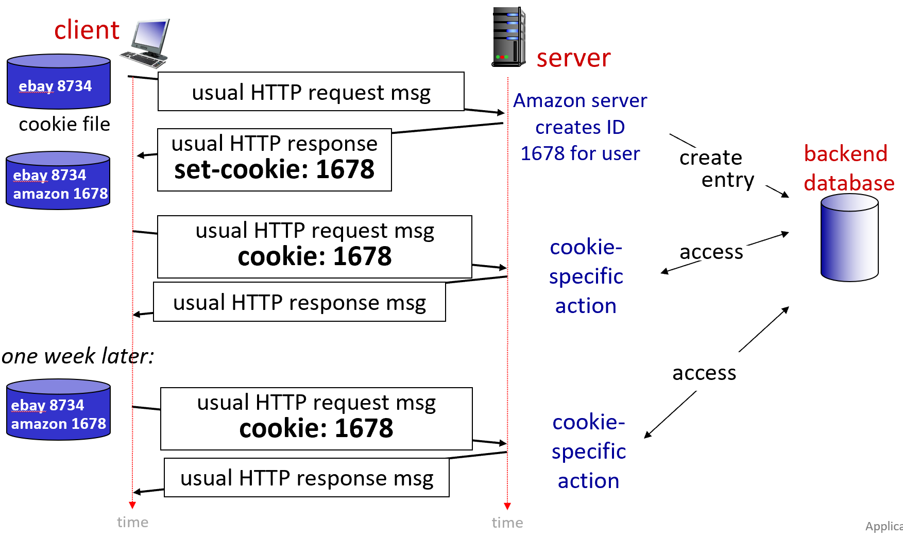

### 2.2.5 Web缓存

> Web cache(proxy server)

**Web缓存器（Web cache）**也叫**代理服务器（proxy server）**，它是能够代表**初始Web服务器（origin server）**来满足HTTP网络请求的实体。

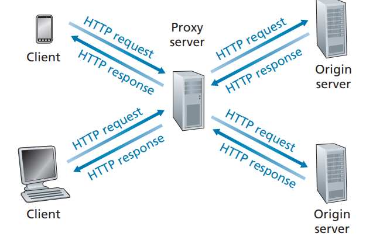

请求过程：

1. 浏览器创建一个到Web缓存器的TCP连接，并向Web缓存器中的对象发送一个HTTP请求；
2. Web缓存器进行检查，看看本地是否存储该对象副本。如果有，Web缓存器向客户返回该对象；
3. 如果缓存器中没有该对象，它就打开一个与该对象的初始服务器的TCP连接。Web缓存器向初始服务器发送请求，并得到初始服务器的响应；
4. 当Web缓存器接受对象后，在本地创建给对象的副本，并向客户发送响应报文返回该对象；

通过使用**内容分发网络（Content Distribution Network，CDN）**，Web缓存器正在因特网中发挥着越来越重要的作用。

### 2.2.6 条件GET方法

> Conditional GET

尽管高速缓存器能减少用户感受到的响应时间，但引入了一个新的问题，即存放在缓存器中的副本可能陈旧的。
> 服务器端数据与缓存区的数据不一致

**条件GET方法：**

1. 请求报文使用`GET`方法；
2. 请求报文中包含一个`If-Modified-Since:`首部行；

响应报文中状态行为`304 Not Modified`表示缓存器可以使用该对象的副本。

## *2.3 FTP


**FTP 文件传输协议**：向远程主机上传输文件或从远程主机接收文件
* 客户/服务器模式
    * 客户端：发起传输的一方
    * 服务器：远程主机
* ftp: RFC 959
> ftp服务器：端口号为21

**FTP: 控制连接与数据连接分开**
* FTP客户端与FTP服务器通过**端口21**联系，并使用TCP为传输协议
* 客户端通过控制连接获得身份确认
* 客户端通过控制连接发送命令浏览远程目录
* 收到一个文件传输命令时，服务器打开一个到客户端的数据连接
* 一个文件传输完成后，服务器**关闭连接**
* 服务器**打开第二个TCP数据连接**用来传输另一个文件
* 控制连接：带外（“`out of band`” ）传送
* FTP服务器维护用户的状态信息：当前路径、用户帐户与控制连接对应
> 有状态

**FTP命令**
命令样例：
> 在控制连接上以ASCII文本方式传送

* `USER username`
* `PASS password`
* `LIST`：请服务器返回远程主机当前目录的文件列表
* `RETR filename`：从远程主机的当前目录检索文件(gets)
* `STOR filename`：向远程主机的当前目录存放文件(puts)


**FTP响应**
返回码样例：
> 状态码和状态信息(同HTTP)

* 331 `Username OK, password required`
* 125 `data connection already open; transfer starting`
* 425 `Can’t open data connection`
* 452 `Error writing file`


## 2.3 因特网种的电子邮件

> E-mail

电子邮件三个主要组成部分：

- 用户代理（User agent）；
- 邮件服务器（mail server）；
- 简单邮件传输协议（Simple Mail Transfer Protocol，SMTP）；

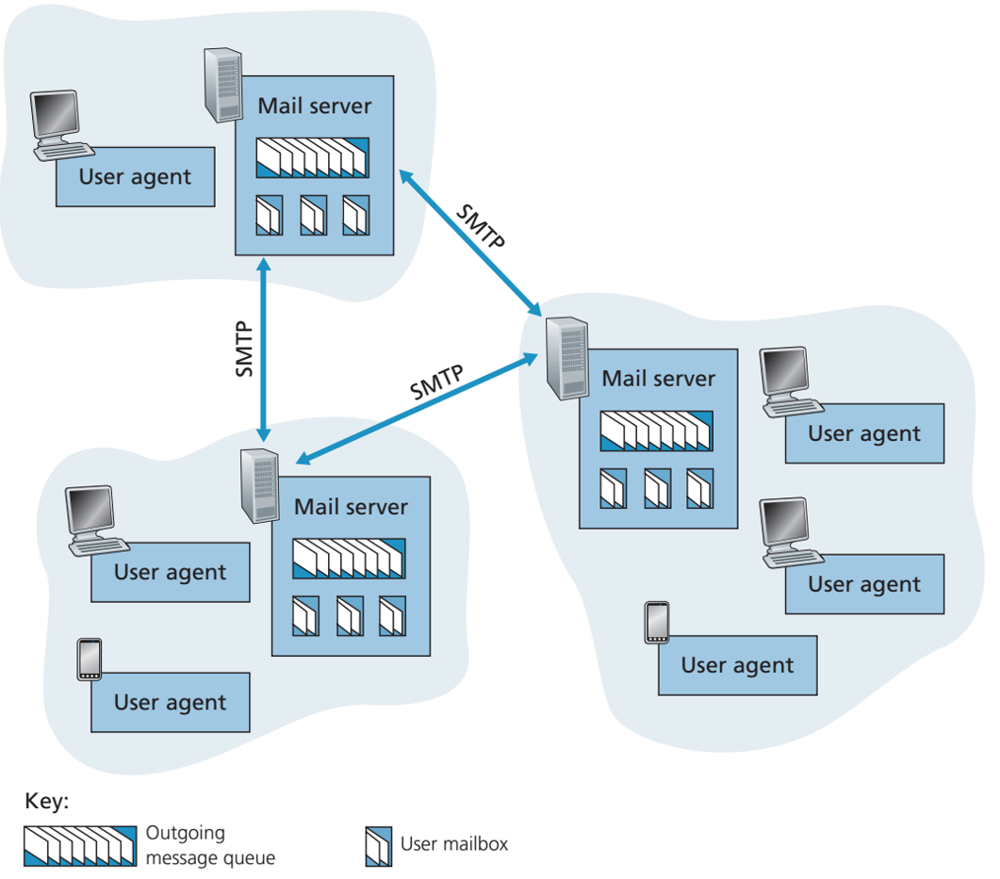

用户代理

- 撰写、编辑、阅读邮件；
- 服务器上存储的传入和传出的消息；

邮件服务器

- 邮箱（mailbox）包括用户传入的消息；
- 报文队列（message queue）中为待发送的邮件报文；

SMTP协议

- 在邮箱服务器之间传输邮件报文；

### 2.3.1 SMTP

假设Alice想给Bob发送一封简单的ASCII报文：

1. Alice调用她的邮件代理程序并提供Bob的邮件地址，撰写报文，然后指示用户代理发送该报文；
2. Alice的用户代理把报文发给她的邮件服务器，在那里该报文被放在报文队列中；
3. 运行在Alice的邮件服务器上的**SMTP客户端**发现了该报文队列中的这个报文，它就创建一个到运行在Bob的邮件服务器上的SMTP服务器的**TCP连接**；
4. 经过一些**初始SMTP握手**后，SMTP客户通过该TCP连接发送Alice的报文；
5. 在Bob的邮件服务器上，**SMTP的服务器端**接受该报文。Bob的邮件服务器然后将该报文放入Bob的邮箱中；
6. 在Bob方便的时候，他调用用户代理阅读该报文；

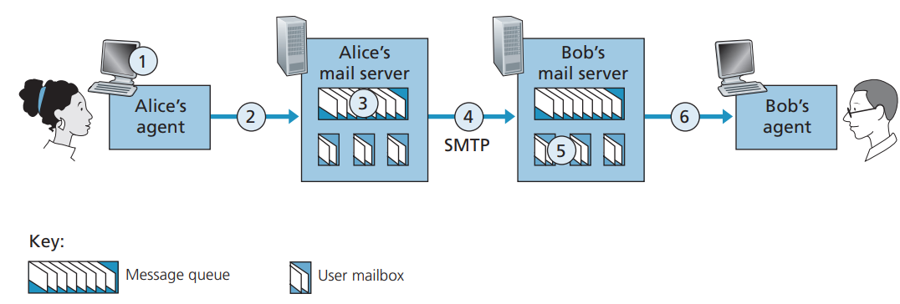

- 如果Bob的邮件服务器没有开机，该报文会保留在Alice的邮件服务器上并等待进行新的尝试，这意味着邮件并**不在中间的某个邮件服务器存留**。

### 2.3.2 与HTTP对比

1. HTTP主要是一个**拉协议（pull protocol）**，TCP连接是由想==接受==文件的机器发起的；SMTP是一个**推协议（push protocol）**，TCP连接是由==发送==文件的机器发起；
2. SMTP要求报文采用7比特ASCII码格式，如果含有非7比特ASCII字符，则这些数据必须按照7比特ASCII码进行编码；HTTP不受这种限制；
3. HTTP把每个对象分别封装在不同的HTTP响应报文中；SMTP则把所有报文对象放在一个报文中；

### 2.3.3 邮件报文格式

```HTTP
To:发件人地址
From:收件人地址
Subject:邮件主题

...邮件正文
```

### 2.3.4 邮件访问协议

> Mail accss protocol

收件人的用户代理不能使用SMTP得到报文，因为取得报文是一个拉操作，而SMTP协议是一个推协议。通过引用一个特殊的邮件访问协议来解决这个问题，该协议将收件人邮件服务器上的报文传送给他的本地PC。目前有一些流行的邮件访问协议，包括**第三版的邮局协议（Post Office Protocol-Version 3，POP3）（不常用）**、**因特网邮件访问协议（Internet Mail Access Protocol，IMAP）**以及**HTTP**。

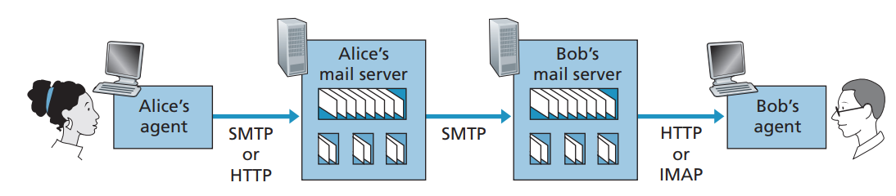

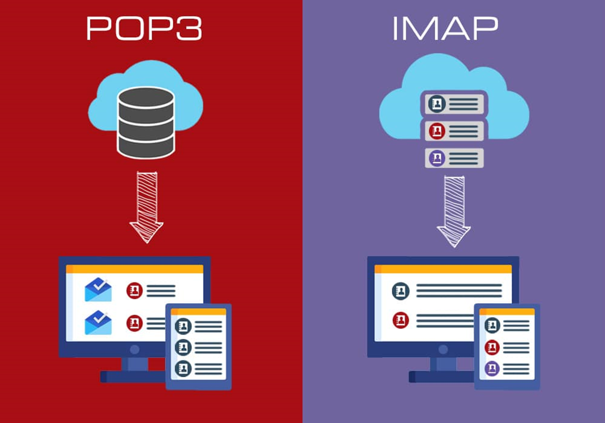

## 2.4 DNS：因特网的目录服务

> Domain Name System

**DNS的主要思路**
* **分层的、基于域**的命名机制
* 若干分布式的数据库完成名字**到IP地址的转换**
* 运行**在UDP**之上**端口号为53**的应用服务
* 核心的Internet功能，但以应用层协议实现
    * 在网络边缘处理复杂性

**DNS域名结构**
* 一个层面命名设备会有很多重名
* DNS采用**层次树状结构**的命名方法
* Internet根被划为**几百个顶级域**(top lever domains)
    > * 通用的(generic)
    > `.com`; `.edu` ; `.gov` ; `.int` ;  `.mil`  ;  `.net`   ; `.org`
    > `.firm` ; `.hsop`  ;  `.web` ; `.arts`  ; `.rec`  ; 

    > * 国家的(countries)
    > `.cn`  ;  `.us`  ; `.nl`  ; `.jp`
    
    * 每个(子)域下面可划分为若干子域(subdomains)
    * 树叶是主机
> DNS有13个根名字服务器

**DNS名字空间(The DNS Name Space)**


**域名(Domain Name)**
- 从本域往上，直到树根
- 中间使用“`.`”间隔不同的级别
> 例如：`ustc.edu.cn` `www.auto. ustc.edu.cn`
- 域的域名：可以用于表示一个域
- 主机的域名：一个域上的一个主机

**域名的管理**
- 一个域管理其下的子域
> `.jp  被划分为ac.jp  co.jp` `.cn  被划分为edu.cn com.cn`
- 创建一个新的域，必须征得它所属域的同意

**域与物理网络无关**
- 域遵从组织界限，而不是物理网络
    - 一个域的主机可以不在一个网络
    - 一个网络的主机不一定在一个域
- 域的划分是逻辑的，而不是物理的

**名字空间划分为若干个区域：Zone**

权威DNS服务器：组织机构的DNS服务器，提供组织机构服务器可访问的主机和IP间的映射

**顶级域(TLD)服务器**：负责顶级域名（如com, org, net, edu和gov）和所有国家级的顶级域名（如cn, uk, fr, ca, jp ）
### 2.4.1 DNS提供的服务

> DNS:services

识别主机的两种方式：通过**主机名（hostname）**或者**IP地址（IP address）**。人们喜欢记忆主机名标识方式，而路由器喜欢定长的、有着层次结构的IP地址。域名系统的主要任务：==主机名到IP地址转换的目录服务==。

DNS是：

1. 一个由分层的**DNS服务器**（DNS service）实现的分布式数据库；
2. 一个使得主机能够查询分布式数据库的应用层协议；

DNS协议运行在`UDP`之下，使用`53`号端口；

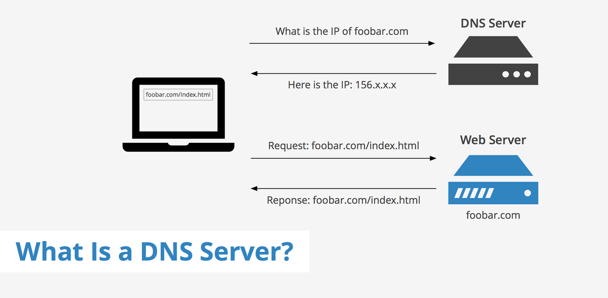

DNS重要的服务：

- 主机名到IP地址的转换（hostname to IP address translation）；
- 主机别名（host aliasing）：应用程序调用DNS获取主机别名对应的**规范主机名（canonical hostname）**以及主机的IP地址；
- 邮件服务器别名（mail server aliasing）；
- 负载分配（load distribution）：繁忙的站点被**冗余分布在多台服务器**上，每台服务器运行在不同的端系统上，每个都有着不同的IP地址。由于这些冗余的Web服务器，一个==IP地址集合==于**一个规范主机名**相联系。当客户对映射到某处到某地址集合的名字发出一个DNS请求时，该服务器用IP地址的整个集合进行响应，但在每个回答中循环这些地址次序。因为客户通常**<u>总是向IP地址排在最前面的服务器发送HTTP请求报文</u>**，所以DNS就在所有这些冗余的Web服务器之间循环分配了负载；

### 2.4.2 DNS工作机理概述

> Overview of How DNS Works

集中式设计的问题包括：

- 单点故障（a single point of failure）；
- 通信容量（traffic volume）；
- 远距离的集中式数据库（distant centralized database）；
- 维护（maintenance）；

#### 分布式，层次数据库

分布式DNS服务器的层次结构：

- 根DNS服务器（root DNS servers）；
- 顶级域服务器（Top-Level Domain DNS servers）；
- 权威DNS服务器（authoritative DNS servers）；
- 本地服务器（local DNS servers）：不属于该服务器的层次结构，但它对DNS层次结构是至关重要的；

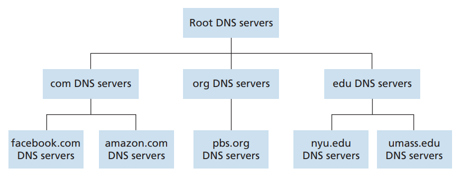

#### 查询方式

1. 递归查询（Recursive query）

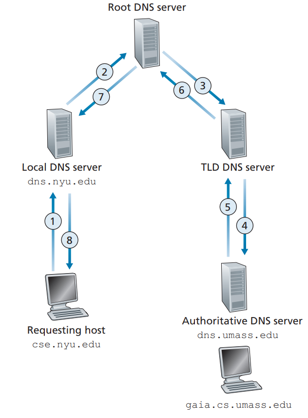

2. 迭代查询（Iterative query）

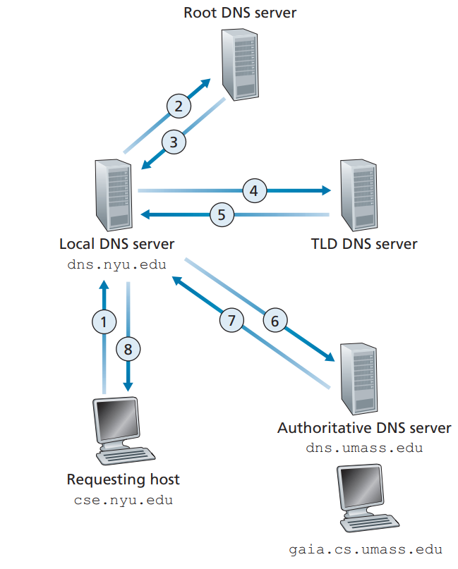

==从请求主机到本地的DNS服务器的查询是**递归**的，其余的查询是**迭代**的。==

#### DNS缓存

在某一个请求链中，当某DNS服务器接收一个DNS回答，它能映射在本地存储器中。由于主机和主机名与IP地址的映射并不是永久的，DNS服务器在一段时间后将丢弃缓存的信息。

### 2.4.3 DNS记录和报文

> DNS Record and Protocol Message

#### DNS记录

所有DNS服务器存储了**资源记录（Resourse Record，RR）**，资源记录是一个包含了下列字段的4元组：

- `(Name, Value, Type, TTL)`

下面为不同类型`Type`的`Name`和`Value`：

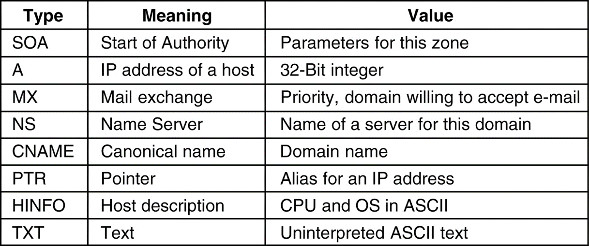

#### DNS报文

DNS报文中各字段的语义如下：

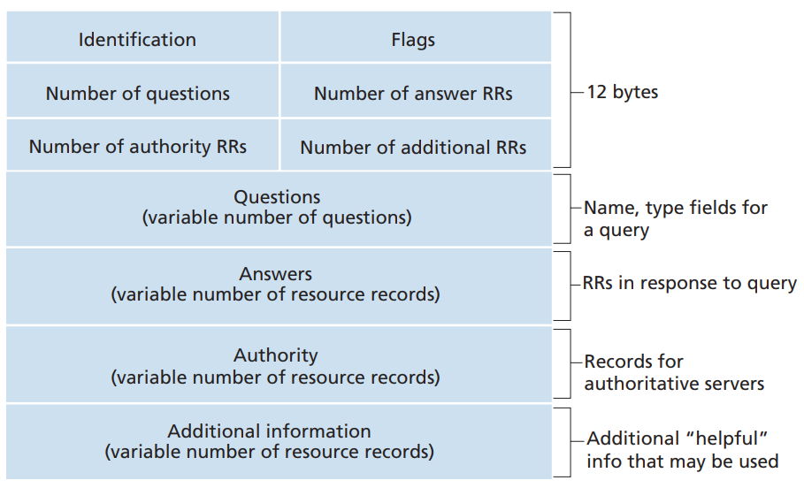

## 2.5 P2P文件分发

> Peer-to-Peer File Distribution  

CS系统极大依赖于总是打开的基础设施服务器，P2P对总是打开的服务器有最小的（或者没有）依赖。

P2P体系结构：
* **非结构化P2P**
    * 集中化目录
    * 完全分布式
    * 混合体
* **DHT(结构化)P2P**

### P2P体系结构的扩展性

> Scalability of P2P Architectures

文件分发问题的示例图如下：

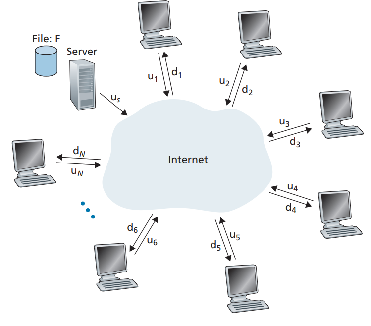

对于客户-服务器体系结构的分发时间如下：
$$
D_{cs}=\max\{\frac{NF}{u_s},\frac{F}{d_{min}}\}
$$
对于P2P体系结构分发时间如下：
$$
D_{P2P}=\max\{\frac{F}{u_s},\frac{F}{d_{min}},\frac{NF}{u_s+\sum^N_{i=1}u_i}\}
$$
P2P和客户-服务器体系结构的分发时间随用户数量变化如下：

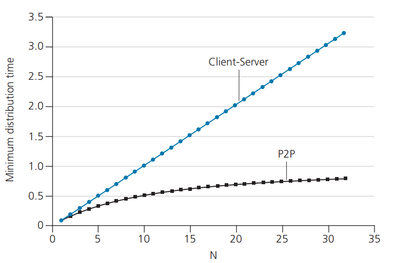

### BitTorrent

参与一个特定文件分发的所有对等方的集合被称为一个**洪流（torrent）**。在一个洪流中的对等方彼此下载等长度的**文件块（chunk）** ，典型块长度为256KB。当一个对等方下载块时，也为其他对等方上载了多个块。每个洪流具有一个基础设施节点，称为**追踪器（tracker）**。当一个对等方加入某洪流时，它向追踪器注册自己，并周期性地通知追踪器它仍在该洪流中。

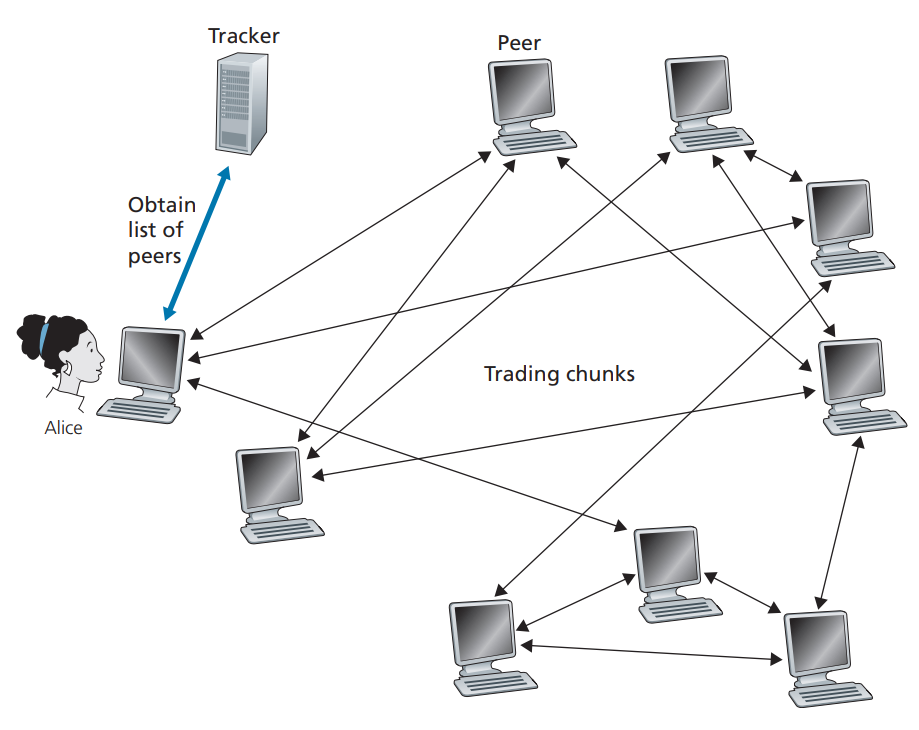

- 决定请求哪些块的过程：**最稀缺优先（rarest first）**技术；
- 决定响应哪个请求：根据当前能够以最高速率的**疏通（unchoked）**的对等方提供数据的邻居，给出优先权；


## 2.6 视频流和内容分发网

> Video Streaming and Content Distribution Networks

### 2.6.1 HTTP流和DASH

HTTP流所有客户接受到相同编码的视频，但对不同用户或者不同时间，客户可用的带宽大小有很大不同。**HTTP的动态适应性流（Dynamic Adaptive Streaming over HTTP，DASH）**：视频编码成几个不同的版本，其中每个版本具有不同的比特率，对应于不同的质量水平。客户动态地请求来自不同版本且长度为几秒的视频段数据块。

每个视频版本存储在HTTP服务器中，每个版本都有一个不同的URL。HTTP服务器也有一个**告示文件（manifest file）**，为每个版本提供了一个URL及其比特率。

### 2.6.2 内容分发网

为了应对向分布于全世界的用户分发巨量视频数据的挑战，几乎所有主要的视频流公司都利用**内容分发网（Content Distribution Network，CDN）**。CDN管理分布在多个地理位置上的服务器，在它的服务器中存储视频的副本，并且所有试图将每个用户请求定向到一个将提供最好的用户体验的CDN位置。CDN可以是**专用CDN（private CDN）**，即它由内容提供商自己所拥有；另一种CDN可以是**第三方CDN（third-party CDN）**，它代表多个内容提供商分发内容。

#### CDN操作

当客户请求一个特定视频时，CDN必须截获该请求，以便能够：

1. 确定此时适合用于该客户的CDN服务器集群；
2. 将客户的请求重定向到该集群的某台服务器；

CDN操作步骤如下：

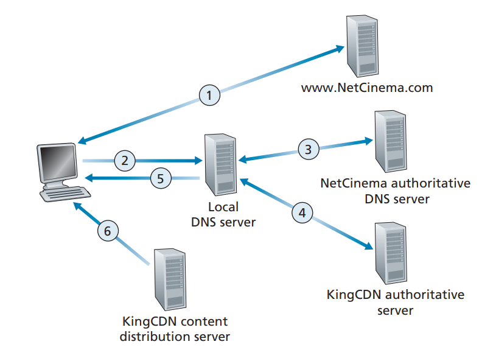

## 2.7 套接字编程：生成网络应用

> Socket Programming: Creating Network Applications

> 本地标识，物理上是一个整束   

### 2.7.1 UDP套接字编程
对于使用**无连接服务（UDP）的应用**而言，套接字是*2元组*的一个**具有本地意义的标示**

> 2元组：IP，port  （源端指定）

* UDP套接字指定了应用所在的一个端节点（end point）
* 在发送数据报时，采用创建好的本地套接字（标示ID），就不必在发送每个报文中指明自己所采用的ip和port
* 但是在发送报文时，必须要指定对方的ip和udp port(另外一个段节点)

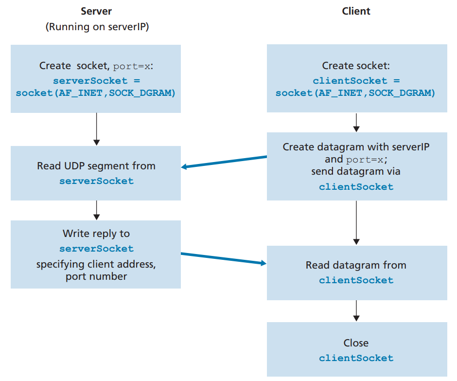

### 2.7.2 TCP套接字编程
对于使用**面向连接服务（TCP）的应用**而言，套接字（Socket）是*4元组*的一个**具有本地意义的标示**
> 4元组：(源IP，源port，目标IP，目标port)

* 唯一的指定了一个会话（2个进程之间的会话关系）
* 应用使用这个标示，与远程的应用进程通信
* 不必在每一个报文的发送都要指定这4元组
* 就像使用操作系统打开一个文件，OS返回一个文件句柄一样，以后使用这个文件句柄，而不是使用这个文件的目录名、文件名
* 简单，便于管理

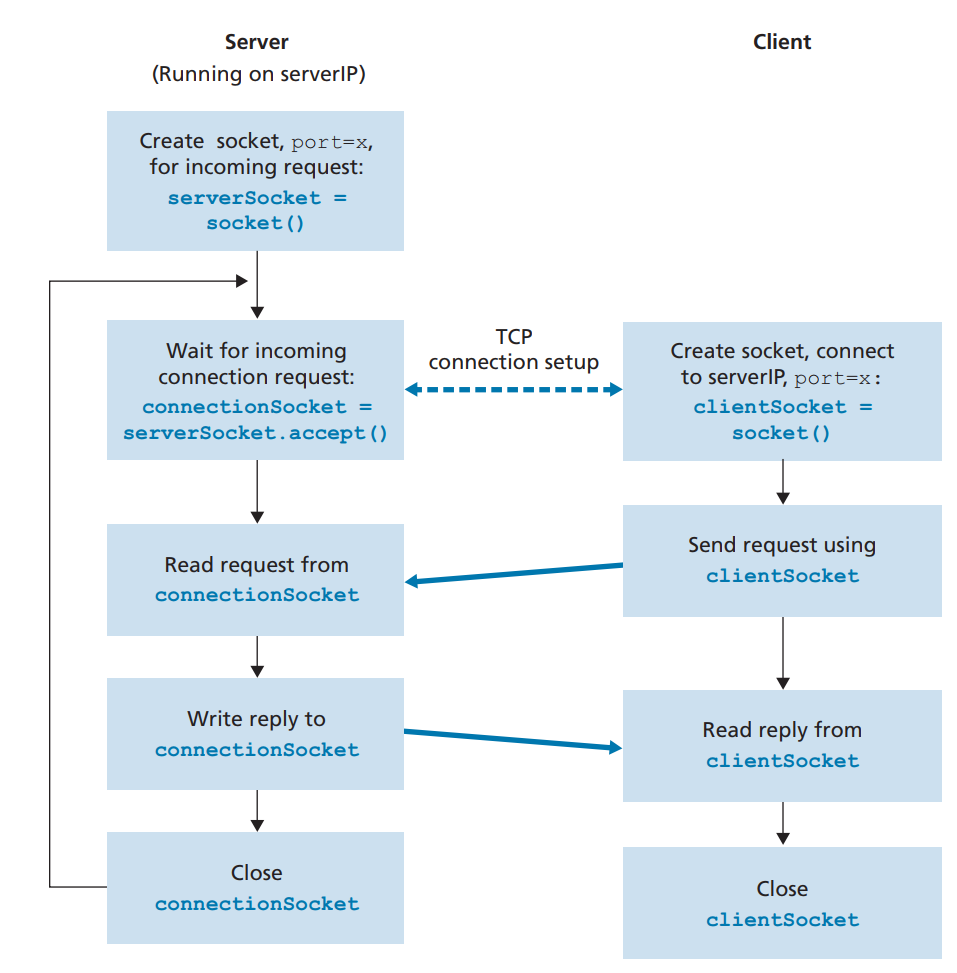

---

# 3 Transport layer运输层

**解决进程与进程间的通信**

## 3.1 概述和运输层服务

> Introduction and Transport-Layer Services

运输层协议为运行在不同的主机上的应用进程之间提供了**逻辑通信**（logic communication）功能从应用程序的角度看，通过逻辑通信，运行不同进程的主机好像直接相连一样。逻辑通信的概念如下：

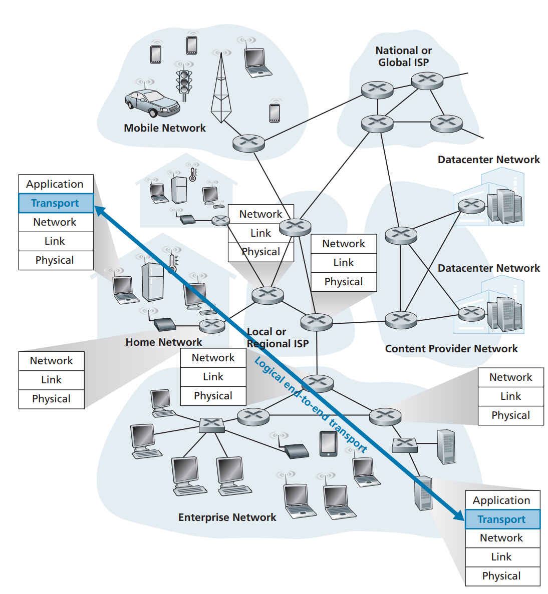

运输层协议是**在端系统中**而不是在路由器中实现。在发送端，运输层将从发送应用程序接收到的报文转换成传输层分组，用因特网术语来讲该分组称为运输层**报文段（segment）**。

### 3.1.1 运输层和网络层的关系

> Relationship Between Transport and Network Layers

在协议栈中，运输层刚好位于网络层之上。网络层提供了**主机之间**的逻辑通信，而运输层为运行在**不同主机上的进程之间**提供了逻辑通信。运输协议能够能够提供的服务常常受制于底层网络层协议的服务模型。如果网络层协议无法为主机之间发送的运输层报文段提供时延或带宽保证的话，运输层协议也就无法为进程之间发送的应用程序报文提供时延或带宽保证。

即使底层网络协议是不可靠的，也就是说网络层协议会使分组丢失、篡改和冗余，运输层协议也能为应用程序提供可靠的数据传输服务。另一方面，即使网络层不能保证运输层报文段的机密性，运输协议也能使用加密来确保应用程序报文不被入侵者读取。

### 3.1.2 因特网运输层概述

> Overview of the Transport Layer in the Internet

因特网提供两种不同的可用的运输层协议。**UDP（User Datagram Protocol）**，它为调用它的应用程序提供了一种不可靠、无连接的服务；**TCP（Transmission Control Protocol）**，它为调用它的应用程序提供了一种可靠的、面向连接的服务。

> 都不能提供**延迟保证**，**带宽保证**

因特网网络层协议有一个名字叫IP（Internet Protocol），即网际协议，IP的服务模型是**尽力而为交付服务（best-effort delivery service）**，同时IP被称为**不可靠服务（unreliable service）**。

UDP和TCP最基本的责任是，将两个端系统间IP的交付服务扩展为运行在端系统上的两个进程之间的交付服务。将主机间交付扩展到进程间交付被称为**运输层的多路复用（transport-layer multiplexing）**与**多路分解（demultiplexing）**。

> TCP提供复用与解复用，建立连接，流量控制，拥塞控制

> UDP只提供复用与解复用，并不会为网络层服务提供额外的功能

> **UDP存在的必要性**：将网络层的**主机到主机**端的逻辑通信转换为**进程到进程**间的逻辑通信

## 3.2 多路复用与多路分解

> Multiplexing and Demultiplexing

运输层的多路复用与多路分解，也就是将由网络层提供的主机到主机的交付服务延伸到为运行在主机上的应用程序提供进程到进程的服务。一个进程（作为网络应用的一部分）有一个或多个**套接字（socket）**，它相当于从网络向进程传递数据和从进程向网络传递数据的门户。下图为进程交付过程：

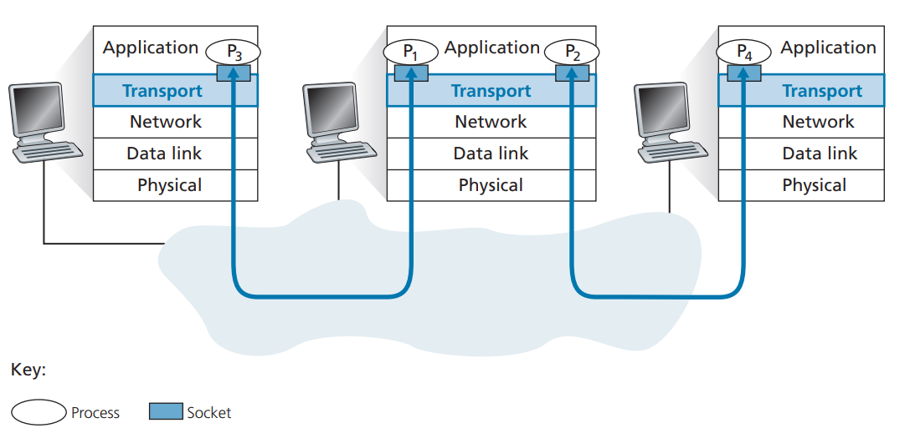

- 多路分解（Demultiplexing）：在接收端，运输层检查这些字段，标识出接收套接字，进而将报文段定向到该套接字，即将运输层报文段的数据交付到正确的套接字的工作；
- 多路复用（Multiplexing）：在源主机从不同套接字中收集数据块，并为每个数据块封装上首部信息（这将在以后用于分解）从而生成报文段，然后将报文传递到网络层；

运输层多路复用要求：

1. 套接字由唯一标识符；
2. 每个报文段有特殊字段来指示该报文段所要交付的套接字；

这些特殊字段是**源端口号字段（source port number field）**和**目的端口号字段（destination port number field）**，如下图所示：

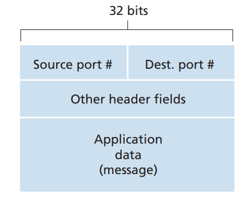

端口号是一个16比特的数，其大小在`0~65535`之间。`0~1023`范围的端口号称为**周知端口号（well-know port number）**，是受限制的。

### UDP的socket表示

二元组表示👉`(源端口， 目的端口)`，具体过程如下图所示：

> 无连接关系

> UDP中目标端口一致，则发送到的应用进程一致

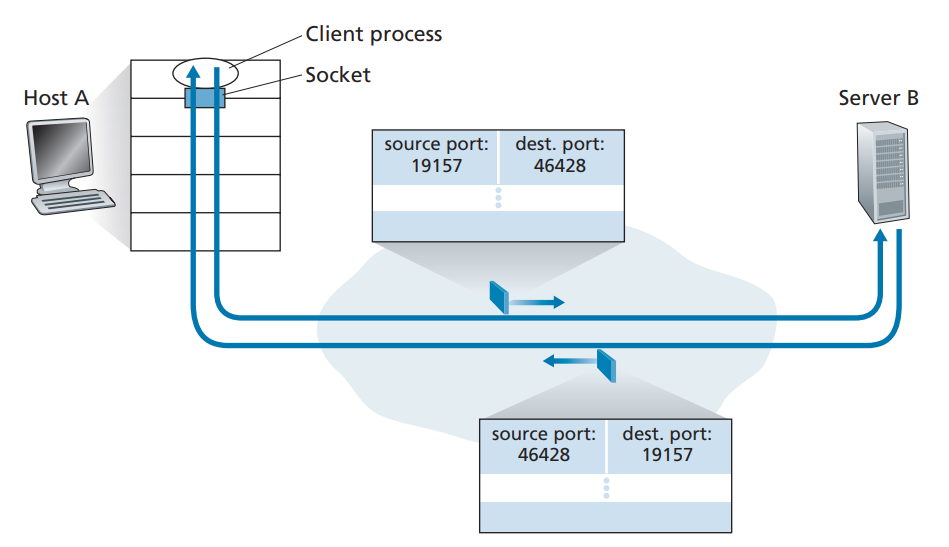

### TCP的socket表示

四元组表示👉`(源IP地址， 源端口号， 目的IP地址， 目的端口号)`，下图为两个客户使用相同的目的端口号（80）与同一个Web服务器应用通信：

> 一个多路复用与四元组相捆绑，有连接关系

> TCP四元组中，只要有一个不一样，其对应的socket就不一样，就会指向不同的**应用进程**

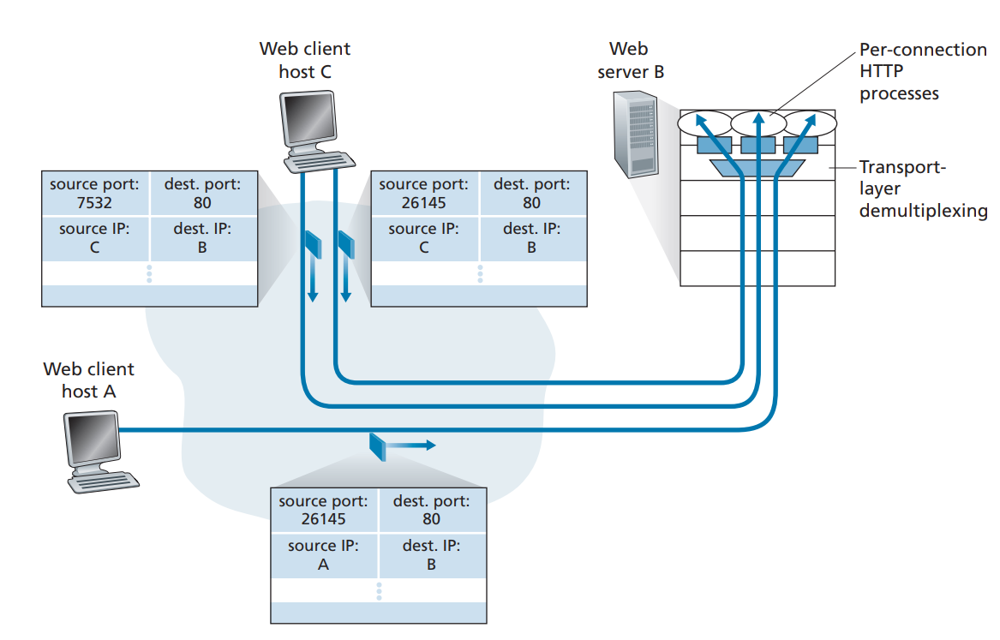

## 3.3 无连接运输：UDP

> Connectionless Transport: UDP

使用UDP时，在发送报文段之前，发送方和接收方的运送层实体之间没有握手，UDP被称为**无连接的（connectionless）**。许多应用更适合用UDP的原因如下：

> 封装成**数据报(Package)**

- 无拥塞控制（no congestion control）；
- 无须连接建立（no connection establishment)；
- 无连接状态（no connection state）；
- 分组首部开销小（small header size）；

流行的因特网应用及其下面的运输协议如下图：

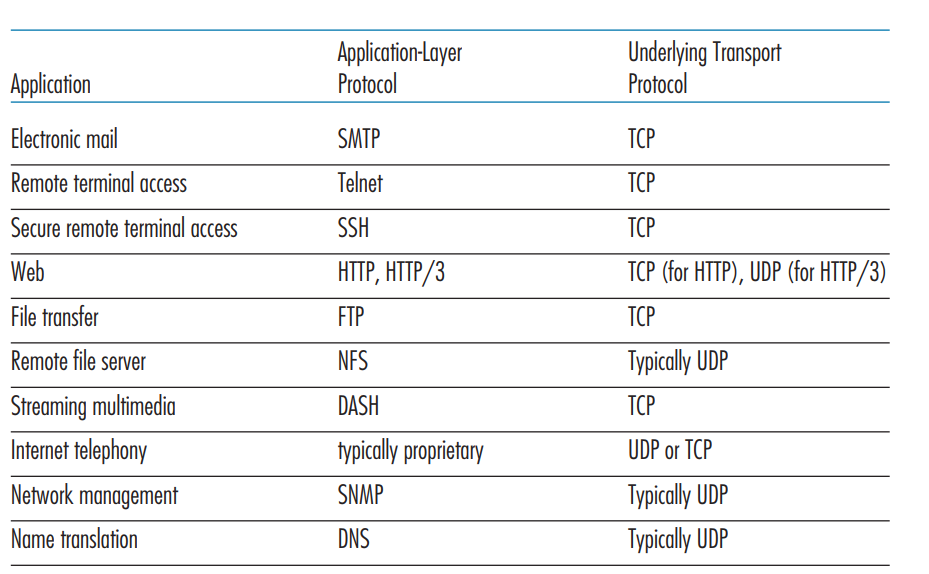

### 3.3.1 UDP报文段结构

> UDP Segment Structure

报文段包括上面提到的源端口号和目的端口号；还有长度字段，指明UDP报文段中的字节数（首部➕数据）；报文段中的检验和字段来检查在该报文段中是否出现差错。报文段结构如下图：

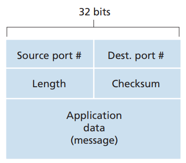

### 3.3.2 UDP检验和

> UDP Checksum

发送方的UDP对报文段中的所有16比特字的和进行反码运算，求和时遇到的任何溢出都被**回卷（溢出位与低16位相加）**，下图为两个16比特字相加过程：

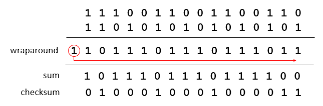

接收方，全部的16比特字（包括检验和）加在一起，如果分组中没有差错，接收方处该和将是`1111111111111111`，如果比特字中出现`0`，那么就认为该分组出现差错。

> **发送端**，将报文段分割为一个个16bits的块，并进行相加，遇到进位溢出进行回滚相加，并取反得到检验和，放到对应检验和字段中

> **接收端** 将所有16bits字段(包括检验和)进行求和，若没出错则结果为16比特全1


## 3.4 可靠数据传输原理

> Principles of Reliable Data Transfer

可靠数据传输的框架：为上层实体提供的服务抽象是：数据可以通过一条可靠的信道进行传输。如下图所示：

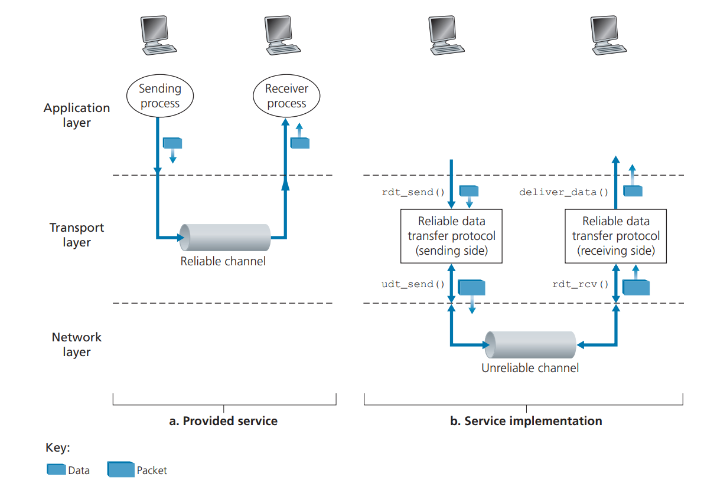

实现这种服务抽象是**可靠数据传输协议（reliable data transfer protocol，rdt）**的责任，下图为可靠数据传输协议的相关接口（Interface）：

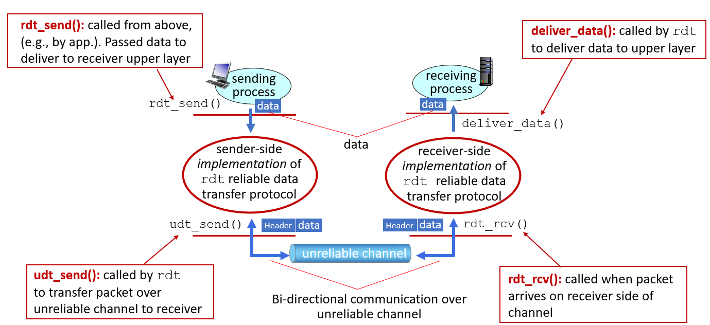

### 3.4.1 构造可靠数据传输协议

> Building a Reliable Data Transfer Protocol

#### 经完全可靠信道的可靠数据传输：rdt1.0

发送方和接收方的表示使用==**有限状态机（Finite-State Machine，FSM）**==定义，如果对一个事件没有动作，或没有就发生发生而采取了一个动作，我们将在横线上方或下方使用==**符号$\Lambda$**==，以分别明确地表示缺少动作或事件。

我们考虑最简单的情况，**即==底层信道==是完全可靠的**，我们称该协议为`rdt1.0`，发送方和接收方的FSM定义如下：

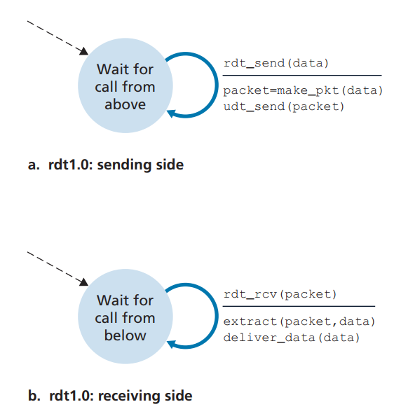

#### 经具有比特差错信道的可靠数据传输：rdt2.0

底层信道更为实际的模型是分组中的比特可能受损的模型。在分组传输、传播或缓存的过程中，这种比特差错通常会出现在网络的物理部件中。在接收方得到比特差错的信息时，需要发送方进行重传。在计算机网络环境中，基于这种重传机制的可靠数据传输协议称为**自动重传请求（Automatic Repeat reQuest，ARQ）协议**。ARQ协议中还需要另外三种协议来处理存在比特差错的情况：

- 差错检测：发送方同时发送检测和（checksum）到接收端判断是否出现比特差错；
- 接收方反馈：
  - **肯定确认（Acknowledgement，ACK）**：接收方告诉发送方包数据无差错；
  - **否定确认（Negative acknowledgement，NAK）**：接收方告诉发送方包数据有错误；
- 重传：接收方收到有差错的分组时，发送方将重传该分组文；

`rdt2.0`的FSM如下图：

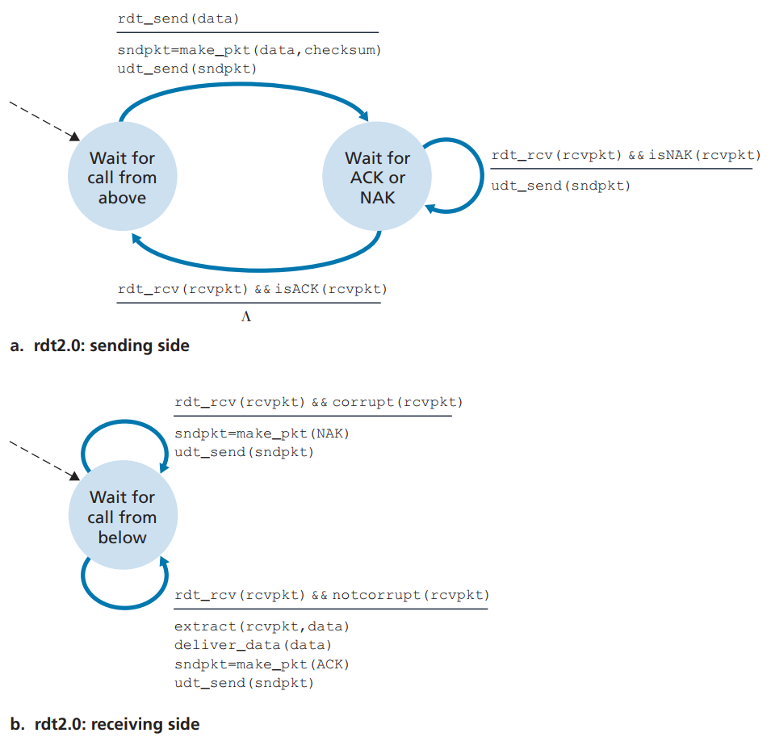

当发送方处于等待ACK或NAK的状态时，它不能从上层获得更多的数据；这就是说，`rdt_send()`事件不可能出现；仅当接收到ACK并离开该状态时才能发生这样的事件。因此，发送方将不会发送一块新数据，除非发送方确信接收方已正确接收当前分组。由于这种行为，`rdt2.0`这样的协议被称为**停等（stop-and-wait）协议**。

`rdt2.0`协议并没有考虑ACK和NAK受损的情况，为了解决这一问题，就是在数据分组中添加一新字段，让发送方对其数据分组编号，即将发送数据分组的**序号**（sequence number）放在该字段。于是，接收方只需要检查序号即可确定收到的分组是否一次重传。

`rdt2.1`的FSM如下图：

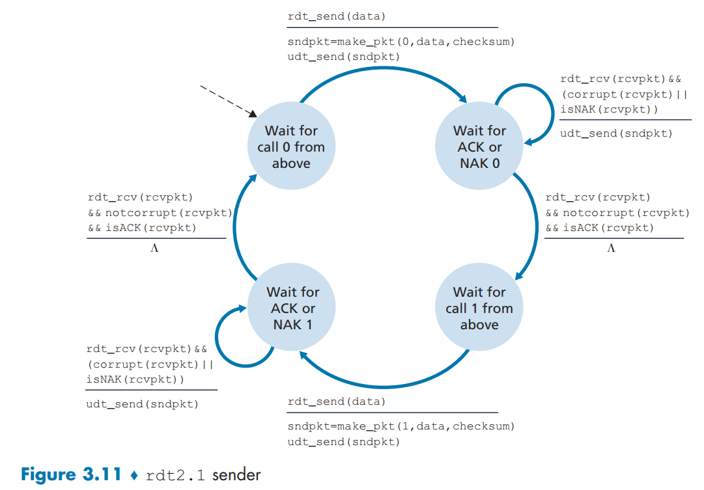

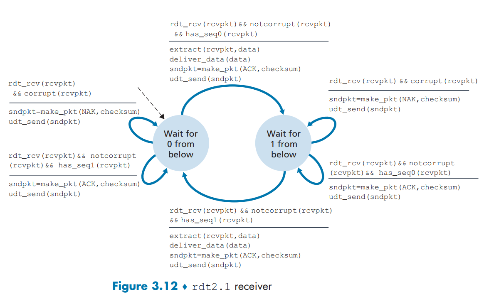

> `rdt2.1`通过对分组进行`01`编号，若确认受损，则重新发送该分组`p0`，直到成功接收到确认信号`ACK`。收到`ACK`时，则才能发送下一分组`p1`


如果收到受损的分组，则接收方将发送一个否定确认。如果不发送NAK，而是对上次正确接收的分组发送一个ACK，我们也能实现与NAK一样的效果`rdt2.2`。发送方接收到对同一个分组的两个ACK，即**冗余ACK**(duplicate ACK)后，就知道接收方没有正确接收到跟在被确定两次的分组后面的分组。

`rdt2.2`的FSM如下图所示：

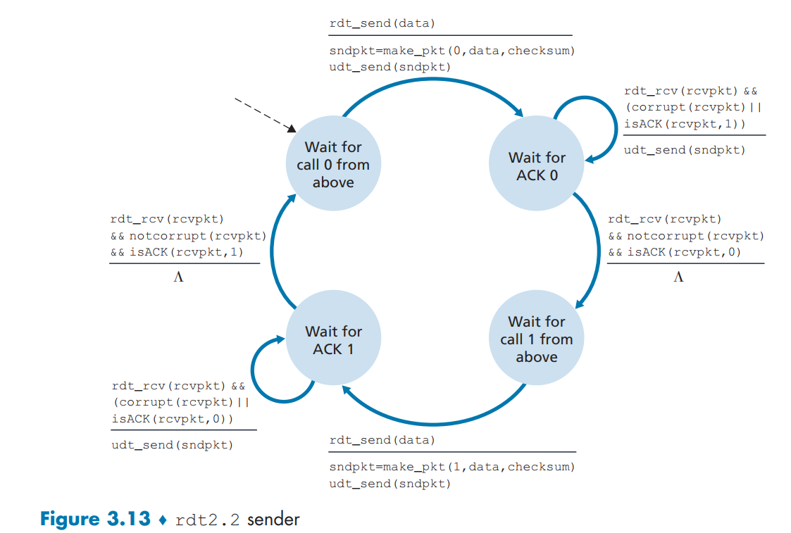

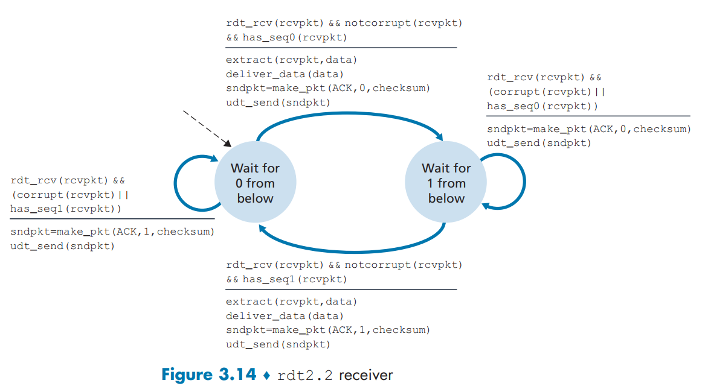

 rdt2.2：无NAK的协议，功能同rdt2.1，但只使用ACK(ack要编号)，接收方用**最后**正确接收的分组发送**ACK来代替NAK**
 当收到重复的ACK（如：再次收到ack0）时，发送方与收到NAK采取相同的动作：重传当前分组
 > 接收方必须显式地包含被正确接收的**ACK序号**

 > 为后面的一次发送多个数据单位（流水线）做一个准备

#### 经具有比特差错的丢包信道的可靠数据传输：rdt3.0

- 因为特别大的时延，发送方和接收方的信道中引入了**冗余数据分组**（duplicate data packet）的可能性；
- 需要一个**倒计数定时器（countdown timer）**，实现基于时间的重传机制；

> 超时重传机制

> 时间设置要合理，否则会出现单个分组同时传输多次的情况，导致效率降低    

`rdt3.0`发送方FSM如下图：

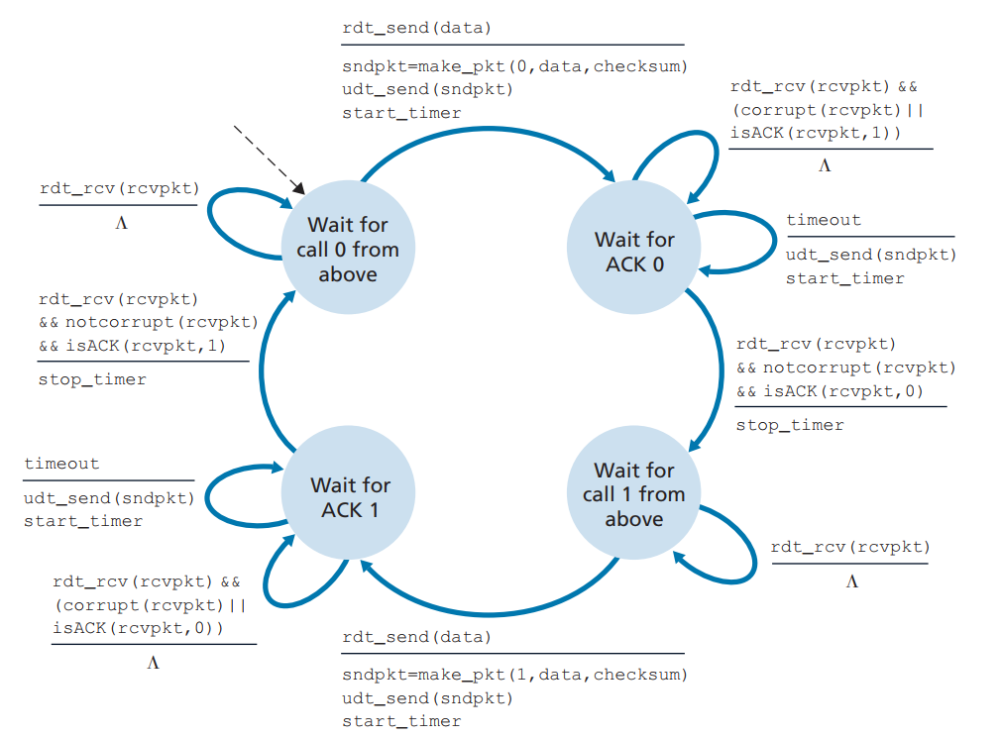

因为分组序号在0和1之间交替，因此`rdt3.0`有时被称为**比特交替协议（alternating-bit protocol）**。运行如下图所示：

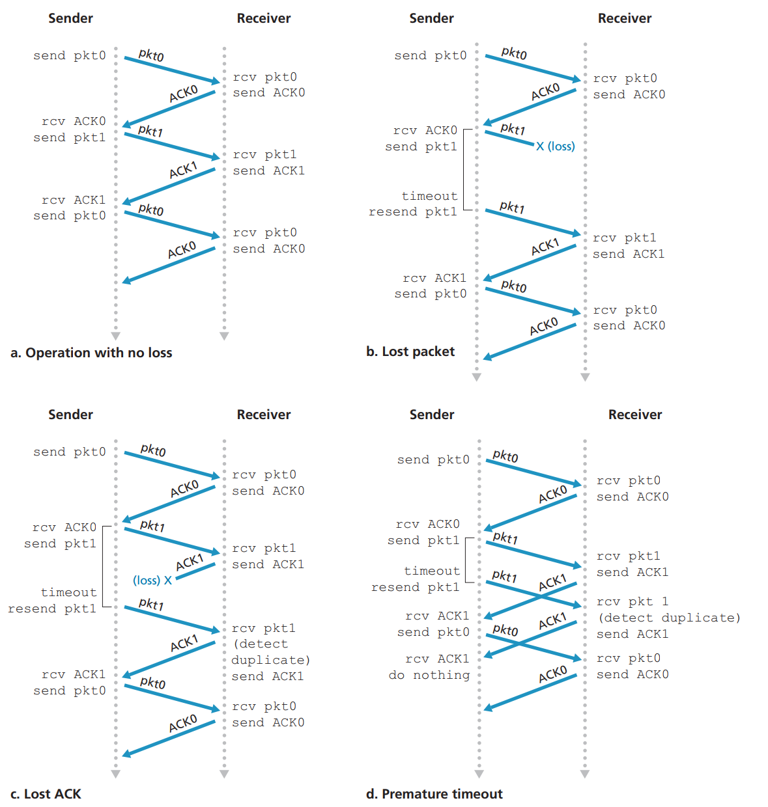

> 一次只能发送一个数据，其余时间都在该信道都在等待，信道利用率过低

### 3.4.2 流水线可靠数据传输协议

> Pipelined Reliable Data Transfer Protocols

定义发送方（或信道）的**利用率（utilization）**为：发送方实际忙于将放送比特送进信道的那部分时间与发送时间之比。对于一个等停协议的发送方利用率$U_{sender}$：
$$
U_{sender}=\frac{L/R}{RTT+L/R}
$$
对于停等协议的发送发利用率是非常低的，解决该问题的方法是：不以停等方式运行，允许发送方发送多个分组而无须等待确认。因为许多从发送方向接收方输送可以看成是填充到一条流水线中，故这种技术被称为**流水线（pipeline）**，下图为停等和流水线发送示意图：

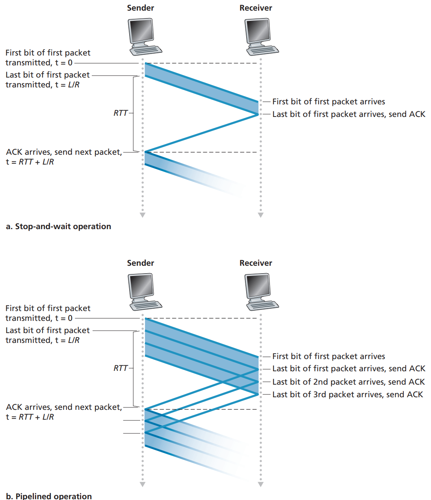

> **管道化协议**：分为**回退N步协议**，**选择性重传协议**

通用协议：滑动窗口协议
* 发送缓冲区
* 发送窗口：发送缓冲区内容的一个范围（**已发送但未确认**的分组）
    * 前沿：发送端每次发送一个**分组**，前沿向后移动一格
    * 后沿：发送端没接收到一个**确认**，后沿向后移动一格（不会超过前沿）

* 接收窗口：
    * 接收窗口在低序号分组到来时才滑动(因为要保证`rdt`，不允许失序)
    * 发送确认
        * 接收窗口=1，发送连续接收的最大分组确认（累计确认）
        * 接收窗口>1，发送收到的分组的确认（单独确认）

|发送端|接收端|协议类型|
|:---:|:---:|:---:|
|发送端SW = 1|接收端RW = 1|S-W(停止等待协议)|
|发送端SW > 1|接收端RW = 1|GBN(回退N步协议)|
|发送端SW > 1|接收端RW > 1|SR(选择性重传协议)|

> 其中**回退N步协议**，**选择性重传协议**属于**流水线协议**

> 每发送的一个分组都提供一个超时计时器

### 3.4.3 回退N步

> Go-Back-N,GBN

> 接收窗口大小=1，因此所有失序的分组都会被丢弃

> 若之前接收窗口因失序而丢弃了某些分组，在接收到正确顺序的下一个分组时，发送端会重新发送发送窗口中的所有分组，恢复刚刚在接收端被丢弃的失序分组，**接收端每次发送一个确认，就像上层提交**（接收窗口大小=1）

> 若重传旧分组，并且该旧分组已经被接收方接收(确认消息未正常发送)，则该旧分组会被**丢弃**，并**重新向发送端发送一条确认**

> GBN窗口最大为：2^n^-1 (`n为序列号大小(bit)`)
>    > `n=2, 序列号为0,1,2,3`

在回退N步协议中，将基序号（base）定义为最早未确认分组的序号，将下一个序号（nextseqnum）定义为最小的未使用序号，则将序号范围分割成如下4段：

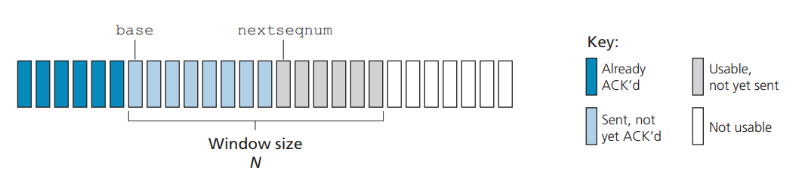

- `[0,base-1]`👉已经发送并得到确认的分组；
- `[base,nextseqnum-1]`👉已经发送但未被确认的分组；
- `[nextseqnum,base+N-1]`👉能用于那些要被立即发送的分组；
- `[base+N,end]`👉不能使用；

那些已被发送但还未被确认的分组的许可序号范围可以被看成一个在序号范围内长度未`N`的窗口。随着协议的运行，该窗口在序号空间向前滑动。因此，N常被称为**窗口长度（window size）**，GBN协议也常被称为**滑动窗口协议（sliding-window protocol）**。

为一个基于ACK、无NAK的GBN协议的发送方和接收方两端的扩展FSM描述，因为加入了变量`base`和`nextseqnum`所以我们称其为扩展FSM，下图为发送端的扩展FSM描述：

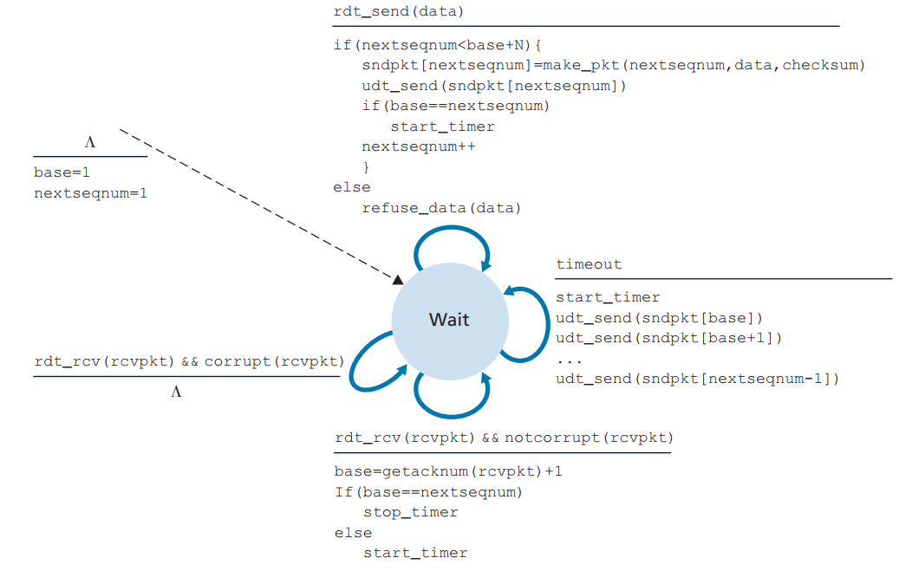

下图为接收端的FSM描述：

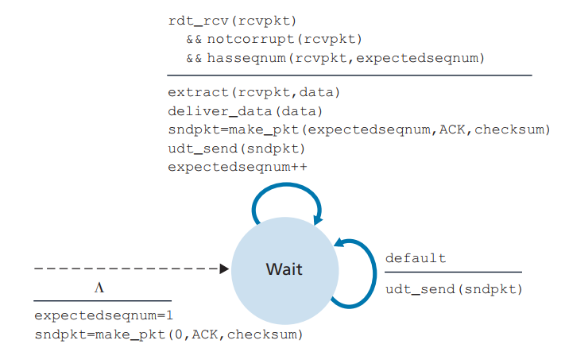

在GBN协议中，接收方丢弃所有失序分组。这种方法的优点是接收缓存简单，即**接收方不需要缓存任何失序分组**。因此，虽然发送方必须维护窗口的上下边界及`nextseqnum`在该窗口的位置，但接收方需要维护的唯一信息就是下一个按序接收的分组序号。运行中的GBN如下图所示：

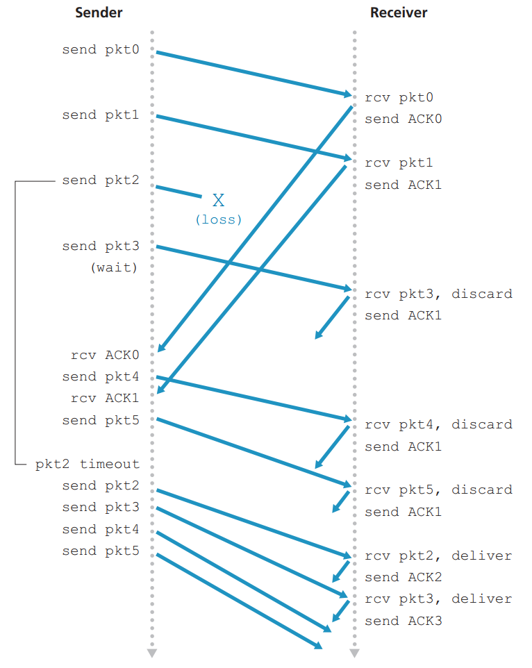

> **优点**：简单，所需资源少（接收方一个缓存单元）
> **缺点**：一旦出错，回退N步代价大

### 3.4.4 选择重传

> Selective Repeat，SR

> 发送端和接收端**分别维护**一个N大小的窗口，发送窗口发送分组(在发送缓冲区中)，接收窗口接收分组并**单独发送对应的确认**，当发送最低序的确认后，发送窗口进行移动(移动从最低序向后有序的已成功发送的分组个数),接收窗口在接收到**下沿分组的确认**时，后沿向后移动，前沿在每次成功发送分组时进行移动(不超过发送缓冲区大小)，**将分组一起打包发送给上层用户**

> RS窗口最大为：2^n-1^ (`n为序列号大小(bit)`)
>    > `n=2, 序列号为0,1,2,3`

在GBN发送方有窗口N的基础上，接收方同时维护一个窗口N，下图为SR发送方和接收方的序号空间：

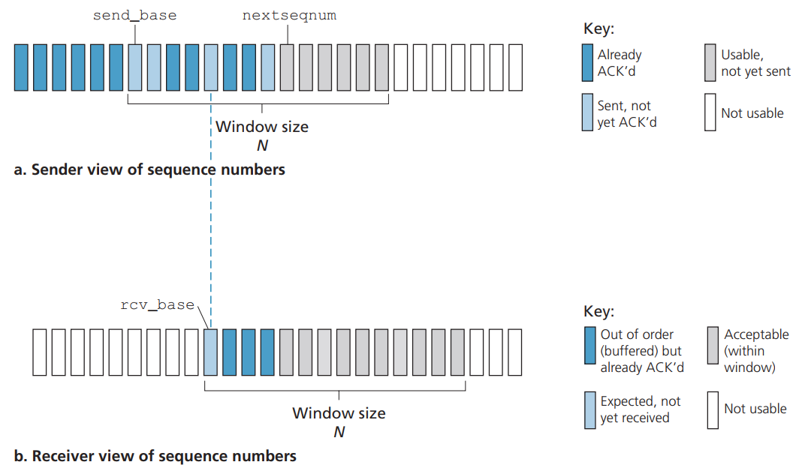

SR具体操作如下：

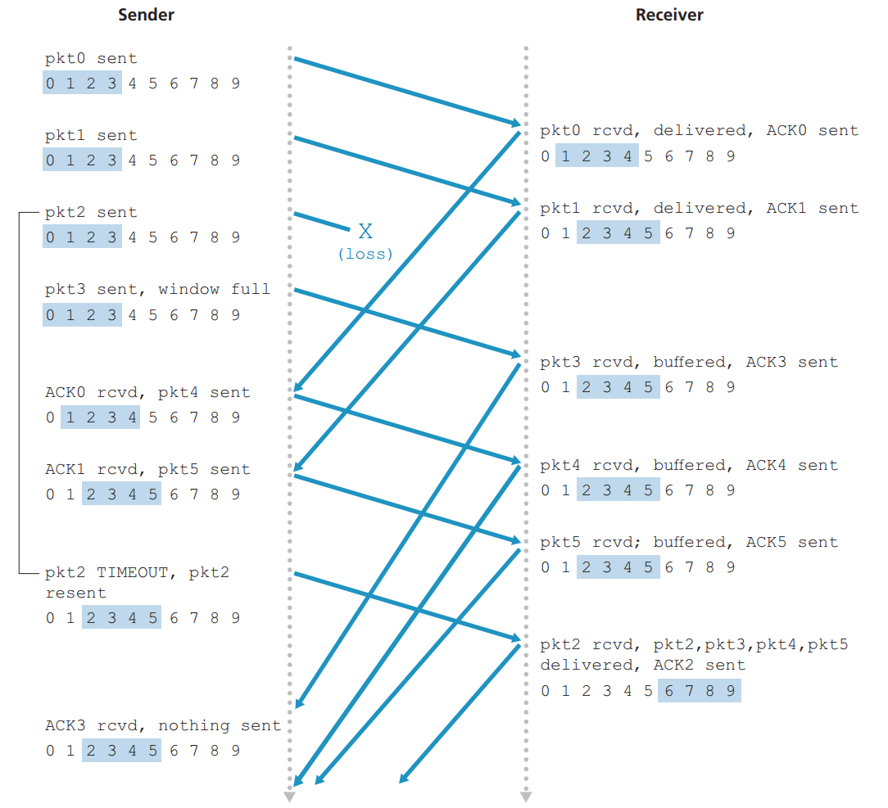

> **优点**：出错时，重传一个代价小
> **缺点**：复杂，所需要资源多（接收方多个缓存单元）

## 3.5 面向连接的运输：TCP

> Connection-Oriented Transport: TCP

### 3.5.1 TCP连接

> TCP Connection

- **面向连接（connection-oriented）**：相互发送预备报文段，以建立确保数据传输的参数；
- **全双工服务（full-duplex service）**：如果一台主机上的进程A与另一台主机上的进程B存在一条TCP连接，那么应用层数据就可以在从进程B流向进程A的同时，也从进程A流向进程B；
- **点对点（point-to-point）**：即在单个发送方与单个接收方之间的连接；
- **三次握手（three-way handshake）**：客户先发送一个特殊TCP报文段，服务器用另一个特殊的TCP报文段来响应，最后客户再用第三个特殊报文段作为响应。

客户进程通过套接字，TCP会将要发送的数据引导到该连接的发送缓存（send buffer），发送缓存是发起三次握手期间设置的缓存之一，TCP发送缓存与接收缓存如下图所示：

> 封装成**报文段(Segment)**

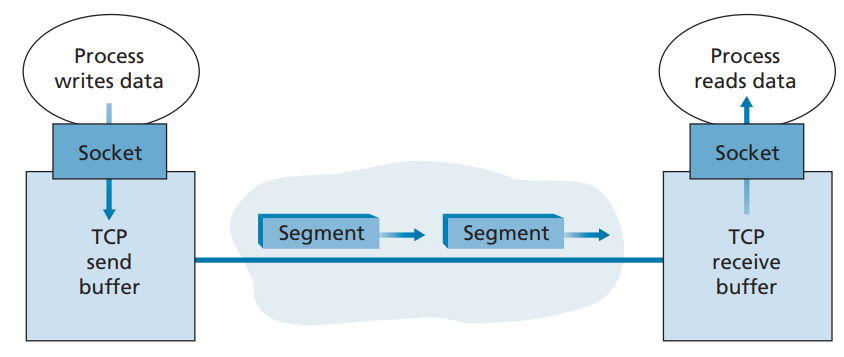

TCP可以从缓存中取出并放入报文段中数据数量限制于**最大报文段长度（Maximum Segment Size，MSS）**，MSS通常根据最初确认的由本地发送主机发送的最大链路层帧长度（即所谓的**最大传输单元（Maximum Transmission Unit，MTU）**）来设置。

### 3.5.2 TCP报文段结构

> TCP Segment Structure

TCP报文段结构如下图：

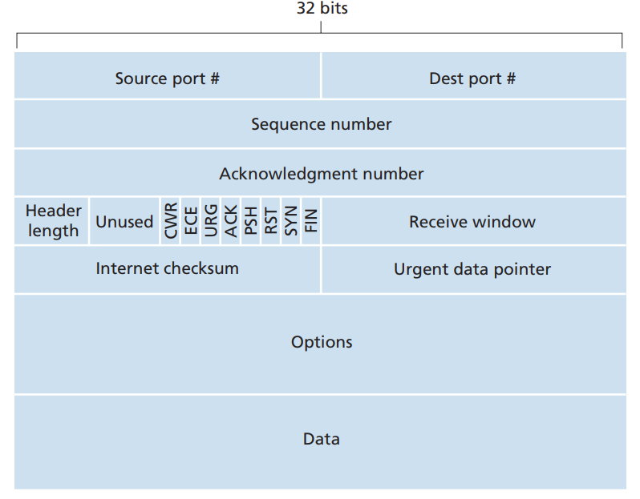

与UDP一样，首部包括**源端口号（Source port）**和**目的端口号（Dest port）**，它被用于多路复用和多路分解来自或送到上层应用的数据，也包括**检验和字段（Internet checksum）**，首部还包括以下字段：

- 32bit的**序号字段（Sequence number）**和32bit的**确认号字段（Acknowledgement number）**；
- 16bit的**接受窗字段（Receive window）**：用于控制流量；
- 4bit的**首部长度字段（Header length）**：指示了以32bit的字为单位的TCP首部长度；
- 可选和变长的**选项字段（Options）**：用于发送方与接收方协商最大报文段长度（MSS）时，或在高速网络环境下用作窗口调节因子时使用；
- 6bit的**标志字段（flag field）**：
  - `ACK`：确认字段中的值是否有效；
  - `RST,SYN,FIN`：用于连接建立和拆除；
  - `CWR,ECE`：在明确拥塞通过中使用；
  - `PSH`：被置位时，指示接收方立即将数据交给上层；
  - `URG`：指示报文段中存放着被发送端上层实体置为“紧急”的数据；
- 16bit的**紧急数据指针字段（Urgent data point）**：指出紧急数据的最后一个字节；

#### 序号和确认号

> Sequence number and Acknowledgement number

一个**报文段的序号**（sequence number for a segment）是该报文段首字节的**字节流**编号，而不是建立在传送的报文段的序列之上。

> 序号：偏移量 --- `x+(n-1)*MSS`

TCP是全双工的，因此主机A在向主机B发送数据的同时，也许也接收来自主机B的数据。从主机B到达的每个报文段都有一个序号用于从B流向A的数据。==**<u>主机A填充进报文段的确认号是主机A期望从主机B收到的下一字节的序号</u>**==。如下图所示：

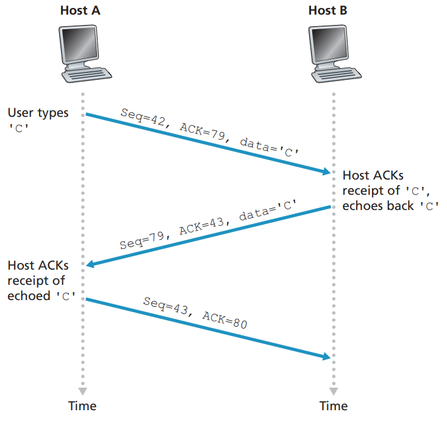

### 3.5.3 往返时间的估计与超时

> Round-Trip Time Estimation and Timeout

#### 估计往返时间

报文段的样本RTT（表示为`SampleRTT`），在任意时刻，仅为一个已发送的但目前尚未确认的报文段估计SampleRTT，从而产生一个接近每个RTT的新SampleRTT值。另外，TCP绝不为已重传的报文段计算SampleRTT；它仅为传输一次的报文段测量。

TCP维持一个SampleRTT均值（称为`EstimatedRTT`），EstimatedRTT更新方式如下：
$$
EstimatedRTT=(1-\alpha)\times EstimatedRTT+\alpha\times SampleRTT\\
\alpha推荐值为\alpha=0.125
$$
这种平均方法被称为指**数加权移动平均（Exponential Weighted Moving Average，EWMA）**。

定义RTT偏差`DevRTT`，用于估算SampleRTT一般会偏离EstimatedRTT的程度：
$$
DevRTT=(1-\beta)\times DevRTT+\beta\times |SampleRTT-EstimatedRTT|\\
\beta推荐值\beta=0.25
$$

#### 设置和管理重传超时间隔

超时间隔应该大于等于EstimatedRTT，否则，将造成不必要的重传。在TCP确定重传超时间隔的设置方法如下：
$$
TimeoutInterval = EstimatedRTT + 4\times DevRTT
$$

### 3.5.4 可靠数据传输

> Reliable Data Transfer

TCP在IP不可靠的尽力而为服务之上创建了一种**可靠数据传输服务（reliable data transfer service）**。为了减少多个定时器管理带来的相当大的开销，TCP在即使有多个已发送但未确认的报文段的情况下，定时器的管理过程仅使用==**单一**==的定时器。简化的TCP发送方如下：

```c
/* Assume sender is not constrained by TCP flow or congestion control, that data from above is less than MSS in size, and that data transfer is in one direction only. */

NextSeqNum=InitialSeqNumber
SendBase=InitialSeqNumber
    
loop (forever) {
    switch(event)
        
        event: data received from application above
            create TCP segment with sequence number NextSeqNum
            if (timer currently not running)
                start timer
            pass segment to IP
            NextSeqNum=NextSeqNum+length(data)
            break;
    
        event: timer timeout
            retransmit not-yet-acknowledged segment with smallest sequence number
            start timer
            break;
    
        event: ACK received, with ACK field value of y
            if (y > SendBase) {
                SendBase=y
                if (there are currently any not-yet-acknowledged segments)
                    start timer
            }
            break;
} /* end of loop forever */
```

#### 超时间隔加倍

当发生超时事件时，TCP重传时都会将下一次的超时间隔设为先前值的两倍；当发生其他两个事件计时器重启时，`TimeoutInterval`由最近的`EstimatedRTT`值与`DevRTT`值推算得到。这种修改提供了一个形式受限的拥塞控制。

#### 快速重传

当比期望序号大的失序报文段到达，接收方立即发送**冗余ACK（duplicate ACK）**，指示下一个期待字节的序号（其为间隔的低端的序号）。如果TCP发送方接收到对相同数据的**3个冗余ACK**，TCP就执行**快速重传（fast retransmit）**，即在该报文段的定时器过期之前重传丢失的报文段。快速重传示例如下图：

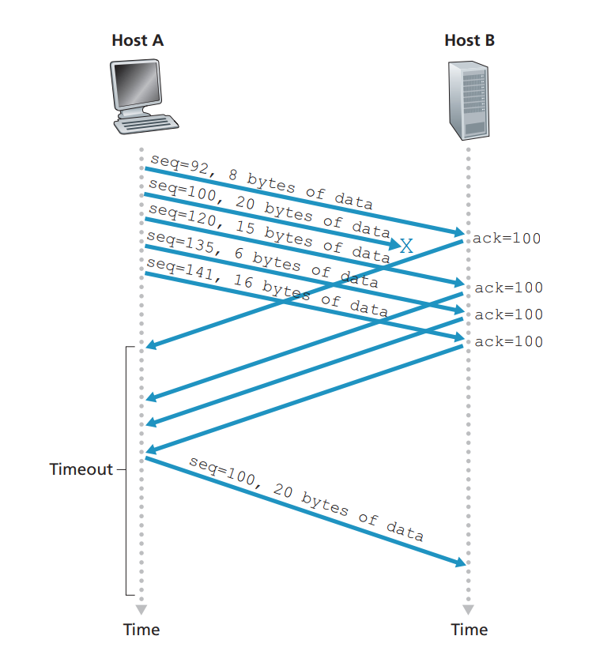

#### 选择确认

> selective acknowledgment

> 接收端在接收到一个报文段后，不着急发送确认，而是等待(500ms)，看后续是否有报文段到来，若到来，则只发送后续到来的报文段的确认，否则要及时发送接收到的报文段确认

允许TCP接收方有选择地确认失序报文段，而不是积累地确认最后一个正确接收的有序报文。当该机制与选择重传机制结合起来使用时，TCP看起来就很像通常的SR协议。因此，TCP的差错恢复机制最好分类为GBN协议与SR协议的混合体。

> 接收端发送确认，乱序到来，发送**期待的报文段**的确认来弥补原本的有序性

> TCP的rdt协议是UDP的rdt协议中GBN和SR的结合
> 接收端重发，只重发最老的一个报文段
> 接收端接收到报文段后，发送顺序到来的最后一个字节+1的确认(期待)

### 3.5.5 流量控制

> Flow Control

TCP通过让发送方维护一个称为**接收窗口**（receive window）的变量来提供流量控制。通俗的说，接收窗口用于给发送方一个指示——该接收方还有多少可用的缓存空间。因为TCP是全双工通信，在连接两端的发送方都各自维护一个接收窗口。

接收窗口（`rwnd`）和接收缓存（`RcvBuffer`）如下图所示：

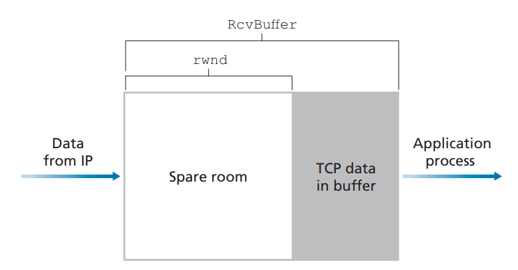

### 3.5.6 TCP连接管理

> TCP Connection Management

#### [三次握手连接](https://blog.csdn.net/weixin_45304503/article/details/142029483?spm=1001.2014.3001.5502 "三次握手优质教程")

> three-way handshake

TCP三次握手：报文交换交换过程如下：

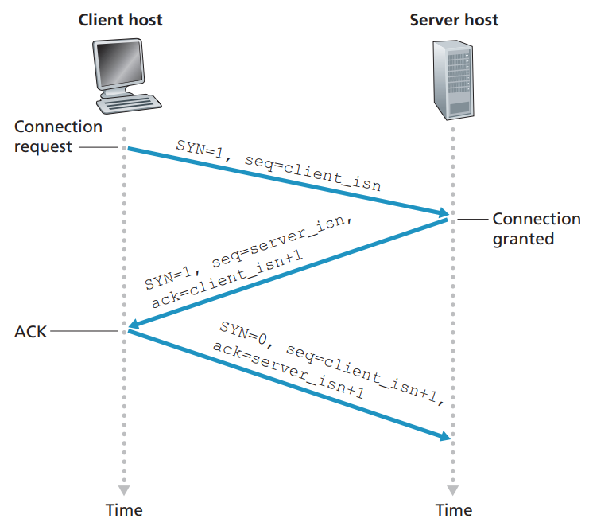

> SYN：同步序号。它表示建立连接。SYN=1时，不能携带数据，但要消耗一个序号。

形象的可以表述为：
* 第一次握手: 可以确认**客户端**的发送能力
* 第二次握手: 可以确认**服务端**的接收能力 和 发送能力
* 第三次握手: 可以确认**客户端**的接收能力。


> 解决了半连接和接收老数据的问题(两次握手)

**采用两次握手发生的问题：**
如客户端发出连接请求，但因连接请求报文丢失而未收到确认，于是客户端再重传一次连接请求。后来收到了确认，建立了连接。数据传输完毕后，就释放了连接，客户端共发出了两个连接请求报文段，其中第一个丢失，第二个到达了服务端，但是第一个丢失的报文段只是在某些网络结点长时间滞留了，延误到连接释放以后的某个时间才到达服务端，此时服务端误认为客户端又发出一次新的连接请求，于是就向客户端发出确认报文段，同意建立连接，不采用三次握手，**只要服务端发出确认，就建立新的连接了**
> 此时如果有之前因超时而重传的数据刚刚接收到，会让服务器误以为客户端又发送了新数据，从而导致服务器端**将老数据当成新数据进行接收**。

> 或者没有数据到来，此时客户端忽略服务端发来的确认，也不发送数据，则服务端一致等待客户端发送数据，**产生半连接**，浪费资源。

#### [四次握手关闭](https://blog.csdn.net/weixin_45304503/article/details/142427461?spm=1001.2014.3001.5502 "四次挥手优质教程")

> four-way handshake

由客户端关闭一条TCP连接的四次握手过程如下：

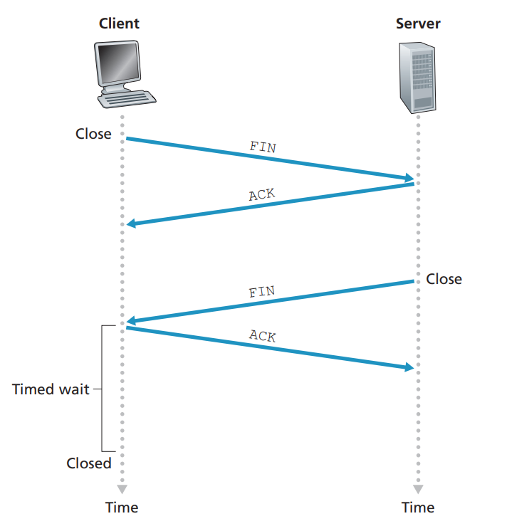

**第一次挥手**
客户端A的应用进程先向TCP发出连接释放报文段，并停止再发送数据，主动关闭TCP连接。客户端A把链接释放报文段首部的终止控制位FIN置为1，其序号为seq=u，它等于前面以传送过的数据的最后一个字节的序号加1。这时候A进入了`FIN-WAIT-1(终止等待1)`状态，等待B的确认。

> TCP规定：FIN报文段即使不携带数据，也消耗掉一个序号！！

**第二次挥手**
服务端B收到链接释放报文段后即发出确认，确认号是ack = u + 1，而这个报文段自己的序号v是等于B前面已传送过的数据的最后一个字节的序号加1，然后B就进入`CLOSE-WAIT(关闭等待)状态`。
**第三次挥手**
A收到来自B的确认后，就进入了`FIN-WAIT-2(终止等待2)`状态满等待B发出的连接释放报文段。若B已经没有要向A发送的数据，其应用进程就通知TCP释放连接，这时B发出的连接释放报文段必须使FIN = 1，现假定B的序号为w，B还必须重复上次已发送过的确认号ack = u + 1.这时B就进入`LAST-ACK(最后确认)`状态，等待A的确认。
**第四次挥手**
A在收到了B的链接释放报文段后，必须对此发出确认。在确认报文段中把ACK置1，确认号ack=w+1，而自己的序号是seq=u+1(根据TCP标准，前面发送过的FIN报文段要消耗一个序号)，然后进入到`TIME-WAIT(时间等待)`状态。

> 现在TCP连接还没有还没有释放掉。必须经过时间等待计时器设置的时间2MSL后，A才能进入CLOSED状态。

<image src=".\image\4handshake.png" width=60%>

> **第四次挥手后进入等待2MSL状态的原因**
> **1.为了保证A发送的最后一个ACK报文段能够到达B。**
> * 这个ACK报文段有可能丢失，因而使处于在LAST-ASK状态的B收不到对己发送的FIN-ACK报文段的确认。B会超时重传这个FIN+ACK报文段，而A就能在2MSL时间内收到这个重传的FIN+ACK报文段。接着A重传一次确认，重新启动2MSL计时器，最后的A和B都正常进入`CLOSED状态`。
> * 如果A在`TIME-WAIT状态`不等待一段时间，而是发送完ACK报文段后立即释放连接，那么就无法收到B重传的FIN+ACK报文段，因而也不会再发送一次确认报文段。

> **2. 防止了已失效的连接请求报文段。**
> * A 在发送完最后一个ACK报文段后，在经过时间2MSL，就可以使本连接持续的时间内所产生的所有报文段都从网络中消失，这样就可以使下一个连接中不会出现这种旧的连接请求报文段。B只要收到了A发出的确认，就进入CLOSED状态。同样，B在撤销相应的传输控制块TCB后，就结束了这次的TCP连接，所以B结束TCP连接的时间要比A早一些的。

> <image src=".\image\4handshake2.png" width=60%>

#### TCP状态

> TCP State

客户TCP经历的典型的TCP状态序列如下图：

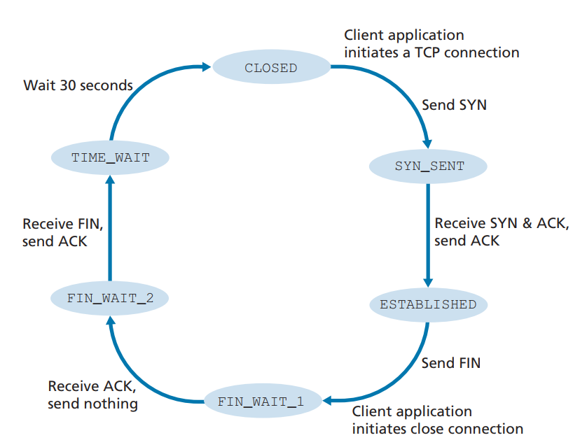

- `ESTABLISHED`状态：已建立连接状态，TCP客户能发送和接收包含有效载荷数据；

服务器端TCP经历的典型的TCP状态序列如下图：

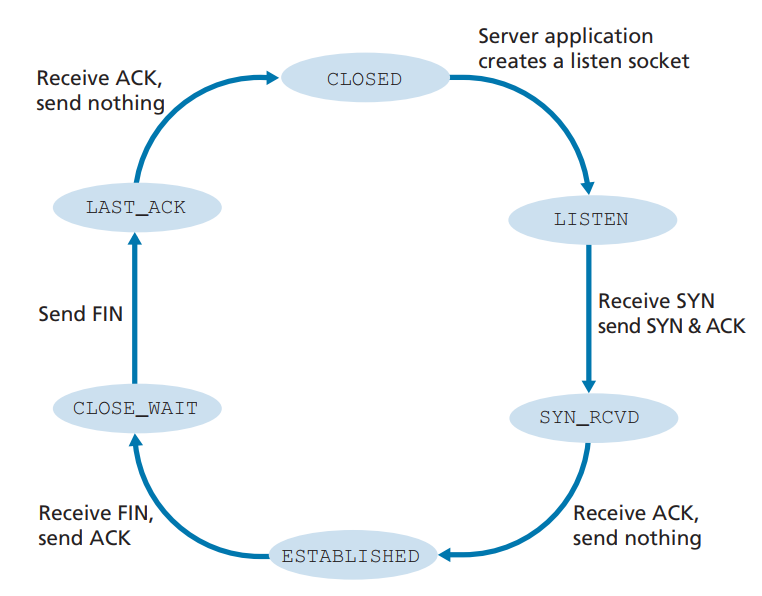

## 3.6 拥塞控制原理

> Principles of Congestion Control

### 3.6.1 拥塞原因与代价

> The Causes and the Costs of Congestion

- 当分组的到达速率接近链路容量时，分组经历巨大的排队时延；
- 发送方在遇到大时延时所进行的不必要重传会引起路由器利用其链路带宽来转发不必要的分组副本；
- 当一个分组沿一条路径被丢弃时，每个上游路由器用于转发该分组到丢弃该分组而使用的传输容量最终被浪费掉；


### 3.6.2 拥塞控制方法

> Approaches to Congestion Control

- **端到端拥塞控制（End-to-end congestion control）**：在端到端拥塞控制方法中，网络层没有为运输层拥塞控制显示支持。即使网络中存在拥塞，端系统也必须通过对网络行为的观察来判断；
- **网络辅助的拥塞控制（Network-assisted congestion control）**：网络辅助的拥塞控制中，路由器向发送方提供关于网络中拥塞状态的显示反馈信息；

> **网络辅助信息的拥塞控制** ATM(异步传输网络) ABR拥塞控制
> 数据交换单位：信元
> 在异步传输网络ABR拥塞控制中，在数据信元中间隔插入RM(资源管理)信元---53字节(5字节头部)
> RM信元中的比特被交换机设置("网络辅助")，NI bit CI bit
> 发射端发送的信元被接收端返回，接收端不做任何改变

## 3.7 TCP拥塞控制

> TCP Congestion Control

运行在发送方的TCP拥塞控制机制跟踪一个额外的变量，即**拥塞窗口（congestion window）**。拥塞窗口表示为`cwnd`，它对一个TCP发送方能向网络中发送流量的速率进行限制。发送方中未被确认的数据量不会超过`cwnd`和`rwnd`中的最小值，即：
$$
LastByteSent-LastByteACK\le \min\{cwnd,rwnd\}
$$
因为TCP使用确认来触发（或计时）增大它的拥塞窗口长度，TCP被说成是自计时（self-clocking）的。TCP基于本地信息设置它们的发送速率的指导性原则：

- 一个丢失的报文段表意味着拥塞，因此当丢失报文段时应当降低TCP发送方的速率；
- 一个确认报文段指示该网络正在向接收方交付发送方的报文段，因此，当对先前未确认报文段的确认到达时，能够增加发送方的速率；
- 带宽探测；

### 3.7.1 TCP拥塞控制算法

> TCP congestion control algorithm

该算法主要包括3个部分：**慢启动（slow-start）**、**拥塞避免（congestion avoidance）**、**快速恢复（fast recovery）**。

在慢启动（slow-start）状态，`cwnd`的值以1个MSS开始并且每当传输的报文段首次被确认就增加1个MSS。TCP发送速率起始很慢，但在慢启动阶段以指数增长，TCP慢启动如下图所示：

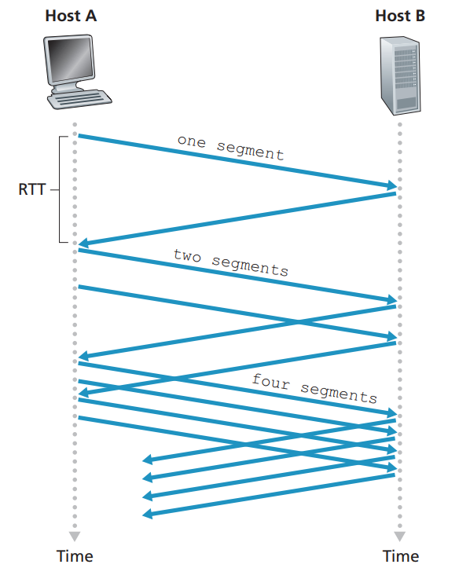

- 如果存在一个由超时指示的丢包事件，TCP发送方将`cwnd`设置为1并重新开始慢启动过程。它还将第二状态变量`ssthresh`（慢启动阈值）设置为`cwnd/2`，三个状态变换FSM如下图：

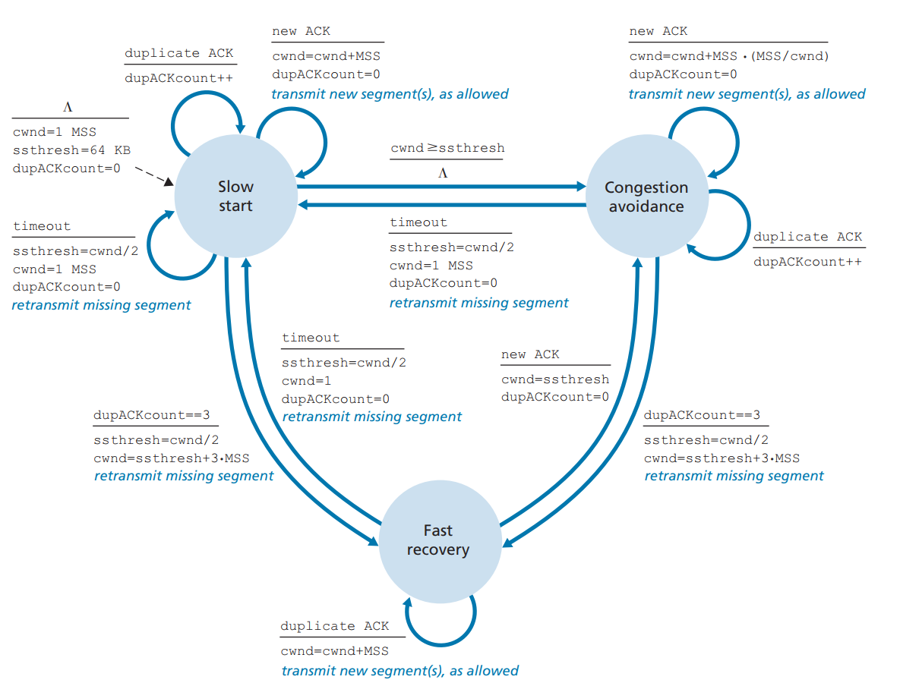

一旦进入拥塞避免状态，`cwnd`的值大约是上次遇到拥塞时的值的一半，即距离拥塞可能并不遥远；在任意状态冗余ACK达到3个就会进入快速恢复状态的缺失报文段。

因此，TCP拥塞控制常常被称为**加性增、乘性减（Additive-Increase，Multiplicative-Decrease，AIMD）**拥塞控制方式。

#### 对TCP吞吐量的宏观描述

$$
一条连接的平均吞吐量=\frac{0.75\times W}{RRT}
$$


# 4 Network Layer:Data Plane网络层：数据平面

## 4.1网络层概述

> Overview of Network Layer

**解决端到端(主机到主机)的通信**

### 4.1.1 转发和路由选择：数据平面和控制平面

> Forwarding and Routing: The Data and Control Planes

- **转发（forwarding）——数据平面**：将分组从一个输入链路接口转移到适当的输出链路接口的路由器的本地动作（==主要利用硬件==）；
- **路由选择（routing）——控制平面**：确定分组从源到目的地所采取的端到端路径的网络范围处理过程（==主要利用软件==）；

每台网络路由器中有一个关键元素是它的转发表（forwarding table）。路由器检查到达分组首部的一个或多个字段值，进而使用这些首部值在其转发表中索引，通过这种方法来转发分组。

**传统方法**是由路由器器中的路由选择算法决定转发表中的值：

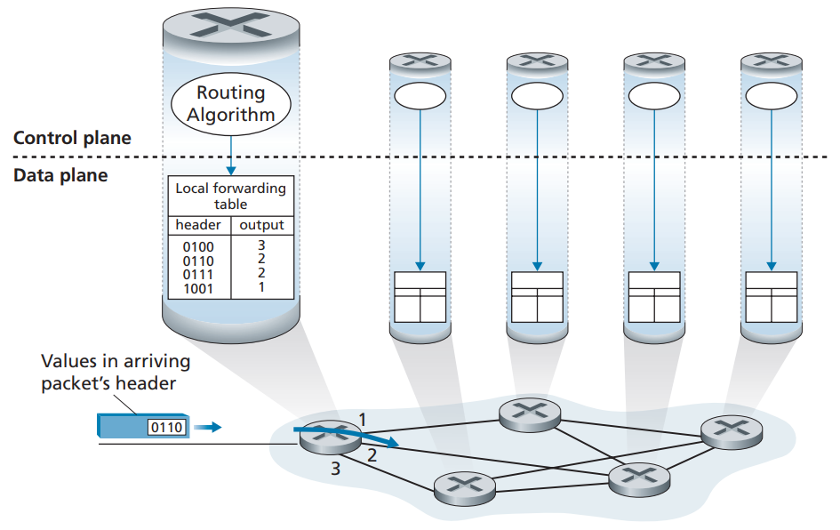

> 传统方式：网络层**数据平面**与**控制平面**紧耦合。

> 根据传送过来分组的头部中的一个**目标地址字段**进行匹配路由表进行转发。

**软件定义网络（Software-Defined Networking，SDN）方法**是从路由器物理上分离的另一种方法，远程控制器计算和分发转发表以供每台路由器所使用：

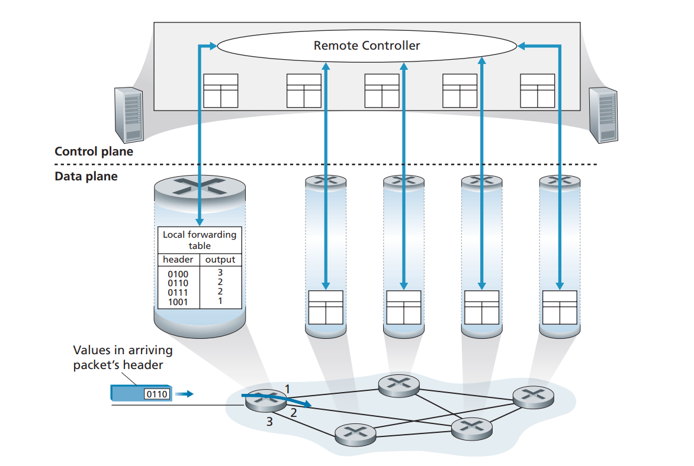

> 集中式的**控制平面**，上层远程控制器通过**南向接口**向下层**CA**(控制代理)发送对应**流表**

> 转发根据接收到的分组的头部中的**多个字段**进行匹配，按照**流表**进行转发
>> 多个字段包括：**源MAC，目标MAC，源IP地址，目标IP地址，源端口，目标端口，部分标志位等字段**

### 4.1.2 网络服务模型

> Network Service Model

**网络服务模型（network service model）i**定义了分组在发送与接收端系统之间的端到端运输特性。可能提供发服务：

- 确保交付；
- 具有时延上界的确保交付；
- 有序分组交付；
- 确保最小带宽；
- 安全性；

因特网的网络层提供了单一的服务，称为**尽力尽为服务（best-effort service）**。传送的分组既不能保证以它们发送顺序接收，也不能保证它们最终交付；既不能保证端到端时延，也不能保证最小的带宽。

某些分组交换机称为**链路层交换机（link-layer switch）**，基于链路层帧中的字段值做出转发决定，这些交换机因此被称为链路层（==第2层==）设备；其他分组交换机称为**路由器（router）**，基于网络层数据报中的首部字段值做出转发决定，路由器因此是网络层（==第3层==）设备。

## 4.2 路由器工作原理

> How Router Works

一台路由器主要由四个组件构成如下图所示：

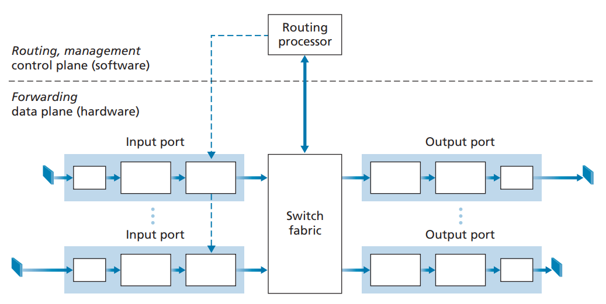

- 输入端口（input port）：
  - 在路由器中终结进入物理链路的物理层；
  - 与位于入链路远端的数据链路层交互；
  - 查找转发表决定路由器的输出端口；
  - 控制分组从输入端口转发到路由选择处理器；
- 输出端口（output port）：
  - 存储从交换结构接收的分组；
  - 执行必要的链路层和物理层功能在输出链路上传输这些分组；
 > 为了原理的讲解，将输入与输出端口分开，实际上通常两端口整合在一个端口上。 
- 交换结构（switch fabric）：
  - 将路由器的输入端口；连接到它的输出端口；
- 路由选择处理器（routing process）：
  - 执行控制平面功能；
  - 传统路由器中，执行路由选择协议，维护路由选择表与关联链路状态信息，并由该路由器计算转发表；
  - SDN路由器中，负责与远程控制器通信；
  - 执行网络管理功能；

### 4.2.1 输入端口处理和基于目的地转发

> Input Port Processing and Destination-Based Forwarding

输入端口处理过程如下图：

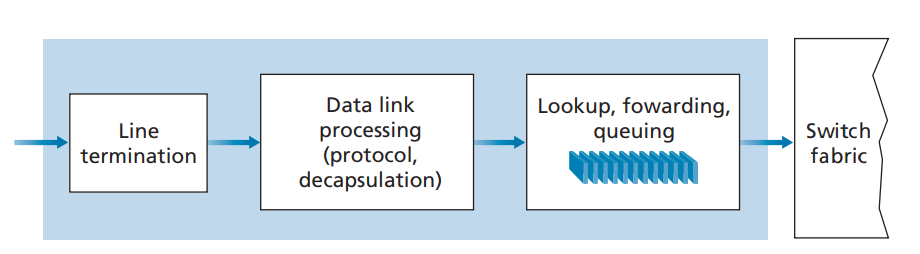

在32比特IP地址的情况下，假设路由器有4条链路，分组以如下方式转发到链路接口：

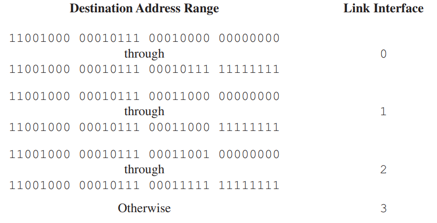

路由器中使用分组目的地址的**前缀（prefix）**与该表中的表项进行匹配，如下图所示：

|           前缀匹配           | 链路接口 |
| :--------------------------: | :------: |
|  `11001000 00010111 00010`   |    0     |
| `11001000 00010111 00011000` |    1     |
|  `11001000 00010111 00011`   |    2     |
|             其他             |    3     |

当有多个匹配时，该路由器使用**最长前缀匹配规则（longest prefix matching rule）**，即在该表中寻找最长的匹配项，并向与最长的前缀匹配先关联的链路接口转发分组。

实践中经常使用**三态内容可寻址存储器（Tenary Content Address Memory，TCAM）**来查找。

### 4.2.2 交换

> Switching

网络层的数据平面中路由器进行交换功能。

交换可以用许多方式完成，如下图所示：

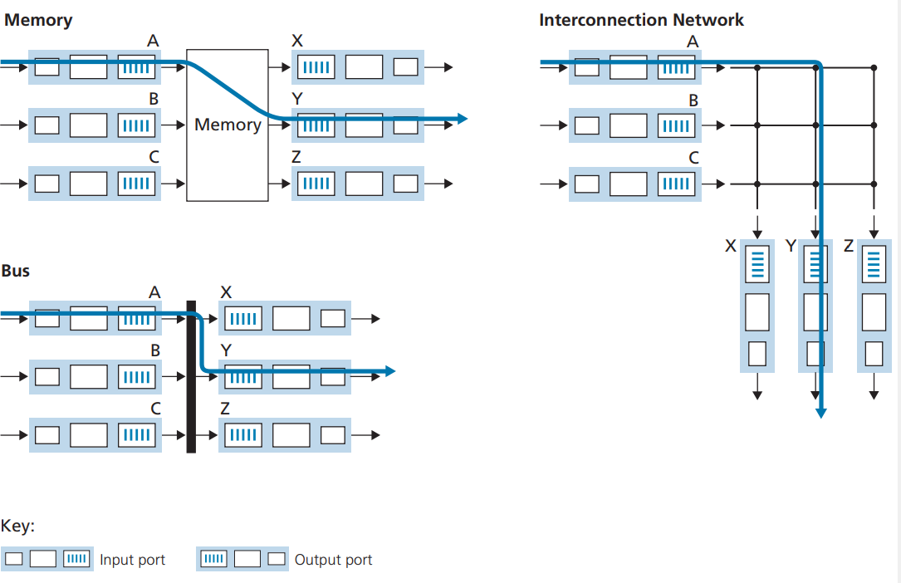

- 经内存交换（Switching via memory）：
  - 在CPU直接控制下交换的传统计算机；
  - 数据包复制到系统存储器；
  - 速度受内存带宽限制（每个数据报2个总线交叉）；
- 经总线交换（Switching via a bus）：
  - 通过共享总线从输入端口存储器到输出端口存储器的数据报；
  - 总线竞争：受总线带宽限制的交换速度；
- 经连接网络交换（Switching via an interconnection network）：
  - Crossbar-Clos网络以及最初为连接多处理器中的处理器而开发的其他互连网络；
  - 多级交换机：nxn交换机由多级较小的交换机组成；
  - 利用并行性：入口时将数据报分段为固定长度单元；通过结构交换信元，在出口重新组装数据报；

### 4.2.3 输出端口处理

> Output Port Processing

输出端口处理如下图：

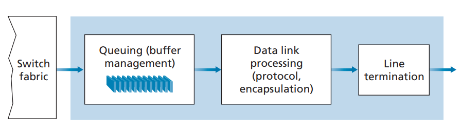

### 4.2.4 何时出现排队

> Where Does Queuing Occur

在输入端口和输出端口都可以形成分组队列，随着这些队列的增长，路由器的缓存空间最终将会耗尽，并且当无内存可用于存储到达的分组时将会出现丢包（packet loss）。

#### 输入排队

线路前部（Head-Of-the-Line，HOL）阻塞：即在一个输入队列中排队的分组必须等待通过的交换结构发送（即使输出端口是空闲的），因为它被位于线路前部的另一个分组所阻塞。如下图所示：

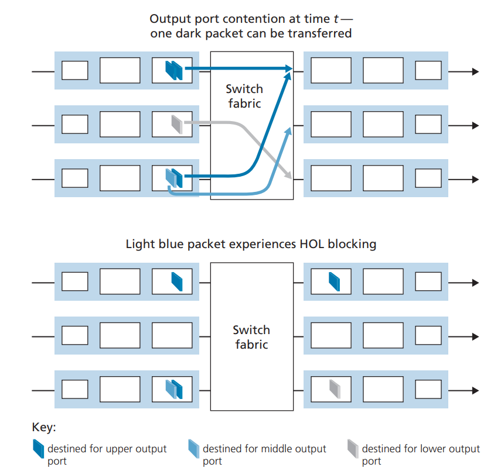

#### 输出排队

当数据报从结构到达的速度快于链路传输速率时，需要缓冲。输出端口排队如下图所示：

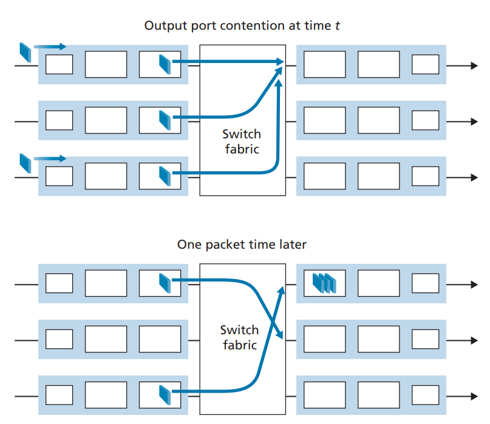

### 4.2.5 分组调度

> Packet Scheduling

#### 先进先出（First-In-First-Out，FIFO）

运行中的FIFO队列如下图所示：

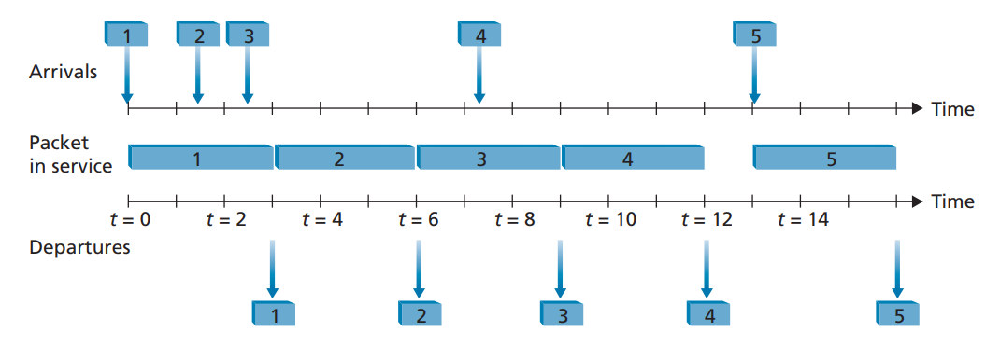

#### 优先权排队（priority queuing）

假设分组1、3和4是高优先权，分组2和5是低优先权，在**非抢占式优先权排队（non-preemptive priority queuing）**中，运行如下图所示：

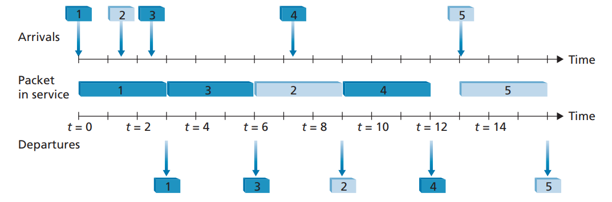

#### 循环排队规则（round robin queuing discipline）

假设分组1，2和4属于第一类，分组3和5属于第二类，运行如下图所示：

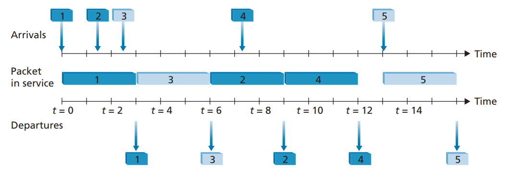

## 4.3 网际协议：IPv4、寻址、IPv6及其他

> The Internet Protocol (IP): IPv4,  Addressing, IPv6, and More

### 4.3.1 IPv4数据报格式

> IPv4 Datagram Format

IPv4数据报格式如下图所示：

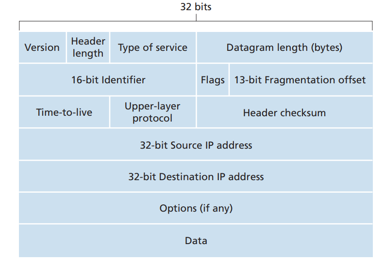

- 版本号（Version）：规定了数据报的IP协议版本；
- 首部长度（Header length）：在无选项（Options）首部时，IP具有==**20字节**==的首部；
- 服务类型（Type of service）：不同类型的数据报可以相互区分；
- 数据报长度（Datagram length）：4个bit位，IP数据报的总长度（首部加上数据），以字节计数，**数值单位为4字节**；
> 如最大ip首部长度为`1111`(即十进制的15)，此时表示的是首部长度为`60字节`(15*4字节)
- 标识（Identifier）、标志（Flags）、片漂移（Fragmentation offset）：用于IP分片；
> 每分一片计数器加一并赋值给**标识字段**。
> **标志**中有最低位`DF`(还有分片)中间位`MF`(不能分片)
> **片偏移**：以**8字节**为偏移单位。
- 寿命（Time-to-live，TTL）：确保数据段不会永远在网络中循环；
- 上层协议（Upper-layer protocol）：指示IP数据报应交付给哪个运输层协议；
- 首部检验和（Header checksum）：帮助路由器检测收到的IP数据报中的比特错误；
- 源和目的IP地址（Source and Destination  IP address）；
- 选项（Options）：允许IP首部被扩展；
- 数据（Data）：一般为运输层报文段；

### 4.3.2 IPv4数据报分片

> IP fragmentation

一个链路层帧能承载的最大数据量叫作最大传送单元（Maximum Transmission Unit，MTU）。


### 4.3.3 IPv4编址

> IPv4 Adressing

主机与物理链路之间的边界叫做**接口（interface）**。每个IP地址长度为32比特（4字节），因此总共有$2^{32}$个可能的IP地址。这些地址通常按所谓**点分十进制记法（dotted-decimal notation）书**写，及地址中的每个字节用它的十进制形式书写，各字节以句点隔开。

地址`192.32.216.9`的二进制记法是：`11000001 00100000 11011000 00001001`。

下图中，一台路由器（具有三个接口）用于互联7台主机。

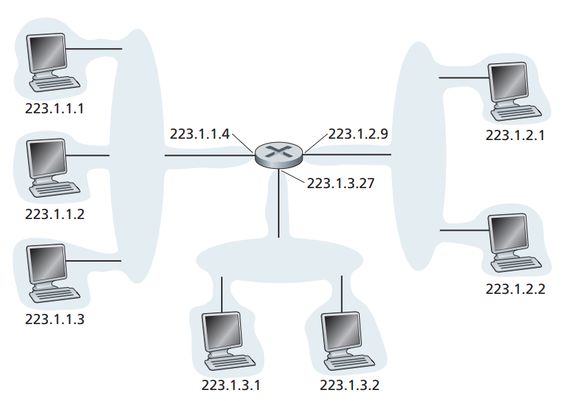

图中左上侧的3个主机和它们连接的路由器接口，都有一个形如`233.1.1.xxx`的IP地址。用IP的术语说，互联这3个主机接口与1个互联网接口的网络形成一个**子网（subnet）**。IP编址为这个子网分配一个地址`233.1.1.0/24`，其中`/24`记法，有时称为**子网掩码（network mask）**，指示32比特中的最左侧24比特定义了子网地址。

下图是由3个路由器互联的6个子网：

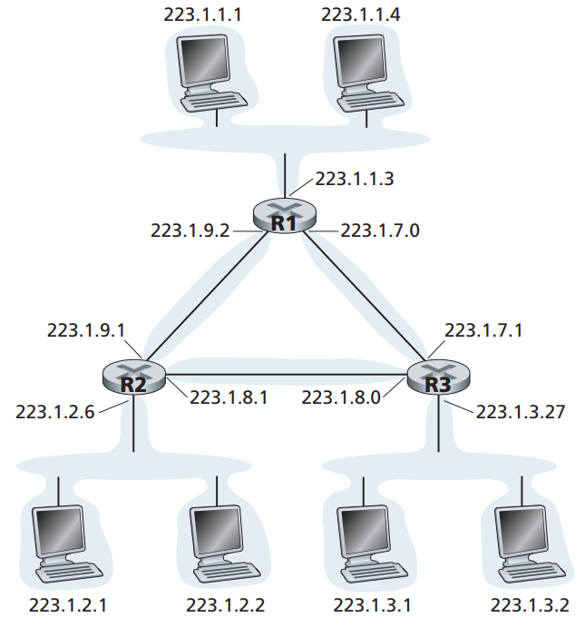

因特网的地址分配策略被称为**无类别域间路由选择（Classless Interdomain Routing，CIDR）**。当使用子网寻址时，32比特的IP地址被划分为两部分，并且也具有点分十进制形式`a.b.c.d/x`，其中`x`指示了地址的第一部分中的比特数，并且该部分经常被称为该地址的**前缀（prefix）**（或网络前缀）。

**特殊IP地址**：
- 子网部分: 全为0---本网络
- 主机部分: 全为0---本主机
- 主机部分: 全为1--广播地址，这个网络的所有主机

- IP广播地址`255.255.255.255`：当主机发出以广播地址为目的地址的数据报时，该报文会交付给同一个网络中的所有主机。

**专用地址**：地址空间的一部份供专用地址使用
- 永远不会被当做公用地址来分配,不会与公用地址重复
- 只在局部网络中有意义，区分不同的设备
    - 路由器不对目标地址是专用地址的分组进行转发

**专用地址范围**:
- Class A `10.0.0.0`-`10.255.255.255`  MASK `255.0.0.0`
- Class B `172.16.0.0`-`172.31.255.255`  MASK `255.255.0.0`
- Class C `192.168.0.0`-`192.168.255.255` MASK `255.255.255.0`

#### 获取主机地址DHCP

> 默认网关与路由器的内网ip地址一致

主机地址的配置更多的是使用**动态主机配置协议（Dynamic Host Configuration Protocol，DHCP）**。

- 给定主机每次与网络连接时能得到一个相同的IP地址；
- 给某个主机分配一个临时的IP地址（temporary IP address），每次地址可能不同；
- 允许移动设备频繁的加入和离开网络；

DHCP客户和服务器分布如下图：

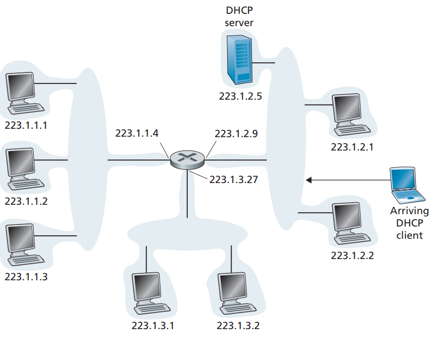

DHCP协议是一个4个步骤过程，`yiaddr`指示分配给该新到达用户的地址，如下图所示：

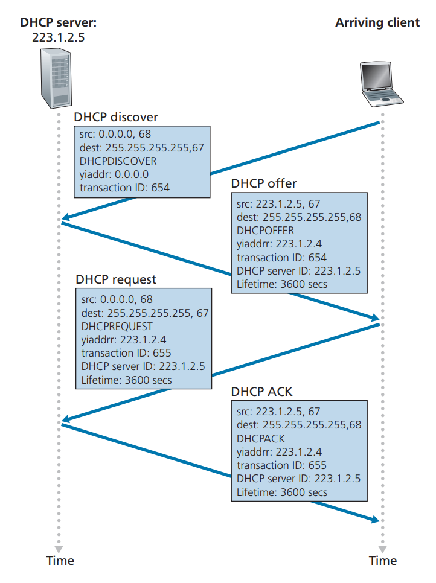

### 4.3.4 IP编址
**转发表和转发算法**
- 获得IP数据报的目标地址
- 对于转发表中的每一个表项
    - 如果`(IP Des addr) & (mask)== destination`, 则按照表项，对应的接口转发该数据报
    - 如果都没有找到,则使用默认表项转发数据报

**获得一个网络的子网部分**
- 从ISP获得地址块中分配一个小地址块
> |地址块|二进制ip地址|十进制ip地址|
> |:---:|:---:|:---:|
> |ISP's block|11001000  00010111  00010000  00000000| 200.23.16.0/20 |
> |Organization 0|11001000  00010111  00010000  00000000| 200.23.16.0/23 |
> |Organization 1|11001000  00010111  00010010  00000000| 200.23.18.0/23 |
> |Organization 2|11001000  00010111  00010100  00000000| 200.23.20.0/23 |
> |...   |   ...        | ... |
> |Organization 7|11001000  00010111  00011110  00000000| 200.23.30.0/23 |

> 将ISP提供的地址块中**主机号**的**高3位**取出来作为**子网的网络号**，此时子网网络号占23位

**层次编址：路由聚集(route aggregation)**
将一些子网的网络向某路由器**通告**，此时要连接这些网络必须经由该路由器 ( 到这些网络的下一跳路由器都是该路由器---**想要连接需经由该路由器** ) ，其他想要连接这些网络的路由器可以将这些网络的网络号统一合并成一个`CIDR(无类别域间路由选择)`地址块，此时可以在路由表中完全使用一个统一的`CIDR地址块`来指示这些网络的路由，后续**再根据该路由器**中路由表进行**具体的确认下一跳**。
> 例如 `200.23.16.0/23`  `200.23.18.0/23` `200.23.20.0/23`这些网络都可以通过`200.23.16.0/20`来指示。
>> 因为与子网掩码进行`&`运算可以得到相同的网络地址

> 通告：通知路由器，其下一跳的ip地址(向被通告的路由器的路由表中的下一跳表项中添加该ip地址)

**层次编址：特殊路由信息(more specific routes)**
在与路由表的表项进行匹配时，可能有多个表项与该路由表表项相匹配，此时采用**最长前缀匹配**(子网掩码1的个数最多的)

### 4.3.5 网络地址转换、

> Network Address Translation (NAT) 

**网络地址转换（Network Address Translation，NAT）**：就外界而言，本地网络中的所有设备只共享一个IPv4地址。

NAT具体步骤如下图：

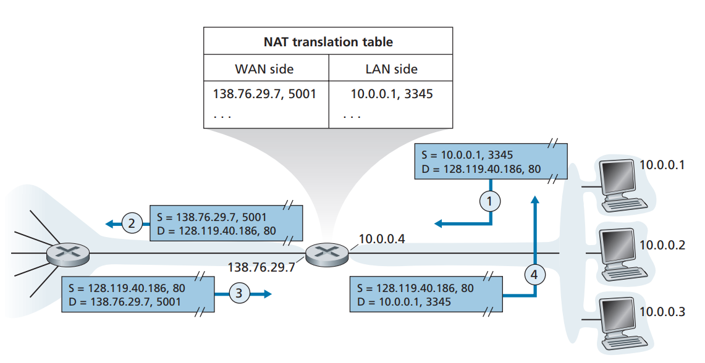

### 4.3.6 IPv6

> IPv6

#### 产生动机

- 将完全分配32位IPv4地址空间;
- 速度处理/转发：40字节固定长度首部；
- 启用流标签的不同网络层处理；

#### 报文格式

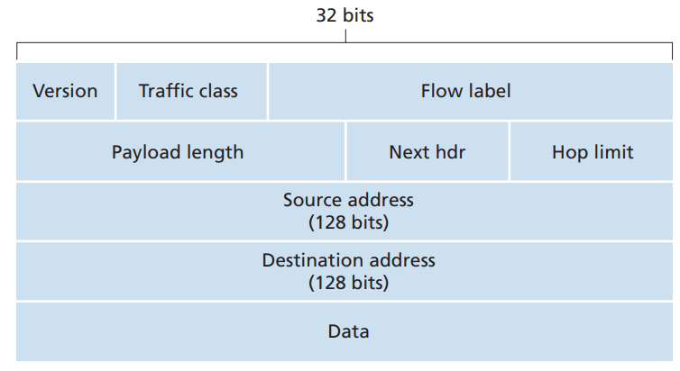

> Next hdr：标识上层协议，标识后面的TLV(type length value)

#### 与IPv4区别

- 删掉分片/重新组装；
> 附加报文类型。e.g."Packet Too Big！"
- 取消首部检验和；
- 将变长选项字段由下一个首部指出；

#### IPv4到IPv6的过渡

**建隧道**（tunneling）如下图：

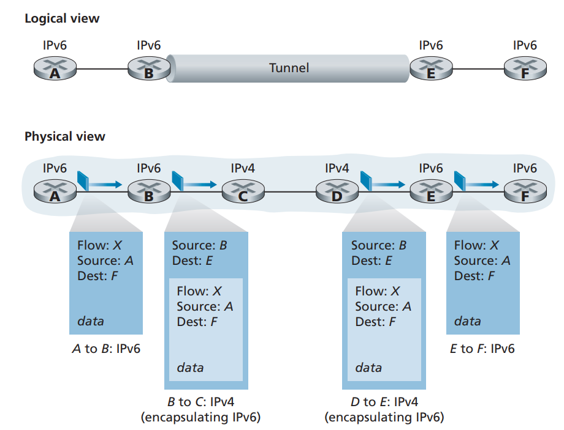

### 4.3.7 通用转发和SDN
传统的方式：网络设备控制平面垂直集中，其功能是分布式的，设备只能按照固定方式工作，控制逻辑固化。

> 传统方式：**路由表(基于目标的转发)**

SDN：逻辑上集中的控制平面，通过控制器(通常是远程的)南向接口将计算的流表发送到下方的代理中。

> SDN：**流表(通用转发)**

> 控制平面与数据平面分离。

> 网络可编程

# 5 Network Layer:Control Plane网络层：控制平面


## 5.1 概述

> Introduction

**路由**：按照某种指标(传播延迟，所经过的站点数目等)找到一条从源节点到目标节点的较好路径

> 路由器-路由器之间的最优路径 = 主机对之间的最优路径

- **每个路由器控制（Per-router control）**：每台路由器有一个路由选择组件，用于与其他路由器中的路由选择组件通信，以计算其转发表的值。如下图所示：

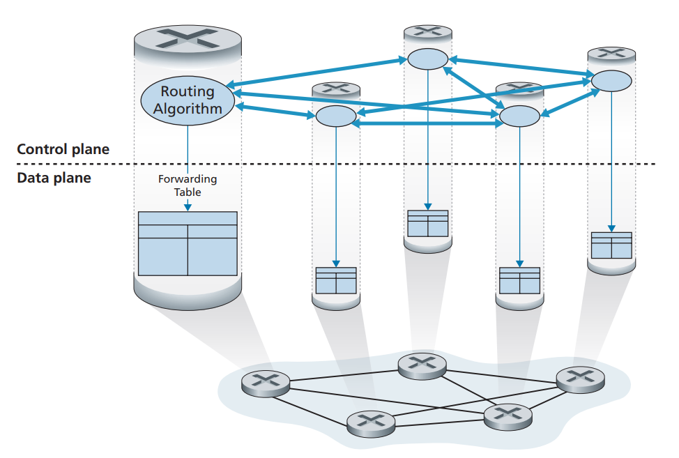

- **逻辑集中式控制（Logically centralized control）**：逻辑集中式控制器计算并分发转发表以供每台路由器使用，如下图所示：

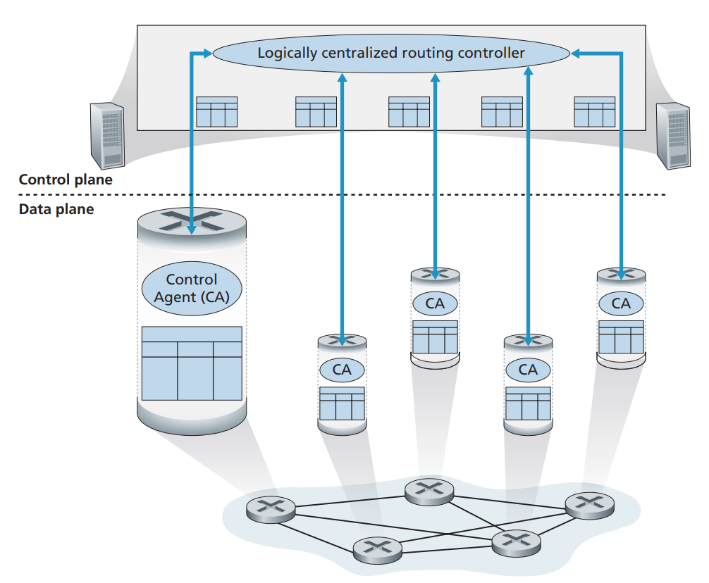

## 5.2 路由选择算法

> Routing Algorithms

> 网络层软件的一部分，完成路由功能。

- (**全局**)**集中式路由选择算法（centralized routing algorithm）**：用完整、全局性的网络知识计算出从源到目的地之间的最低开销路径。具有全局状态信息的算法常被称作**链路状态（Link State，LS）算法**，因为该算法必须知道网络中每条链路的开销。
- (**局部**)**分散式路由选择算法（decentralized routing algorithm）**：路由器以迭代、分布式计算的方式计算出最低开销路径。没有节点拥有关于网络链路开销的完整信息。一个分散式路由选择算法为**距离向量（Distance-Vector，DV）算法**，每个节点维护到网络中所有其他节点的开销估计的向量。

**路由算法也分为静态和动态**：
- 静态:
    - 路由随时间变化缓慢
    > **非自适应算法(non-adaptive algorithm)**：不能适应网络拓扑和通信量的变化,路由表是事先计算好的
- 动态:
    - 路由变化很快
    - 周期性更新
    - 根据链路代价的变化而变化
    > （**目前常用**）**自适应路由选择(adaptive algorithm)**：能适应网络拓扑和通信量的变化

### 5.2.1 链路状态路由选择算法LS

> Link State Routing Algorithms

在实践中，这经常由链路状态广播（link state broadcast）算法完成。下面给出的链路状态路由选择算法叫做`Dijkstra`算法，其计算从某节点（源节点`u`）到网络中所有其他节点的最低开销路径。

基本思想：经算法的第k次迭代后，可知道到k个目的节点的最低开销路径，在到所有目的节点的最低开销路径之中，这k条路径具有k个最低开销。

> After the kth iteration of the algorithm, the least-cost paths are known to k destination nodes, and among the least-cost paths to all destination  nodes, these k paths will have the k smallest costs.

**LS路由算法步骤：**
- 发现它的邻居节点，并了解其网络地址
- 设置到每个邻居节点的距离或者成本度量值(测量相邻节点代价)
- 构造一个包含所有刚刚获知的链路信息包(组装分组)
- 将这个包发送给所有其他的路由器，并接收来自所有其他路由器的信息包
- 计算出到每个其他路由器的最短路径(汇集树)，将计算的结果安装在路由表中

> 前四步构造出完整的以路由器为节点，链路位边的全网拓扑图

> 第五步路由迪杰斯特拉算法进行计算，算出汇集树

我们定义如下符号：

- `D(v)`：到算法的本次迭代，从源节点到目的节点v的最低开销；
- `p(v)`：从源到v沿着当前最小开销路径的前一个节点（v的邻居）；
- `N'`：节点子集；如果从源到v的最低开销路径已经确定，v在`N'`中；

源节点u的链路状态（LS）算法如下：

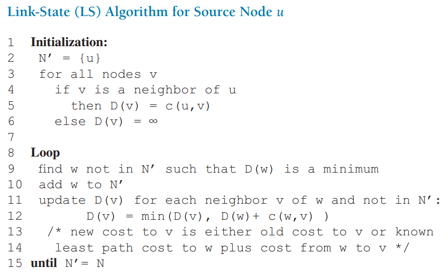

对于下图的网络，链路状态算法迭代运行如下：

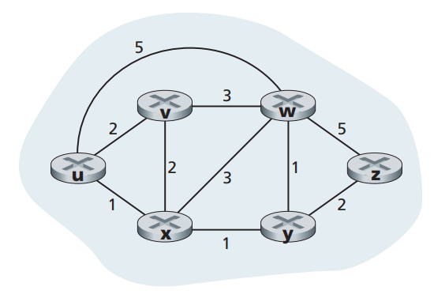

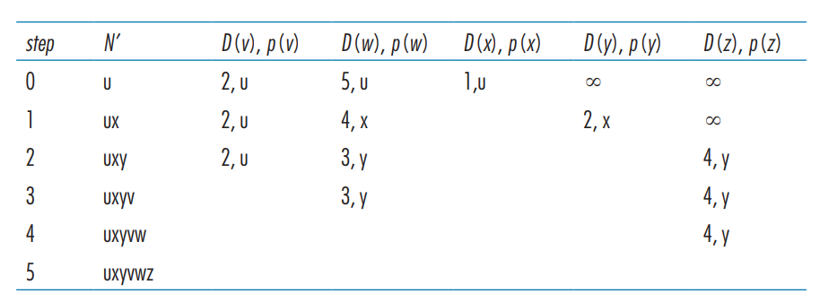

路线上的流量变化和拥塞会使LS算法产生**路由震荡（Routing Oscillations）**。

> 代价为边的拥塞程度，前一周期内代价较小的路径传输分组过大，导致拥塞，此时迪杰斯特拉算法会将路径切换为拥塞程度(代价)较小的路径。因此造成路径的不断切换。

### 5.2.2 [距离向量路由选择算法DV](https://blog.csdn.net/m0_51869692/article/details/125286485)

> The Distance-Vector（DV）Routing Algorithm

**距离向量（Distance-Vector，DV）**算法是一种**迭代的（iterative）、异步的（asynchronous）、分布式的（distributed）和自我终止的（self-termination）**。

> 需要不断迭代才能得到最小的结果

令$d_x(y)$是从节点x到节点y的最低开销路径。则该最低开销与著名的Bellman-Ford方程相关，即：
$$
d_x(y)=\min_v\{c(x,v)+d_v(y)\}
$$
方程中的$\min_v$是对于x的所有邻居的。

算法基本思想：每个节点x以$D_x(y)$开始，对在N中的所有节点y，估计从x到y的最低开销路径的开销路径。

> Each node x begins with $D_x(y)$, an estimate of the cost of the least-cost path from itself to node y, for all nodes, y, in N. 

步骤：
1. **初始化路由表**：每个路由器在开始时都会初始化自己的路由表。这个表包含了路由器知道的所有网络及其对应的下一跳路由器和距离（或度量值）。初始时，路由器通常**只知道与自己直接相连的**网络和距离。
2. **交换路由信息**：路由器会定期与其邻居路由器交换路由信息。这种交换通常是通过广播或特定协议（如RIP）进行的。每个路由器都会将自己完整的路由表**发送给其邻居路由器**。
3. **更新路由表**：当路由器接收到来自邻居路由器的路由信息时，它会根据这些信息更新自己的路由表。具体步骤如下：
    - 对于每个接收到的路由信息，路由器会检查其目的网络是否已经在自己的路由表中。
    - 如果目的网络是新的，路由器会将其添加到路由表中，并设置下一跳路由器和距离。
    - 如果目的网络已经存在，路由器会比较接收到的距离与自己路由表中的距离。如果接收到的**距离更短**，路由器会**更新该目的网络的下一跳路由器和距离**。
4. **循环更新**：路由器会持续地与邻居路由器交换路由信息并更新自己的路由表，直到所有路由器的路由表都稳定下来，**趋于收敛**，即没有进一步的更新发生。这个过程是动态的，意味着当网络拓扑发生变化时，路由表会相应地更新。
5. 处理特殊情况：在实际应用中，距离矢量路由选择算法可能会遇到一些问题，如路由环路、慢收敛和无穷计算等。为了解决这些问题，可以采取一些额外的措施，如定义最大跳计数、使用水平分割、毒抑路由和抑制计时器等。

距离向量算法具体过程如下：

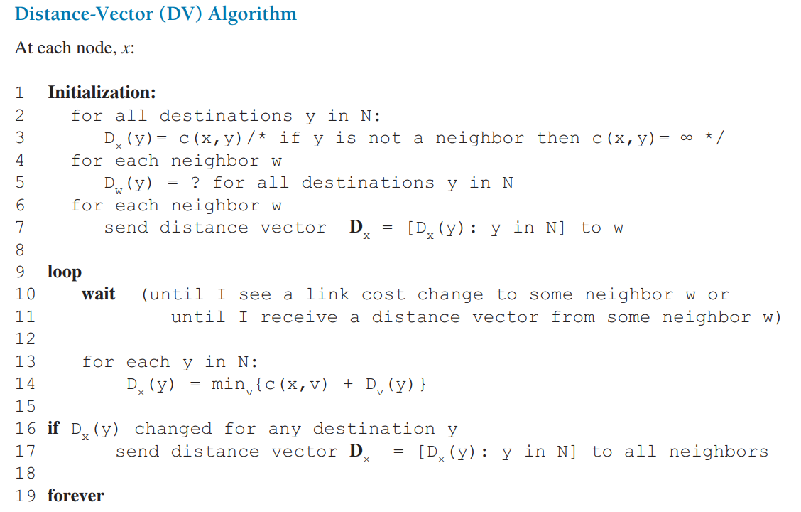

DV算法具体实例如下：

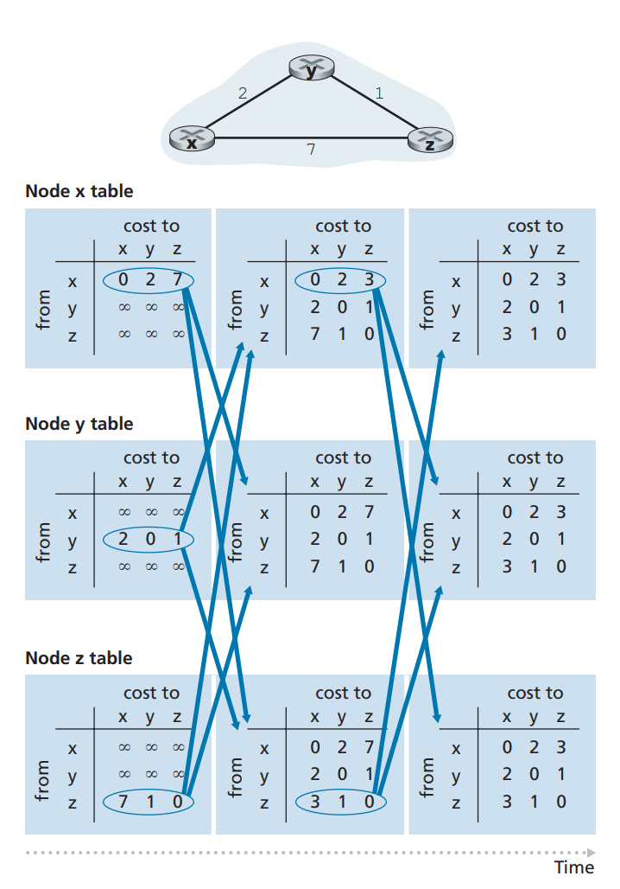

> 每个节点：
> **loop**：**等待**->**重新计算**->**通告**->
> **等待**(本地链路代价变化或者从邻居传送新的DV报文)
> **重新计算**各目标代价估计值
> 如果到任何目标的DV发生变化,**通告**邻居

> 好消息传得快，坏消息传得慢

#### 距离向量算法：链路开销改变与链路故障

**线路故障：**
1. 链路故障发生前：A到D中所有节点都知道对应路径，且都可以正常传输。
> A->C = A->B B->C

2. A->B链路故障
> 第一次交换，B->A无法通过，此时C可以到达，B交给A走C，B->C->A
> 第二次交换，B可以通过，C交给A走B，C->B
> 无限次上述步骤之后，`ttl=0`，或到A的距离等于INF，不可达。

链路开销发生改变，如下图所示：

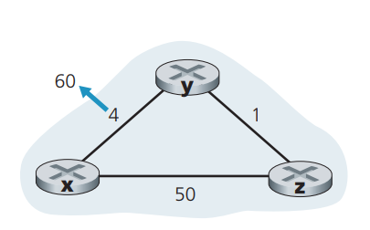

这时我们会遇到**路由选择环路（routing loop）**，这样的问题也被称为**无穷计数**（count-to-infinity）问题。

**解决无穷计数问题：**
水平分裂(split horizon)算法
> 一种对无穷计算问题的解决办法

- C知道要经过B才能到达A，所以C向B报告它到A的距离为INF；C 告诉D它到A的真实距离
- D告诉E,它到A的距离,但D告诉C它通向A的距离为INF
    - 第一次交换: B通过测试发现到A的路径为INF,而C也告诉B到A的距离为INF,因此,B到A的距离为INF
    - 第二次交换: C从B和D那里获知,到A的距离为INF,因此将它到A的距离为INF
> 坏消息以一次交换一个节点的速度传播

> **水平分裂的问题**：在某些拓扑形式下会失败（存在环路）

#### 距离向量算法：增加毒性逆转

**毒性逆转（poisoned reverse）i**思想：如果z通过y路由选择目的地x，则z将通告y，它到x的距离是无穷大，也就是z将通告$D_z(x)=\infin$。

但毒性逆转并不能解决一般的无穷计数问题。

## 5.3 因特网中自治系统内部的路由选择：OSPF

> Intra-AS Routing in the Internet: OSPF

随着路由器规模增大和管理自治的要求，可以通过将路由器组织进**自治系统（Autonomous System，AS）**来解决。在一个自治系统内运行的路由算法叫做**自治系统内部路由选择协议（intra-autonomous system routing protocol）**。

> 一种**LS协议**

### 开放最短路优先（Open Shortest Path First，OSPF）

OSPF是一种链路状态协议，它使用洪泛链路状态信息和Dijkstra最低开销路径算法。使用OSPF，一台路由器构建了一幅关于整个自治系统的完整拓扑图。于是，每台路由器在本地运行Dijkstra的最短路径算法，以确定一个自身为根节点到所有子网的最短路径树。

使用OSPF时，路由器向自治系统内所有其他路由器广播路由选择信息，而不仅仅是向其相邻路由器广播。每当一条链路的状态发生变化时，路由器就会广播链路状态信息。

OFPF的优点：

- 安全（Security）：能够鉴别OSPF路由器之间的交换；
- 多条相同开销的路径（Multiple same-cost paths）：允许使用多条路径；
- 对单播与多播路由选择的综合支持（Integrated support for unicast and multicast routing）；
- 支持在单个AS中的层次结构（Support for hierarchy within a single AS）；
> 可以将一个AS分为多个Area，在单个Area进行泛洪

> **内部网关协议：OSPF，RIP**：在一个自治系统内 **更关注性能**
> **外部网关协议：BGP**：在多个自治系统间 **更关注策略**

## 5.4 ISP之间的路由选择：BGP

**平面路由的问题与使用层次路由的原因：**
* **平面路由**问题：
    * 规模巨大的网络中，路由信息的存储、传输和计算代价巨大
    * 管理问题
* **层次路由**：
    - 规模问题解决：
        - 内部网关协议解决：AS内部数量有限的路由器相互到达的问题, AS内部规模可控
        - AS之间的路由的规模问题：增加一个AS，对于**AS之间的路由**从总体上来说，只是**增加了一个节点**=子网（每个AS可以用一个点来表示）；对于其他AS来说只是**增加了一个表项**，就是这个新增的AS如何走的问题；扩展性强：规模增大，性能不会减得太多
    - 解决了管理问题（各个AS可以运行不同的内部网关协议，可以使自己网络的细节不向外透露）

> Routing Among the ISPs:BGP

当分组跨越多个AS进行路由时，我们需要一个**自治系统间路由协议（inter-autonomous system routing protocol）**。在因特网中，所有的AS运行相同的AS间路由选择协议，称为**边界网关协议（Broder Gateway Protocol，BGP）**。

> 自治区内部协议：OSPF，RIP
> 自治区间协议：BGP

### 5.4.1 BGP的作用

> The Role of BGP

在BGP中，分组并不是路由到一个特定的目的地址，相反是路由到CIDR化的前缀，其中**每个前缀表示一个子网或者一个子网集合**。

> In BGP, packets are not routed to a specific destination address, but instead to CIDRized prefixes, with each prefix representing a subnet or a collection of subnets.

BGP为每台服务器提供完成以下任务的手段：

- 从邻居AS获得前缀的可达性信息；

> Obtain prefix reachability information from neighboring ASs.

- 确定到该前缀的“最好”的路由；


> Determine the “best” routes to the prefixes.

**通告TCP协议交换BGP报文。**
首先两不同AS网关要交换路由信息要先建立**TCP连接(端口号179)**，在此连接基础上**建立BGP会话**，利用该会话交换路由信息。

> 虽然BGP是网络层的协议，但**BGP报文本身并不直接在网络层进行传输**。它们是**通过TCP封装**后，在网络层提供的**IP（互联网协议）数据报服务上进行传输**的。这里需要注意的是，IP数据报是传输BGP报文的载体，而不是BGP报文本身。

> 从协议栈的角度来看，BGP报文最终到达的是接收方的传输层。但考虑到BGP是网络层的路由协议，其报文内容（即路由信息）最终会**被网络层的相关组件（如路由表管理器）所处理和利用**。

### 5.4.2 通告BGP路由信息

> Advertising BGP Route Information

对于每个AS，每台路由器要么是一台**网关路由器（getaway router）**，要么是一台**内部路由器（internal router）**。在BGP中，每对路由器通过使用`179`端口的半永久TCP连接交换路由选择信息。跨越两个AS的BGP连接称为**外部BGP（eBGP）i**连接，而在相同AS中的两台路由器之间的BGP会话称为**内部BGP（iBGP）i**连接。两种连接如下图所示：

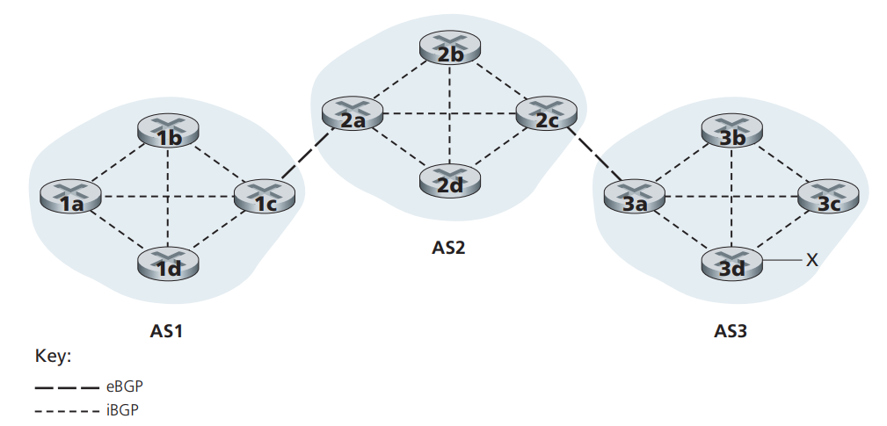

> 例如：`1c`通过`iBGP`会话将其利用`eBGP`获得的`AS2`的网络可达性信息分发给`AS1`中的其他路由器

### 5.4.3 确定最好的路由

> Determining the Best Routes

通告前缀包括一些BGP属性（BGP attribute），前缀及其属性称为路由（route）。

路由器可能获得一个网络前缀的多个路径，路由器必须进行路径的选择，路由选择**可以基于**：
1. 本地偏好值属性: 偏好策略决定
2. 最短AS-PATH ：AS的跳数
3. 最近的NEXT-HOP路由器:热土豆路由
4. 附加的判据：使用BGP标示

#### 热土豆路由选择

> hot potato routing

热土豆路由选择的基本思想是：对于一个路由，尽可能快地将分组送出其AS，而不必担心其AS外部到目的地的余下部分的开销。

在路由器转发表中增加AS外部目的地的步骤：


#### 路由选择算法

> Route-Selection Algorithm

如果到相同前缀有两条或多条路由，则顺序地调用下列消除规则知道余下一条路由：

1. 路由被指派一个本地偏好（local preference）值作为其属性值之一，具有最高本地偏好值的将被选择；
2. 从余下的路由中，将选择具有最短`AS-PATH`的路由；
3. 从余下的路由中，使用热土豆路由选择，即选择具有最靠近`NEXT-HOP`路由器的路由；
4. 如果仍留下多条路由，该路由器使用BGP标识符来选择路由；

> **BGP采用**矢量算法(**路径矢量路由选择算法**)
> 与距离矢量算法相比，该算法通告的路由信息是**到目的地的路径信息**(而非距离)，包括了所经过的所有节点的标识，因此可以避免选择循环路由，不存在"坏消息传得慢"的问题。

### 5.4.4 IP任播

> IP-Anycast

IP任播的动机：

1. 在许多分散的不同地理位置，替换不同服务器上的相同内容；
2. 让每个用户从最靠近的服务器访问内容；

使用IP任播将用户引向最近的CDN服务器如下图：

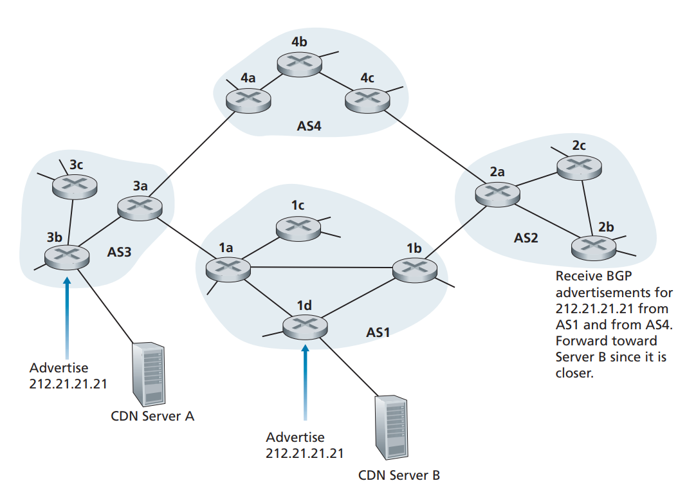

### 5.4.5 路由选择策略

> Routing Policy

如下图所示，X是一个**多宿主接入ISP（multi-homed stub network）**，因为它是经由两个不同的提供商连到网络的其余部分。

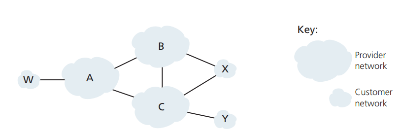

ISP遵循的法则：任何穿越某ISP主干网的流量必须是其源或者目的位于该ISP的某个客户网络中；不然的话这些流量将会免费搭车通过该ISP的网络。

#### 区分AS间和AS内部路由选择的原因

- 策略（Policy）；
- 规模（Scale）；
- 性能（Performance）；


## 5.5 SDN控制平面

> The SDN Control Plane

SDN体系结构具有四个关键特征：

- 基于流的转发（Flow-based forwarding）；
- 数据平面与控制平面分离（Separation of data plane and control plane）；
- 网络控制功能（Network control functions）；
- 可编程网络（A programmable network）；

SDN体系结构如下图所示：

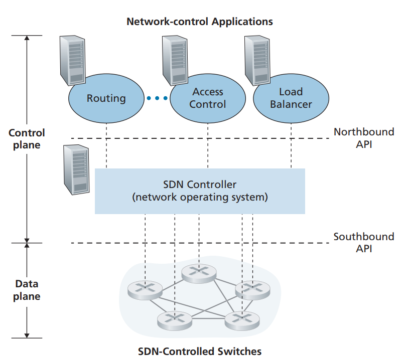

> SDN数据平面中，其对应的转发设备并不是**传统的路由器或二层交换机**，而是一种通用的跨层设备**分组交换机**

## 5.6 ICMP：因特网控制报文协议

> ICMP: The Internet Control Message Protocol

**因特网控制报文协议（the Internet Control Message Protocol，ICMP）**，被主机和路由器用来彼此沟通网络层的信息，有ICMP差错报告报文和ICMP询问报文。ICMP最典型的用途是差错报告。

由主机、路由器、网关用于传达网络层控制信息
- 错误报告：主机不可到达、网络、端口、协议
- Echo 请求和回复（ping）

> ICMP处在网络层，但是是在IP协议的上面，ICMP消息**由IP数据报承载**

ICMP报文类型如下图所示：

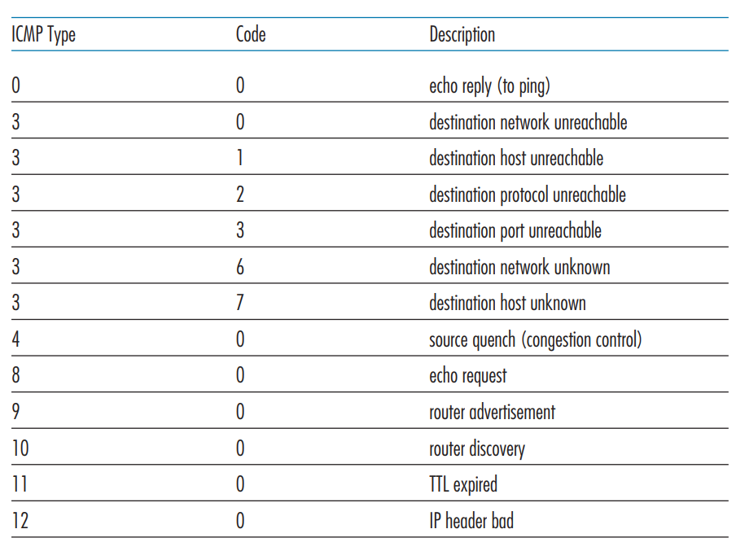

## 5.7 网络管理和SNMP

> Network Management and SNMP

网络管理包括了硬件、软件和人类元素的设置、综合和协调，以监视、测试、轮询、配置、分析、评价和控制网络及网元资源，用合理的成本满足实时性、运营性能和服务质量的要求。

> Network management includes the deployment, integration, and coordination of the hardware, software, and human elements to monitor, test, poll, configure, analyze, evaluate, and control the network and element resources to meet the real-time, operational performance, and Quality of Service requirements at a reasonable cost.  

### 5.7.1 网络管理框架

> The Network Management Framework

网络管理的关键组件如下图所示：

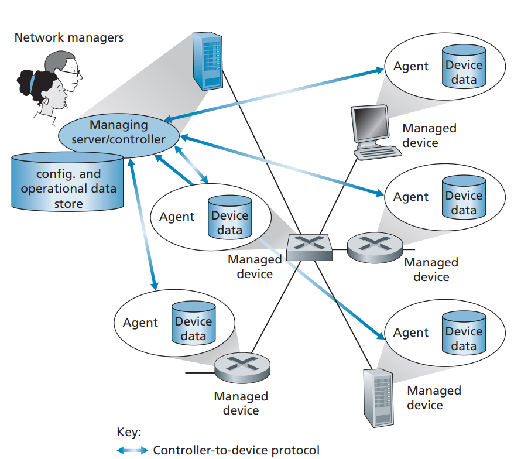

- **管理服务器（managing server）**：一个应用程序，通常有人参与，并运行在网络运营中心（NOC）的集中式网络管理工作站上，执行网络管理活动的地方，控制网络管理信息的收集、处理、分析和显示；
- **被管设备（managed device）**：被管对象（managed object）是被管设备中硬件的实际部分和用于这些硬件及软件组件的配置参数；
- **信息管理库（Management Information Base，MIB）**：收集被管设备中每个被管对象的关联信息，信息值可供管理服务器所用；
- **网路管理代理（network management agent）**：运行在被管设备中的一个进程，该进程与管理服务器通信，在管理服务器的命令和控制下在被管设备中采取本地动作；
- **网络管理协议（network management protocol）**：运行在管理服务器和被管设备之间，允许管理服务器查询被管设备的状态，并经过其代理间接地在这些设备上采取行动；

### 5.7.2 简单网络管理协议

> Simple Network Management Protocol

**简单网络管理协议（Simple Network Management Protocol，SNMP）**是一个应用层协议，用于在管理服务器和代表管理服务器执行的代理之间传递网络管理控制和信息报文。

SNMPv2定义了7种类型报文，这些报文一般称为协议数据单元（PDU），PDU格式如下图所示：

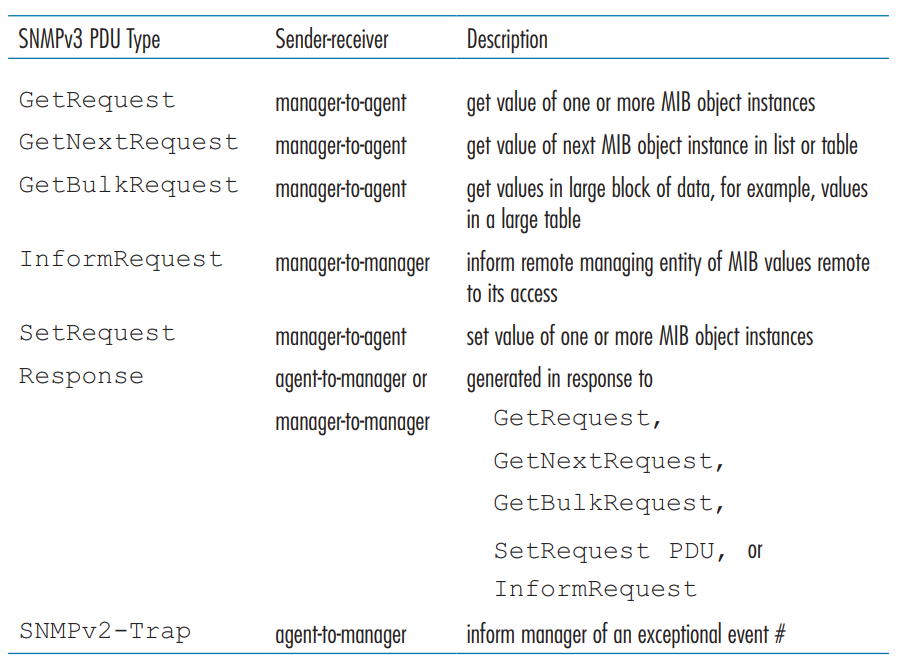

# 6 The Link Layer and LANs链路层和局域网

**解决点到点之间的通信**

> 链路层的点对应**节点**：**主机**，**路由器**

## 6.1 链路层概述

> Introduction to the Link Layer

- 节点（node）：运行链路层协议的任何人设备；
- 链路（link）：沿着通信路径连接相邻节点的通信信道；

### 6.1.1 链路层提供的服务

> The Service Provide by the Link Layer

- 成帧（Framing）；
> 将网络层IP分组封装成帧，加上帧头帧尾
>> **PPP帧**帧头帧尾：帧定界符
>> **多点接入**(广播信道中帧的)帧头：源MAC地址，目标MAC地址，其他控制字段

> 若采用共享性介质，信道接入获得**信道访问权(Access Control)**
> 根据不同链路网卡，封装成不同的帧，以太网帧，WLAN帧等等
- 链路接入（Link access）：**媒体访问控制（Medium Access Control，MAC）i**协议规定了帧在链路上传输规则；
- 相邻两点间可靠交付（Reliable deliver）；
> 在链路层不可靠，出错率较高的链路中加入可靠性传输(rdt)
- 差错检测和纠正（Error detection and correction）；
> 接收方检测出错误：通知发送端重传或丢失帧
> 接收端检查和纠错bit错误，不通过重传来**纠正**错误
- 流量控制
- 半双工和全双工
> 半双工：链路可以双向传输，但一次只能有一个方向。
> 全双工：两方向可以同时收发。

### 6.1.2 链路在何处实现

> Where Is the Link Layer Implemented

链路层的主体部分在**网络适配器（network adapter）**中实现，网络适配器有时也称为**网络接口卡（Network Interface Card，NIC）**，一个典型的主机体系结构如下图所示：

> 网卡

> 每个路由器上，交换机的每个端口上，主机上(也可以装网卡)

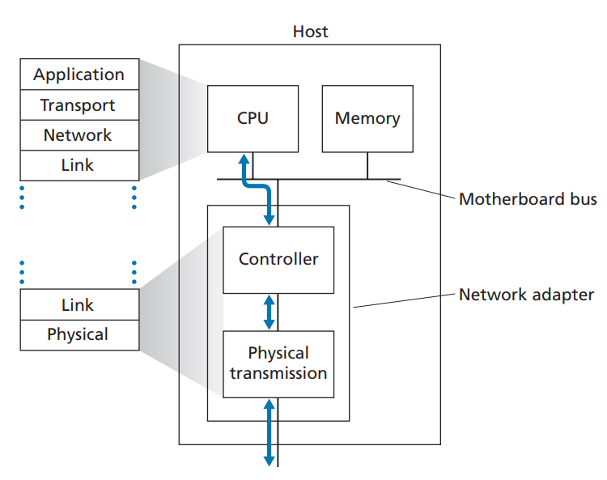

> 一旦确定了下一跳地址和接口，路由器就会将数据报从内存发送到对应的网络接口,路由器通过系统总线（如PCI总线、PCIe总线等）将数据报从内存传输到网络接口卡（网卡）。网卡将数据报封装成数据链路层帧。封装完成后，网卡准备将帧发送到物理传输设备（如以太网交换机、光纤收发器等）。网卡通过物理媒介（如双绞线、光纤等）将帧发送到物理传输设备。
物理传输设备将帧传输到目标网络的接入点。

## 6.2 差错检测和纠正技术

> Error-Detection and -Correction Techniques

`EDC` = 差错检测和纠正位（冗余位）
`D` = 数据由差错检测保护，可以包含头部字段

> 错误检测不是100%可靠的!
> - 协议会漏检一些错误，但是很少
> - 更长的EDC字段可以得到更好的检测和纠正效果


差错检测与纠正的场景如下图所示：

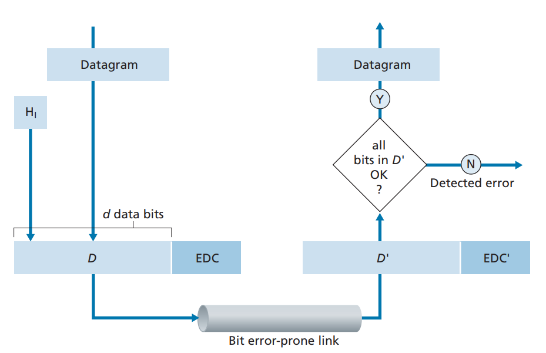

### 6.2.1 奇偶校验

> Parity Checks

单个**奇偶校验位（parity bit）**：发送d比特信息附加一个比特使d+1比特中1的总数是偶数（偶校验）或奇数（奇校验），偶校验如下图所示：

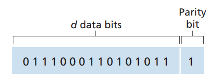

- 只能检测不能纠错，不能检测超过1比特位的错误；

**二维奇偶校验**（two-dimension parity）如下图所示：

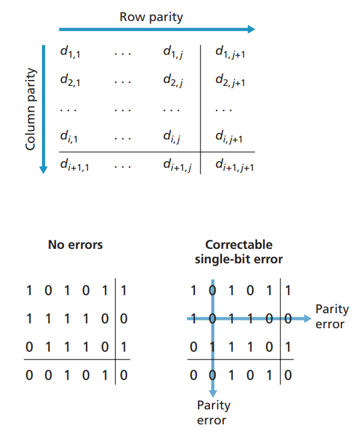

- 能检测并纠正1bit差错；

### 6.2.2 检验和方法

> Checksumming Methods

**因特网检验和**（Internet checksum）基于这种方法，即数据的字节作为16比特的整数对待并求和。

> 发送方：将`checksum`的值放在`‘UDP校验和’`字段
> 接收方：计算接收到的报文段的校验和，检查是否与携带校验和字段值一致:
>> 更简单的方法：**全部加起来看是不是全1**

> 检测在传输报文段时的错误（如位翻转），（注：仅仅用在**传输层**）

### 6.2.3 循环冗余检测

> Cyclic Redundancy Check(CRC)

计算机网络中广泛应用的差错检测技术基于**循环冗余检测（Cyclic Redundancy Check，CRC）**编码，也称为**多项式编码（polynomial code）**，CRC如下图所示：

- 强大的差错检测码
- 将数据比特`D`, 看成是二进制的数据
- 生成多项式`G`：双方协商`r+1位模式`（r次方）
    - 生成和检查所使用的位模式
- 目标:选择`r位CRC附加位`R，使得
    - `<D,R> `正好被`G`整除`(modulo 2) `
    - 接收方知道`G`, 将`<D,R>`除以`G`. 如果非`0`余数: 检查出错误!
    - 能检出所有少于`r+1`位的突发错误

> 发送方：计算CRC
> 接收方：进行校验

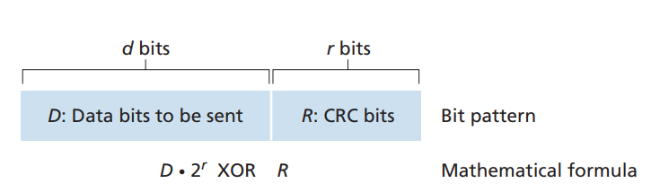

`R`计算：
$$
R=remainder\frac{D\cdot2^r}{G}
$$
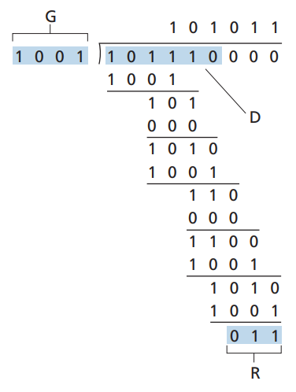

例子：
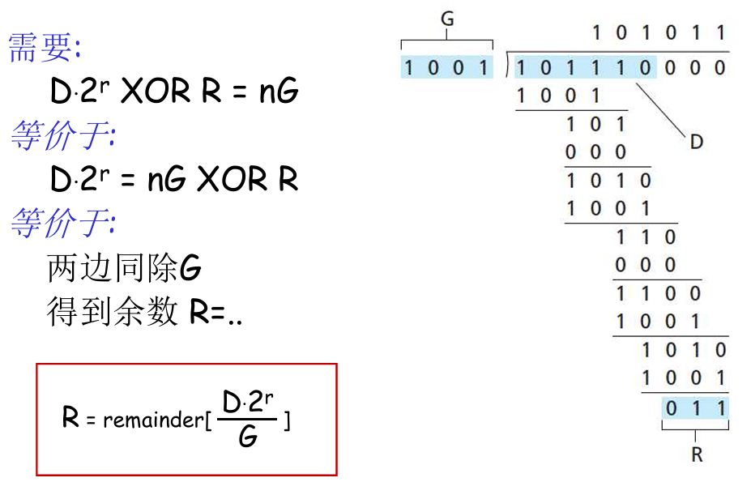

> 发送方通过上述式子算出r位的CRC，并附在该字段D数据位后面
> 接收方收到该字段，通过数据位和低位CRC结合的完整分组模上两端约定好的生成多项式G，若余数为0，则没有出错

---

## 两种类型的网络链路：
**点对点链路（point-to-point link）**：拨号访问的PPP，以太网交换机和主机之间的点对点链路，**广域网**
**广播链路（broadcast link）**：传统以太网，HFC上行链路，802.11无线局域网

## 6.3 点到点访问链路

点对点链路不使用ARP协议，
> 因为在设置这些链路时，网络设备已获得了链路两端的IP地址，不需要ARP协议来实现IP地址和不同网络硬件地址的动态映射。

## 6.4 多路访问链路和协议(MAP)

> Multiple Acess Links and Protocol

**多路访问链路定义**：多路访问链路是指允许多个终端或设备同时连接到同一链路上的通信方式。在这种链路中，多个站点共享一个介质，并且需要一种协议来控制哪个站点可以发送数据。

> PPP并不是多路访问链路的通信方式

**多路访问协议(MAC协议)**：多路访问协议是一种控制共享信道在节点之间共享的**分布式算法**，它利用信道本身进行信道共享的协商、通信，控制信息传输采用带内机制。
> 这种协议主要用于解决**多个发送和接收节点如何访问一个共享广播**信道的问题。

> **介质访问控制协议：MAC协议** === 算法的角度称MAC，协议的角度称为MAP(通常用MAC)
> **mac地址**：又称为物理地址或硬件地址，是一个唯一的标识符，用于在网络中识别设备。它通常由48位二进制数表示，分为6组，每组8位，用冒号或连字符分隔。
>> **MAC协议**通过**MAC地址**来标识网络中的每个设备，并控制数据帧的传输过程。

- 传输的帧在接收方可能在接收方处碰撞（collide）；
- 3种类型多路访问协议(MAC协议)：信道划分协议，随机接入协议，轮流协议；

### 6.4.1 信道划分协议

> Channel Partitioning Protocols

- **时分多路复用（time-division multiplexing，TDM）**；
    - 轮流使用信道，信道的时间分为周期
    - 每个站点使用每周期中固定的时隙(长度=帧传输时间)传输帧
    - 如果站点无帧传输，时隙空闲===>浪费
- **频分多路复用（frequency-division multiplexing，FDM）**；
    - 信道的有效频率范围被分成一个个小的频段
    - 每个站点被分配一个固定的频段
    - 分配给站点的频段如果没有被使用，则空闲
- **码分多址（Code Division Multiple Access，CDMA）**；
    - 所有站点在整个频段上同时进行传输, 采用编码原理加以区分
    - 完全无冲突
    > 假定：信号同步很好,线性叠加

> TDM:不同的人在不同的时刻讲话
> FDM:不同的组在不同的小房间里通信
> CDMA:不同的人使用不同的语言讲话

前两种传输速率：R\N bps

### 6.4.2 随机接入协议

> Random Access Protocols

- 当节点有帧要发送时
    - 以信道带宽的全部R `bps`发送
    - 没有节点间的预先协调
> 两个或更多节点同时传输，会发生➜冲突“collision”
- **随机存取协议**规定: 
    - 如何检测冲突
    - 如何从冲突中恢复（如：通过稍后的重传）
> 随机MAC协议:
> - 时隙ALOHA
> - ALOHA
> - CSMA, **CSMA/CD**, **CSMA/CA**

#### 时隙ALOHA

在每个节点中，时隙ALOHA的操作如下：

- 当节点有一个新帧要发送时，它等到下一个间隙开始并在该时隙传输整个帧；
- 如果没有碰撞，该节点成功地传输它的帧，从而不需要考虑重传该帧；
- 如果有碰撞，该节点在时隙结束之前检测到这次碰撞，该节点以概率p在后续的每个时隙中重传它的帧，直到该帧被无碰撞的传输出去；

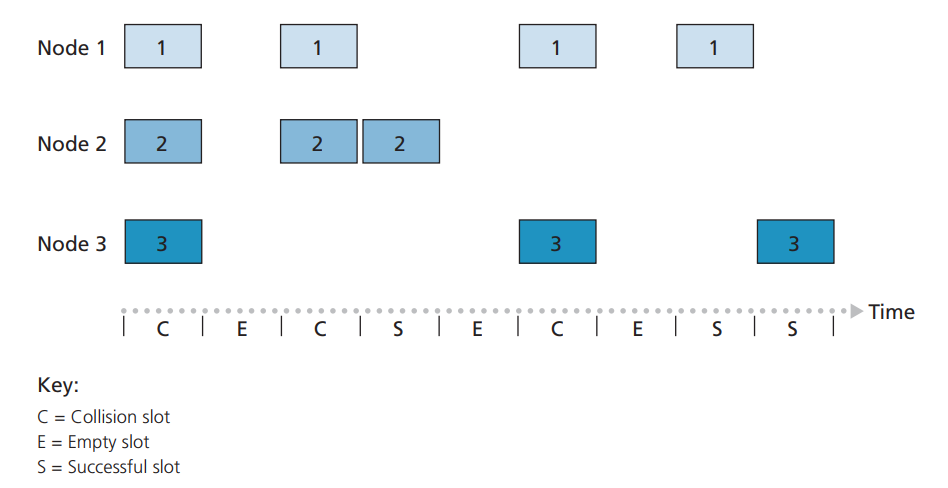

优点：
- 节点可以以信道带宽全速连续传输
- 高度分布：仅需要节点之间在时隙上的同步
- 简单

缺点：
- 存在冲突，浪费时隙
- 即使有帧要发送，仍然有可能存在空闲的时隙
- 节点检测冲突的时间<帧传输的时间
    > 必须传完
- 需要时钟上同步

> 没有延迟保证，有可能一直发生碰撞，导致信道空闲

#### ALOHA

在纯ALOHA(无时隙)中，当一帧首次到达，节点立刻将该帧完整地传输进广播信道；

**无时隙ALOHA**：
- 简单、无须节点间在时间上同步
- 当有帧需要传输：马上传输
- 冲突的概率增加

#### 波载侦听多路访问（CSMA/CD）

> Carrier Sense Multiple Access with Collision Detection

**CSMA(载波侦听多路访问)**
**概念**：CSMA协议要求站在传输数据之前首先侦听媒体是否空闲。如果空闲则发送数据，否则等待通道空闲。
> 类比在说话前，先看对方是否在说话，若有人在说话，则推迟

**CSMA冲突**
> 通过局部来判断全局，因此可能会发生冲突
- 冲突仍然可能发生:
    - 由传播延迟造成：两个节点可能侦听不到正在进行的传输
- 冲突:
   - 整个冲突帧的传输时间都被浪费了，是无效的传输(红黄区域)
- 注意：
    - 传播延迟（距离）决定了冲突的概率

> 节点依据本地的信道使用情况来判断全部信道的使用情况

**CSMA/CD(冲突检测)**
> CS发送前监听一次，CD一边发送一边侦听

**概念**：和在CSMA中一样发送前侦听信道，没有传完一个帧就可以在短时间内检测到冲突，冲突发生时则传输终止，减少对信道的浪费

以太网CSMA/CD算法：
**步骤**：
1. 适配器获取数据报，创建帧
2. 发送前：侦听信道CS
    - 闲：开始传送帧
    - 忙：一直等到闲再发送
3. 发送过程中，冲突检测CD
    - 没有冲突:成功
    - 检测到冲突:放弃,之后尝试重发
    .发送方适配器检测到冲突，
4. 发送方适配器检测到冲突，除放弃外，还发送一个Jam信号，所有听到冲突的适配器也是如此
**强化冲突：让所有站点都知道冲突**
5. 如果放弃，适配器进入指数退避状态
在第m次失败后，适配器随机选择一个{0，1，2，，2^m-1}中K，等待K*512位时，**然后转到步骤2** 
> (exponential backoff) 二进制指数退避算法

**指数退避**:

**目标**：适配器试图适应当前负载，在一个变化的碰撞窗口中随机选择时间点尝试重发
> - 高负载：重传窗口时间大，减少冲突，但等待时间长
> - 低负载：使得各站点等待时间少，但冲突概率大

首次碰撞：在{0，1}选择
第2次碰撞：在{0，1，2，3}选择
第10次碰撞：在{0，1，2，3，……，1023}选择
延迟时间为K*51.2微秒
> 51.2微妙为争用期时间，发送数据在信道中往返时间

> 争用期又称为**冲突窗口**

**CSMA/CD 效率**

**定义**：当有大量的活跃节点, 且每个节点有大量的帧要发送时，帧在信道中无碰撞地传输的那部分时间在长期运行时间中所占的份额

- 令ddrop表示信号能量在任意两个适配器之间传播所需的最大时间。
- 令dtrans表示传输一个最大长度的以太网帧的时间

近似式为：
- 当ddrop接近0时，效率接近1。即传播时延是0,碰撞的节点将立即中止而不会浪费信道
- dtrans变得很大时，效率也 接近于1。因为当一个帧取得了信道时，它将占有信道很长时间；因此信道在大多数时间都会有效地工作

> CSMA/CD比ALOHA有更好的性能，而且简单，廉价，分布式

#### CSMA/CA

> 用于WLAN

> WLAN构成
> - 基站：AP(Access Point) (网络基础设施)
> - 无线链路
> - 移动主机节点

在无线局域网中，不发生冲突与成功传输间**没有关系**

**802.11WLAN**: 没有冲突检测!
无法检测冲突：自身信号远远大于其他节点信号
即使能CD：不冲突!=成功
- 目标: **avoid collisions:CSMA/C(ollision)A(voidance)**
    - 无法CD，一旦发送一股脑全部发送完毕，不CD
    > 原因：无线网特性，以及其隐藏终端和暴露终端的问题。
    - 为了避免无CD带来的信道利用率低的问题，**事前进行冲突避免**

**CSMA/CA** 协议**工作原理** :

发送方：
1. 如果站点侦测到信道空闲持续DIFS长，则传输整个帧(no CD)
2. 如果侦测到信道忙碌，那么选择一个随机回退值，并在信道空闲时递减该值；如果信道忙碌，回退值不会变化到数到0时（只生在信道闲时）发送整个帧如果没有收到ACK, 增加回退值，**重复2**

接收方：
- 如果帧正确，则在SIFS后发送ACK


> **三种机制** :
> - RTS/CTS 帧
> - 预约信道
> - ACK 帧

> **以太网链路**质量好，需要冲突检测，不需要确认，**无线网**需要确认，不需要冲突检测，通过提前监听避免冲突的发生。

### 6.4.3 轮流协议

通过轮流访问信道来避免冲突。
> 要发送的节点越多，轮流时间越长。

轮流协议包括**轮询协议**和**令牌传递协议**

> 解决了信道划分MAC协议和随机访问MAC协议下，低负载好，高负载传输差(发生碰撞)的缺点

#### 轮询协议
- 节点之一要被指定为**主节点**
- 主节点以循环的方式轮询每个节点
- 先向节点1发送一个报文，告诉它（节点1）能够传输的帧的最多数量
- 在节点1传输了某些帧后，主节点告诉节点2它（节点2）能够传输的帧的最多数量

优点：消除了困扰随机接入协议的碰撞和空时隙

缺点：该协议引入了轮询时延。如果主节点有故障，整个信道都变得不可操作

#### 令牌传递协议

- 一个称为**令牌**的**小的特殊帧**在节点之间以某种固定的次序进行交换
- 当一个节点收到令牌时，仅当它有一些帧要发送时，它才持有这个令牌
- 否则，它立即向下一个节点转发该令牌

优点：令牌传递是分散的，并有很高的效率

缺点：一个节点的故障可能会使整个信道崩溃。如果一个节点偶然忘记了释放令牌，则必须调用某些恢复步骤使令牌返回到循环中来

### 6.4.4 DOCSIS：用于电缆因特网接入的链路层协议

**数据经电缆服务接口规范**（DOCSIS）定义了电缆数据网络体系结构及其协议

- 多个40Mbps 下行(广播)信道,FDM
    - 下行：通过FDM分成若干信道，互联网、数字电视等
    - 互联网信道：只有1个CMTS在其上传输
- 多个30Mbps 上行的信道,FDM
    - 多路访问：所有用户使用；接着TDM分成微时隙
    - 部分时隙：分配；部分时隙：竞争


- 采用FDM进行信道的划分：若干上行、下行信道
- 下行信道:
    - 在下行MAP帧中：CMTS告诉各节点微时隙分配方案，分配给各站点的上行微时隙
    - 另外：头端传输下行数据（给各个用户）
- TDM上行信道：
    - 采用TDM的方式将上行信道分成若干微时隙：MAP指定
    - 站点采用分配给它的微时隙上行数据传输：分配
        - 在特殊的上行微时隙中，各站点请求上行**微时隙**竞争
        - 各站点对于该时隙的使用是随机访问的
        - 一旦碰撞（请求不成功，结果是：在下行的MAP中没有为它分配，则二进制退避）选择时隙上传输

## 6.5 交换局域网

### 6.5.1 链路层寻址和ARP

#### MAC地址
并不是主机或路由器具有链路层地址，而是它们的**适配器**（即网络接口或**网卡**）具有**链路层地址**

> 链路层地址有各种不同的称呼:LAN地址、物理地址或MAC地址

- MAC地址长度为6字节(**48bits**)，共有2^48^ 个可能的MAC地址，地址的每个字节被表示为一对十六进制数
> ip地址**32bits**

- 没有两块**适配器**具有相同的地址

- 适配器的MAC地址具有扁平结构，而且不论适配器到哪里用都不会变化

当某适配器要向某些目的适配器发送一个帧时，发送适配器将目的适配器的MAC地址插入到该帧中，并将该帧发送到局域网上

- 当适配器接收到一个帧时，将检查该帧中的目的MAC地址是否与它自己的MAC地址匹配
- 如果匹配，该适配器提取出封装的数据报，并将该数据报沿协议栈向上传递
- 如果不匹配，该适配器丢弃该帧，而不会向上传递该网络层数据报

有时某发送适配器的确要让局域网上所有其他适配器来接收并处理它打算发送的帧。发送适配器在该帧的目的地址字段中插入一个特殊的MAC广播地址：是48个连续的1组成的字符串（即以十六进制表示法表示的FF- FF- FF- FF- FF - FF）

**IP地址和MAC地址的作用不同**

- IP地址是**分层的**
- 一个子网所有站点网络号一致，路由聚集，减少路由表
    - 需要一个网络中的站点地址网络号一致，如果捆绑需要定制网卡非常麻烦
    - 希望网络层地址是配置的；IP地址完成网络到网络的交付
- mac地址是一个**平面的**
    - 网卡在生产时不知道被用于哪个网络，因此给网卡一个唯一的标示，用于区分一个网络内部不同的网卡即可
    - 可以完成一个物理网络内部的节点到节点的数据交付

**网络地址和mac地址分离**

- 分离好处

    - 网卡坏了，ip不变，可以捆绑到另外一个网卡的mac上
    - 物理网络还可以除IP之外支持其他网络层协议， 链路协议为任意上层网络协议， 如IPX等
- 捆绑的问题

    - 如果仅仅使用IP地址，不用mac地址，那么它仅支持IP协议
    - 每次上电都要重新写入网卡IP地址；
    - 另外一个选择就是不使用任何地址；不用MAC地址，则每到来一个帧都要上传到IP层次，由它判断是不是需要接受，干扰一次

#### 地址解析协议

地址解析协议（ARP)：转换网络层地址（例如，因特网的IP地址）和链路层地址（即MAC地址）

问题是：已知B的IP地址，如何确定B的MAC地址?

- 每台主机或路由器在其内存中具有一个ARP表，包含IP地址到MAC地址的映射关系
- TTL时间是指地址映射失效的时间
- 典型是20min

如果ARP表中当前没有该目的主机的表项，又该怎么办

- A广播包含B的IP地址的ARP查询包
- B接收到ARP包，回复A自己的MAC地址
    - 帧发送给A
    - 用A的MAC地址（单播）
- A在自己的ARP表中，缓存IP-to-MAC地址映射关系 ，直到信息超时
- 发送A的IP数据报，该帧的目的MAC就是B的MAC地址

把ARP看成是**跨越链路层和网络层边界两边的协议**

#### 发送数据报到子网以外

发送数据报：由A通过R到B，假设A知道B的IP地址

* 在R上有两个ARP表，分别对应两个子网
* 在源主机的路由表中，发现到目标主机的下一跳时111.111.111.110
* 在源主机的ARP表中，发现其MAC地址是E6-E9-00-17-BB-4B

编址：
* A创建数据报，源IP地址：A；目标IP地址：B
* A创建一个链路层的帧，目标MAC地址是R，该帧包含A到B的IP数据报
* 帧从A发送到R，帧被R接收到，从中提取出IP分组，交给上层IP协议实体
* R转发数据报，数据报源IP地址为A，目标IP地址为B
* R创建一个链路层的帧，目标MAC地址为B，帧中包含A到B的IP数据报

> 发送分组的**源ip**与**目标ip**在每一跳不发生改变
> 在每一跳中，**源mac地址**和**目标mac地址**不断发生改变

### 6.5.2 以太网

> 以太网（Ethernet）是一种广泛使用的局域网（Local Area Network，LAN）技术

#### 以太网帧结构


- **数据字段**（46 ~ 1500字节）：这个字段承载了IP数据报。以太网的最大传输单元 （MTU）是1500字节
    - 如果IP数据报超过了1500字节，数据报分片
    - 如果IP数据报小于46字节，填充到46字节
- **目的地址**（6字节）：这个字段包含目的适配器的MAC地址
- **源地址**（6字节）：包含了传输该帧到局域网上的适配器的MAC地址
- **类型字段**（2字节）：类型字段允许以太网复用多种网络层协议
- **CRC** （4字节）：使得接收适配器检测帧中是否引入了差错
- **前同步码**（8字节）：以太网帧以一个8字节的前同步码字段开始。
    - 前7字节的值都是1010101，用于“唤醒”接收适配器，并且将它们的时钟和发送方的时钟同步
    - 最后一个字节是10101011，的最后两个比特（第一个出现的两个连续的1）警告接收适配器, “重要的内容”就要到来了

以太网：无连接、不可靠的服务

- **无连接**：帧传输前，发送方和接收方之间没有握手
- **不可靠**：接收方适配器不发送ACKs或NAKs给发送方
    - 递交给网络层的数据报流可能有间隙

#### 以太网技术

很多不同的以太网标准

* 相同的MAC协议（介质访问控制）和帧结构
* 不同的速率：2 Mbps、10 Mbps 、100 Mbps 、1Gbps 、10G bps
* 不同的物理层标准
* 不同的物理层媒介：光纤，同轴电缆和双绞线

以太网使用CSMA/CD

> 低负载好，CSMA/CD特性
> 高负载好：switch交换机

> **100BASE-T**
> 100Mbps BASE基带信号 T双绞线

### 6.5.3 链路层交换机

> 由集线器HUB升级而来
> Hub中，所有节点都在一个碰撞域范围内，**一个时刻最多一个节点发送**，速率也要同步

**Hub集线器**，可以级联，由某一端口连接至另一个Hub
与Hub集线器连接的设备处在**同一网段**

> 交换机，每个节点以及相连的交换机端口使用(独立的)以太网协议（不会和其他节点的发送产生碰撞）

交换机也可以级联，由级联端口与另外的交换机进行连接

交换机的任务是接收入链路层帧并将它们转发到出链路

到交换机自身对子网中的主机和路由器是透明的

> 通常一个交换机的端口可以认为是**一个独立的网段**

> **网段**是由网络前缀（即网络号）加上主机地址共同组成的一段地址范围，用来划分一个网络中各个子网的边界。

#### 交换机转发和过滤

**过滤**：决定一个帧应该转发到某个接口还是应当将其丢弃的交换机功能

**转发**：决定一个帧应该被导向哪个接口，并把该帧移动到那些接口的交换机功能

交换机的过滤和转发借助于交换机表完成，表项包含

* 一个MAC地址
* 通向该MAC地址的交换机接口
* 表项放置在表中的时间


过滤和转发工作过程：

假定目的地址为DD-DD-DD-DD-DD-DD的帧从交换机接口x到达，索引表可能的情况如下：

* 表中没有对于DD-DD-DD-DD-DD-DD的表项。交换机广播该帧
* 表中有一个表项将DD-DD-DD-DD-DD-DD与接口x联系起来。无须将该帧转发到任何其他接口，交换机通过丢弃该帧执行过滤功能即可
* 表中有一个表项将DD-DD-DD-DD-DD-DD与接口y≠x联系起来。交换机通过将该帧放到接口y前面的输出缓存完成转发功能

假设一个帧从接口1到达交换机。交换机检查它的表并且发现其目的地是在与接口1相连的局域网网段上网。这意味着该帧已经在包含目的地的局域网网段广播过了。因此该交换机过滤（即丢弃）了该帧。现在假设有同样目的地址的帧从接口2到达。交换机再次检查它的表并且发现其目的地址在接口1的方向上；因此它向接口1前面的输出缓存转发该帧

每个帧在进入链路时，要进行**载波侦听CSMA/CD**，若直接连接（点到点），没有碰撞，**全双工通信**
> MAC协议在内部被弱化了(在点到点直接连接的方式下没有实际作用，摆个样子)

> 过程：ip分组由路由器路由转发，发送给网卡，网卡将分组封装成帧发送给交换机，交换机将帧交换给目标网卡，目标网卡通过解封装，将帧变为ip分组，之后进行后续操作

#### 自学习

交换机的表是自动、动态和自治地建立的，即没有来自网络管理员或来自配置协议的任何干预，即自学习的，通过以下方式实现：

1. 交换机表初始为空
2. 对于在每个接口接收到的每个入帧，该交换机在其表中存储：1）在该帧源地址字段中的MAC地址。2）该帧到达的接口。3）当前时间。记录了发送节点所在的局域网网段
3. 如果在一段时间（称为老化期）后，交换机没有接收到以该地址作为源地址的帧，就在表中删除这个地址

> **内部交换表结构**：(主机的MAC地址，到达该MAC经过的接口，时戳TTL)

交换机是**即插即用设备**, 因为它们不需要网络管理员或用户的干预

> 主机直接接到交换机的端口上，称为**点到点**的访问接入方式

> 若交换机的端口接入了另外一个Hub集线器，此时为**多点接入**的访问接入方式

#### 链路层交换机的性质

**消除碰撞**：在使用交换机（不使用集线器）构建的局域网中，没有因碰撞而浪费的带宽
**异质的链路**：交换机将链路彼此隔离，因此局域网中的不同链路能够以不同的速率运行并且能够在不同的媒体上运行
**管理**：除了提供强化的安全，交换机也易于进行网络管理
**透明**：主机对交换机的存在可以不关心
> 通过交换机相联的各节点好像这些站点是直接相联的一样
> 在点到点了连接方式下，弱化了**介质访问控制（MAC）**，只进行交换操作

#### 交换机和路由器比较

- 都是存储转发设备，但层次不同
    - 交换机：链路层设备（检查链路层头部）
    - 路由器：网络层设备（检查网络层的头部）
- 都有转发表：
    - 交换机：维护交换表，按照MAC地址转发
        - 执行过滤、自学习和生成树算法
        - 即插即用；二层设备，速率高
        - 执行生成树算法，限制广播帧的转发
        - ARP表项随着站点数量增多而增多
    - 路由器：维护路由表，执行路由算法
        - 路由算法能够避免环路，无需执行生成树算法，可以以各种拓扑构建网络
        - 对广播分组做限制
        - 不是即插即用的，配置网络地址（子网前缀）
        - 三层设备，速率低

> 

### 6.5.4 虚拟局域网

现代机构的局域网常常是配置为等级结构的,每个工作组（部门）有自己的交换局域网，经过一个交换机等级结构与其他工作组的交换局域网互联，但有以下缺点：

- 缺乏流量隔离
- 交换机的无效使用
- 管理用户

支持**虚拟局域网**VLAN的交换机允许经一个单一的物理局域网基础设施定义多个虚拟局域网

在一个VLAN内的主机彼此通信，仿佛它们（并且没有其他主机）与交换机连接

基于端口的VLAN：

- 交换机的端口（接口）由网络管理员划分为组
- 每个组构成一个VLAN,在每个VLAN中的端口形成一个广播域

物理上一个交换机，虚拟成多个局域网


端口 2 ~8属于电气工程系（EE） VLAN,而端口 9 ~ 15属于计算机科学系（CS）VLAN （端口1和16未分配）。交换机端口8的用户加入计算机科学系时，网络操作员只需重新配置VLAN软件,使得端口8与CS VLAN相关联即可

- 来自电子工程系的流量怎样才能发送到计算机科学系呢？

将VLAN交换机的一个端口（如上图端口1）与一台外部的路由器相连，并且将该端口配置为属于EE VLAN和CS VLAN
连接具有两个VLAN的两台VLAN交换机呢？


- 在每台交换机上定义一个属于CS VALN的端口（对EE VLAN也类似处理），并且如图a所示将这两个端口彼此互联起来
- VLAN干线连接：如图b中，每台交换机上的一个特殊端口（左侧交换机上的端口16, 右侧交换机上的端口 1）被配置为干线端口，以互联这两台VLAN交换机

一个交换机怎样知道到达干线端口的帧属于某个特定的VLAN呢？

一种扩展的以太网帧格式——802.1Q：


VLAN标签：
- 2字节的标签协议标识符（TPID）字段（具有固定的十六进制值81-00）
- 2字节的标签控制信息字段（包含一个12比特的VLAN标识符字段）
- 3比特优先权字段（具有类似于IP数据报TOS字段的目的）组成