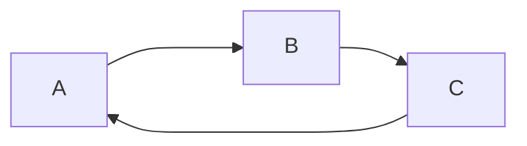

自动插入动态目录可以使用这条指令
`<!-- @import "[TOC]" {cmd="toc" depthFrom=标题级数1 depthTo=标题级数2 orderedList=false} -->`

<!-- code_chunk_output -->

- [生成目录](#生成目录)
- [你好](#你好)
- [标题](#标题)
- [标题1](#标题1)
  - [标题2](#标题2)
- [表格](#表格)
- [有序列表](#有序列表)
- [无序列表](#无序列表)
- [任务列表](#任务列表)
- [代码块](#代码块)
- [数学公式](#数学公式)
- [脚注](#脚注)
- [横线](#横线)
- [链接](#链接)
- [图片](#图片)
- [转义字符](#转义字符)
- [强调标识](#强调标识)
- [ditaa绘图](#ditaa绘图)
- [Kroki绘图](#kroki绘图)
- [puml绘图](#puml绘图)
- [mermaid绘图](#mermaid绘图)

<!-- /code_chunk_output -->

<!-- @import "[TOC]" {cmd="toc" depthFrom=1 depthTo=2 orderedList=false} -->

# 生成目录

[TOC]

# 你好

# 标题

> # 标题1
>
> ## 标题2
>
> ### 标题三
>
> #### 标题四 一共有六个
>
> 一级标题另外形式
> =====
>
> 二级标题另外形式
> -

> 或者使用任意文字下方添加任意数量的=标识一级标题
> 使用任意文字下方添加任意数量的-标识二级标题

# 表格

|           表格 | 年龄            |        姓名         |
| -------------: | :-------------- | :-----------------: |
| 右对齐aaaaaaaa | 左对齐aaaaaaaaa | 居中对齐aaaaaaaaaaa |

# 有序列表
>
>必须从1开始,并且与序号.后各一个空格

1. 列表1
2. 列表2
3. 列表3

# 无序列表
>
> -和*都可以标识无序列表项,
>两个符号切换时中间会间隔一行来区分不同类型

- 表项1
- 表项2

- 表项3

- 表项4

# 任务列表
>
>打不出来这里,不知道原因 注意-[ ] 括号中有空格,括号后也有空格

明天要做的事：

- [x] 吃饭
- [ ] 睡觉

# 代码块
>
>三个反引号+要使用的语言 退出代码块再加三个反引号

```c
#include <stdio.h>
int main(){
    printf("hello world！");
    return 0;
}
```

# 数学公式
>
> **块内数学公式**
> 两个&&符号包裹的部分 内部写入对应的公式
> 引用也可以包裹公式
> $$
> \frac{\partial f}{\partial x}
> $$
>
> **行内数学公式**
> $\theta=x^2$
>
> ##### 上下标
>
> H~2~O
> X^2^

# 脚注
>
>在需要标脚注的位置加上[^脚注内容]
>在文章结尾解释脚注[^脚注内容]:解释...

脚注：
你好[^打招呼]

[^打招呼]:打招呼

# 横线
>
>利用 --- 标识
---
内容一

---

# 链接
>
> 中括号[],内部写入链接文本
> 后面加(链接地址 鼠标悬浮时提示信息)

[百度](baidu.com "一个搜索引擎")

> 引用链接
> 利用[],后面加上[id]
> 在后续定义id 的值
> 中间要间隔

[sougou][id],[sougou][id] [sougou][id]

[id]:sougou.com "搜狗引擎"

> 设置链接为标题

[标题1](#标题1)

> 网址和Email地址
> 使用尖括号可以很方便地把URL或者email地址变成可点击的链接。

<https://markdown.com.cn>
<fake@example.com>

> 带格式化的链接
> 强调 链接, 在链接语法前后增加星号。 要将链接表示为代码，请在方括号中添加反引号。

I love supporting the **[EFF](https://eff.org)**.
This is the *[Markdown Guide](https://www.markdownguide.org)*.
See the section on [`code`](#代码块).

# 图片

>要添加图像，请使用感叹号 (!), 然后在方括号增加替代文本，图片链接放在圆括号里，括号里的链接后可以增加一个可选的图片标题文本。
>
>插入图片Markdown语法代码：``。

>链接图片
>给图片增加链接，请将**图像的Markdown 括在方括号**中，然后将链接添加在*圆括号中*。
>
>`[](https://markdown.com.cn)`

# 转义字符
>
>要显示原本用于格式化 Markdown 文档的字符，请在字符前面添加反斜杠字符 \ 。

- Without the backslash, this would be a bullet in an unordered list.
\* Without the backslash, this would be a bullet in an unordered list.

# 强调标识
>
>利用 * 或者 _ 来标注
> **粗体**
> *斜体*
> ***斜体粗体***
>
> 高亮
> ==你好==

# ditaa绘图

> 当前VSCode中的MPE插件无法配置ditaa的jar包路径，==无法正常使用！！！==

下载ditaa的jar包，配置环境变量即可

```ditaa {cmd=true args=["-E"]}
        +-------+
        |       |
        |       |
        |       | 
        +-------+
```

```ditaa {cmd=true args=["-E"]}
+-------+
|       |
|  {d}  |
|       | 
+-------+
```

```ditaa {cmd=true args=["-E"]}
    /-----------------\
    | Things to do    |
    | cGRE            |
    | o Cut the grass |
    | o 中文字符       |
    | o Fix car       |
    | o Make website  |
    \-----------------/
```
# Kroki绘图

```blockdiag {kroki=true}
blockdiag {
  Kroki -> generates -> "Block diagrams";
  Kroki -> is -> "very easy!";

  Kroki [color = "greenyellow"];
  "Block diagrams" [color = "pink"];
  "very easy!" [color = "orange"];
}
```

# puml绘图

```puml

A -> B

B -> C

```

# mermaid绘图

