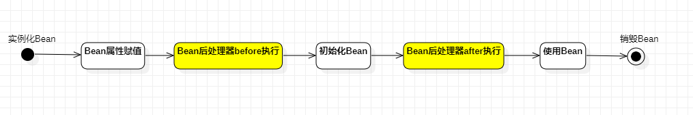
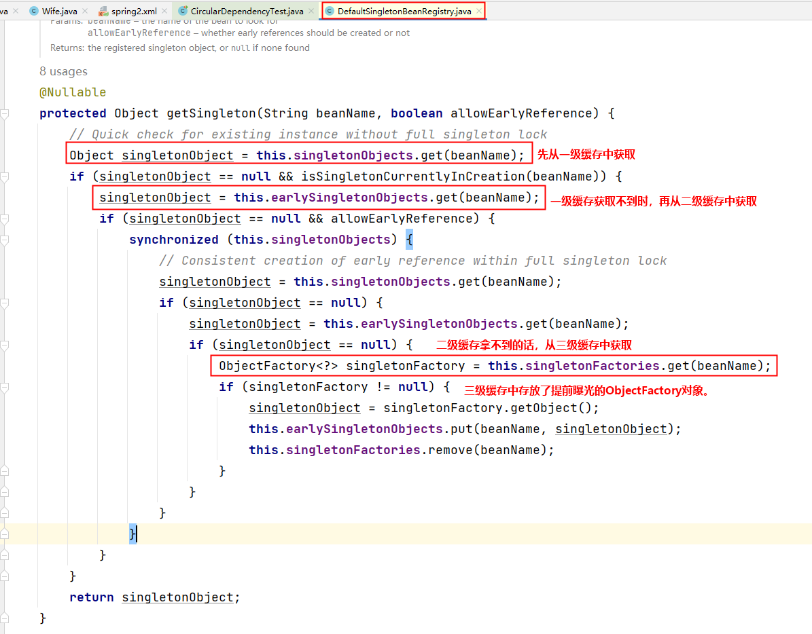
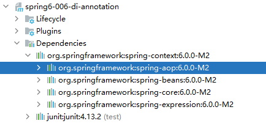

# spring

[TOC]

## 引入

---

```java
/**
 * 业务层
 * 
 * 在创建该对象时，需要依赖下层对象的创建
 **/
class Service {
    //需要依赖下层
    private Dao dao = new Dao();

    public void test() {
        dao.func();
    }
}
```

> 在一般的的MVC架构下(**如上述代码**)，模型、视图和控制器之间通常存在直接的依赖关系。在某些实现中，视图可能会直接访问模型的数据，而不是通过控制器。使得该架构下耦合度高，难以后续进行扩展与维护，违反了**OCP原则**和**DIP原则**。

**OCP原则**：OCP是较件七大开发原则当中**最基本的**一个原则(开闭原则)。
- 对扩展开放，对修改关闭

**DIP原则**：依赖倒置原则，上层不依赖下层。
- 倡导面向接口编程，面向抽象编程，不要面向具体编程

> 可以采用 **控制反转(IoC)** 来解决这个问题

（思想）**控制反转**：IoC(Inversion of Control)，一种新型的设计模式，由于出现的比较晚，没有被纳入GoF23种设计模式范围内。
- 反转：不在程序中采用硬编码来**创建对象**；不在程序中采用硬编码的方式来**维护对象的关系**
  
**控制反转的核心**是：**将对象的创建权交出去，将对象和对象之间关系的管理权交出去，由第三方容器来负责创建与维护**。

**Spring框架**：
- Spring框架**实现了控制反转IoC**这种思想，可以帮你new对象，帮你维护对象和对象之间的关系。
- Spring是一个实现了IoC思想的**容器**。

> 依赖注入：对象A与对象B之间的关系 (依赖) ，靠注入的手段来维护。

（实现方式）**依赖注入(Dependency Injection，简称 DI )**：一种比较重要的控制反转实现方式。
- DI常用方式一：**set注入**(执行set方法给属性赋值)
- DI常用方式二：**构造方法注入**(执行构造方法给属性赋值)


## Spring概述

---

> Spring是一个轻量级的控制反转(IoC)和面向切面(AOP)的容器框架。
> Spring最初的出现是为了解决EJB腕肿的设计,以及难以测试等问题。
> Spring为简化开发而生,让程序员只需关注核心业务的实现,尽可能的不再关注非业务逻辑代码(事务控制,安全日志等)。

**Spring 八大模块**：
注意:Spring5版本之后是8个模块,在Spring5中新增了WebFlux模块

- Spring Core **(核心)** ：控制反转
- Spring AOP：面向切面编程
- Spring Web：支持集成常见的Web框架：structs，webwork...
- Spring Web MVC：Spring自己提供的一套MVC框架
- Spring WebFlux **(Spring 6新增)** ：Spring提供的Web响应式框架
- Spring DAO：提供了单独的JDBC操作的API
- Spring ORM：支持集成其他常见的ORM框架：MyBatis，Hibernate...
- Spring Context：Spring上下文，提供了各种模板等的支持

**Spring特点**：
1. 轻量，非侵入式设计(对象不依赖其他特定类)
2. 控制反转：通过依赖注入来实现
3. 面向切面
4. 容器：Spring包含并管理应用对象的配置和生命周期(某种意义上的一种容器)，容器中存储的对象称为Bean
5. 框架

## Spring入门

--- 

使用xml配置文件向Spring容器中注入bean对象(创建bean对象)

> Spring配置文件可以任意命名，配置文件可以有多个

> bean的id不能重复
> bean可以是自定义类，也可以是JDK已有的类

```xml
<?xml version="1.0" encoding="UTF-8"?>
<beans xmlns="http://www.springframework.org/schema/beans"
       xmlns:xsi="http://www.w3.org/2001/XMLSchema-instance"
       xsi:schemaLocation="http://www.springframework.org/schema/beans http://www.springframework.org/schema/beans/spring-beans.xsd">
    <!-- IDEA 为我们提供了这个文件的使板,定要使用运个模板来创建 -->
    <!-- 这个文件是好是放在类路径当中,方便后期的移植。 -->
    <!--
           放在resources根录下,就相当子是到了类的根路径下。
           配置bean,这样spring才可以帮助我们管理这个对象

            bean标签的两个重要性:
                id:是这个bean的身份证号,不能重复,是唯一的标识。
                class,须填写类的全路径,全定类名。(带包名的类名)
    -->

    <bean id="userBean" class="com.xcq.spring06.bean.User1"></bean>
    <!-- <bean id="userBean" class="com.xcq.spring06.bean.User2" />  id重复，会报错！ -->
</beans>
```

获取Spring容器，并根据bean的id获取对应的bean对象

> 默认情况下Spring会通过反射机制,调用类的**无参数构造方法**来实例化对象。
> 若使用有参构造方法注入则会使用有参构造方法
>
> getBean("bean的id") 若id不存在，则会**抛出异常**而非返回null

```java
/*
    ApplicationContext 翻译为：应用上下文。其实就是Spring容器。
    ApplicationContext 是一个接口,
    ApplicationContext 接口下有很多实现类，其中有一个实现类叫做CLassPathXmlApplicationContext
    CLassPathXmlApplicationContext 从类路径当中加载spring配置文件的一Spring上下文对象。
*/
    //代码只要执行:就相当于启动了Spring容器,解析了spring.xml文件，并实例化所有的bean对象,放到spring容器当中。

    //参数可以有多个配置文件(可变长参数)
    //new该实现类时就会创建bean对象
    ApplicationContext applicationContext = new ClassPathXmlApplicationContext("spring.xml"); 

    //获取bean对象
    Object userBean = applicationContext.getBean("userBean");

    //若不想强制类型转化，也可以使用另一个重载的getBean()方法
    User userBean2 = applicationContext.getBean("userBean", User.class);

    System.out.println(userBean);
```

Spring会将创建好的对象存储在Map集合中

> XML配置文件中，bean标签属性 
> key ：id
> value ：class


若Spring配置文件不在类目录下，需要创建`FileSystemXmLApplicationContext`实现类对象来获取
```java
ApplicationContext applicationContext = new FileSystemXmLApplicationContext("文件路径");
```

> AppLicationContext接口的超级父接口是:BeanFactory (翻译为Bean工厂,就是能够生成Bean对象的一个工厂对象。
> BeanFactory是IoC容器的顶级接口。
> Spring的IoC容器底层采用了：工厂模式。

Spring的IoC是通过：**XML解析 + 工厂模式 + 反射机制**实现的

## Spring6启用Log4j2日志框架

引入Log4j2依赖
```xml
<!-- https://mvnrepository.com/artifact/org.apache.logging.log4j/log4j-core -->
<dependency>
    <groupId>org.apache.logging.log4j</groupId>
    <artifactId>log4j-core</artifactId>
    <version>2.23.1</version>
</dependency>
```

在类的根路径下提供`log4j2.xml`配置文件（**文件名固定为:log4j2.xml, 文件必须放到类根路径下**。）
```xml
<?xml version="1.0" encoding="UTF-8"?>
<Configuration xmlns="http://logging.apache.org/log4j/2.0/config">
    <Appenders>
        <!--输出日志信息到控制台-->
        <Console name="spring6log" target="SYSTEM_OUT">
            <!--控制日志输出的格式-->
            <PatternLayout pattern="%d{yyyy-MM-dd HH:mm:ss SSS} [%t] %-3level %logger{1024} - %msg%n"/>
        </Console>
    </Appenders>

    <Loggers>
        <!--
            level指定日志级别，从低到高的优先级：
                ALL < TRACE < DEBUG < INFO < WARN < ERROR < FATAL < OFF
        -->
        <Root level="DEBUG">
            <appender-ref ref="spring6log"/>
        </Root>
    </Loggers>
</Configuration>
```

使用日志框架
```java
//获取FirstSpringTest这个类的日志记录器对象
Logger logger = LoggerFactory.getLogger(FirstSpringTest.class);

//根据不同级别输出日志
logger.info("我是一条消息");
logger.debug("我是一条调试信息");
logger.error("我是一个错误信息");
```


## 1\. Spring对IoC的实现

### 1.1 IoC 控制反转

> 控制反转是一种思想。

控制反转是**为了降低程序耦合度，提高程序扩展力，达到OCP原则，达到DIP原则**。

控制反转，反转的是
-   将对象的创建权利交出去，交给第三方容器负责。
-   将对象和对象之间关系的维护权交出去，交给第三方容器负责。
控制反转这种思想实现：
-   DI（Dependency Injection）：依赖注入


### 1.2 依赖注入
依赖注入**实现**了控制反转的思想。
**Spring通过依赖注入的方式来完成Bean管理的。**
**Bean管理说的是：Bean对象的创建，以及Bean对象中属性的赋值（或者叫做Bean对象之间关系的维护）。**
依赖注入：

-   依赖指的是对象和对象之间的关联关系。
-   注入指的是一种数据传递行为，通过注入行为来让对象和对象产生关系。

依赖注入常见的实现方式包括两种：

-   第一种：set注入
-   第二种：构造注入

---

#### 1.2.1 set注入：

set注入，基于set方法实现的，底层会通过反射机制调用属性对应的set方法然后给属性赋值。这种方式要求属性必须对外提供set方法。

**set注入方式**：

---

1. 注入外部Bean


> 外部Bean的特点：bean定义到外面，在property标签中使用ref属性进行注入。通常这种方式是常用。

> 注入时需要在bean标签中使用property标签，对应两个属性
> - name属性值为：对应set方法名，
> - ref属性值为：依赖的bean对象的id值

```xml
<bean id="userServiceBean" class="com.powernode.spring6.service.UserService">
  <property name="userDao">
    <ref bean="userDaoBean"/>
  </property>
</bean>
```

---

2. 注入内部Bean

内部Bean的方式：在bean标签中嵌套bean标签。

```xml
<?xml version="1.0" encoding="UTF-8"?>
<beans xmlns="http://www.springframework.org/schema/beans"
       xmlns:xsi="http://www.w3.org/2001/XMLSchema-instance"
       xsi:schemaLocation="http://www.springframework.org/schema/beans http://www.springframework.org/schema/beans/spring-beans.xsd">

    <bean id="userServiceBean" class="com.powernode.spring6.service.UserService">
        <property name="userDao">
            <bean class="com.powernode.spring6.dao.UserDao"/>
        </property>
    </bean>

</beans>
```

---

3. 注入简单类型

> 给简单类型赋值，使用value属性或value标签。而不是ref。

创建User对象，内部有int类型的age属性。

```xml
<?xml version="1.0" encoding="UTF-8"?>
<beans xmlns="http://www.springframework.org/schema/beans"
       xmlns:xsi="http://www.w3.org/2001/XMLSchema-instance"
       xsi:schemaLocation="http://www.springframework.org/schema/beans http://www.springframework.org/schema/beans/spring-beans.xsd">
    <bean id="userBean" class="com.powernode.spring6.beans.User">
        <!--如果像这种int类型的属性，我们称为简单类型，这种简单类型在注入的时候要使用value属性，不能使用ref-->
        <!--<property name="age" value="20"/>-->
        <property name="age">
            <value>20</value>
        </property>
    </bean>
</beans>
```

**简单类型包括：**

-   **基本数据类型**
-   **基本数据类型对应的包装类**
-   **String或其他的CharSequence子类**
-   **Number子类**
-   **Date子类(一般将该类作为引用类型来使用)**
-   **Enum子类**
-   **URI**
-   **URL**
-   **Temporal子类**
-   **Locale**
-   **Class**
-   **另外还包括以上简单值类型对应的数组类型。**

> **注意**：
>
> - 如果把Date当做简单类型的话，日期字符串格式不能随便写。格式必须符合Date的toString()方法格式。显然这就比较鸡肋了。如果我们提供一个这样的日期字符串：2010-10-11，在这里是无法赋值给Date类型的属性的。
> - spring6之后，当注入的是URL，那么这个url字符串是会进行有效性检测的。如果是一个存在的url，那就没问题。如果不存在则报错。

---

4. 级联属性赋值

> 在spring配置文件中，注意顺序。
> 在spring配置文件中，clazz属性必须提供getter方法。

```xml
<bean id="clazzBean" class="com.powernode.spring6.beans.Clazz"/>

<bean id="student" class="com.powernode.spring6.beans.Student">
    <property name="name" value="张三"/>

    <!--要点1：以下两行配置的顺序不能颠倒-->
    <property name="clazz" ref="clazzBean"/>
    <!--要点2：clazz属性必须有getter方法-->
    <property name="clazz.name" value="高三一班"/>
</bean>
```

---

5. 注入数组

> 如果数组中是简单类型，使用value标签。
> 
> 如果数组中是非简单类型，使用ref标签。

当数组是**简单数据类型**时：
```xml
<bean id="person" class="com.powernode.spring6.beans.Person">
    <property name="favariteFoods">
        <array>
            <value>鸡排</value>
            <value>汉堡</value>
            <value>鹅肝</value>
        </array>
    </property>
</bean>
```

当数组中的元素是**非简单类型**：一个订单中包含多个商品。
```xml
<bean id="goods1" class="com.powernode.spring6.beans.Goods">
    <property name="name" value="西瓜"/>
</bean>

<bean id="goods2" class="com.powernode.spring6.beans.Goods">
    <property name="name" value="苹果"/>
</bean>

<bean id="order" class="com.powernode.spring6.beans.Order">
    <property name="goods">
        <array>
            <!--这里使用ref标签即可-->
            <ref bean="goods1"/>
            <ref bean="goods2"/>
        </array>
    </property>
</bean>
```

---

6. 注入List集合

> 注入List集合的时候使用list标签，如果List集合中是简单类型使用value标签，反之使用ref标签。

List集合：有序可重复
```xml
<bean id="peopleBean" class="com.powernode.spring6.beans.People">
    <property name="names">
        <list>
            <value>铁锤</value>
            <value>张三</value>
            <value>张三</value>
            <value>张三</value>
            <value>狼</value>
        </list>
    </property>
</bean>
```

---

7. 注入Set集合

> 注入Set集合的时候使用set标签。set集合中元素是简单类型的使用value标签，反之使用ref标签。

Set集合：无序不可重复
```xml
<bean id="peopleBean" class="com.powernode.spring6.beans.People">
    <property name="phones">
        <set>
            <!--非简单类型可以使用ref，简单类型使用value-->
            <value>110</value>
            <value>110</value>
            <value>120</value>
            <value>120</value>
            <value>119</value>
            <value>119</value>
        </set>
    </property>
</bean>
```

---

8. 注入Map集合

> 使用map标签
> 如果key是简单类型，使用 key 属性，反之使用 key-ref 属性。
> 如果value是简单类型，使用 value 属性，反之使用 value-ref 属性。

```xml
<bean id="peopleBean" class="com.powernode.spring6.beans.People">
    <property name="addrs">
        <map>
            <!--如果key不是简单类型，使用 key-ref 属性-->
            <!--如果value不是简单类型，使用 value-ref 属性-->
            <entry key="1" value="北京大兴区"/>
            <entry key="2" value="上海浦东区"/>
            <entry key="3" value="深圳宝安区"/>
        </map>
    </property>
</bean>
```

---

9. 注入Properties

> java.util.Properties继承java.util.Hashtable，所以**Properties也是一个Map集合**。
>
> Properties键值对的值只能为String类型

使用标签嵌套标签完成。 
```xml
<bean id="peopleBean" class="com.powernode.spring6.beans.People">
    <property name="properties">
        <props>
            <prop key="driver">com.mysql.cj.jdbc.Driver</prop>
            <prop key="url">jdbc:mysql://localhost:3306/spring</prop>
            <prop key="username">root</prop>
            <prop key="password">123456</prop>
        </props>
    </property>
</bean>
```

---

10. 注入null和空字符串

> 注入空字符串使用： 或者 value=""

```xml
<bean id="vipBean" class="com.powernode.spring6.beans.Vip">
    <!--空串的第一种方式-->
    <!--<property name="email" value=""/>-->
    <!--空串的第二种方式-->
    <property name="email">
        <value/>
    </property>
</bean>
```

> 注入null使用：`null`标签 或者 不为该属性赋值

使用`null`标签
```xml
<bean id="vipBean" class="com.powernode.spring6.beans.Vip">
    <property name="email">
        <null/>
    </property>
</bean>
```

不为该属性赋值
```xml
<bean id="vipBean" class="com.powernode.spring6.beans.Vip" />
```

---

11. 注入的值中含有特殊符号

XML中有5个特殊字符，分别是：`<`、`>`、`'`、`"`、`&`

| **特殊字符** | **转义字符** |
| --- | --- |
| > | `&gt;` |
| < | `&lt;` |
| ' | `&apos;` |
| " | `&quot;` |
| & | `&amp;` |

**解决方案**：
- 特殊符号使用转义字符代替。

> 使用转义字符来代替

```xml
<bean id="mathBean" class="com.powernode.spring6.beans.Math">
    <property name="result" value="2 &lt; 3"/>
</bean>
```

- 将含有特殊符号的字符串放到：`<![CDATA[]]>` 当中。因为放在CDATA区中的数据不会被XML文件解析器解析。

> 使用CDATA时，不能使用value属性，只能使用value标签。
```xml
<bean id="mathBean" class="com.powernode.spring6.beans.Math">
    <property name="result">
        <!--只能使用value标签-->
        <value><![CDATA[2 < 3]]></value>
    </property>
</bean>
```

**set注入的核心实现原理**：通过反射机制调用set方法来给属性赋值，让两个对象之间产生关系。


---

#### 1.2.2 构造注入：

核心原理：通过调用**构造方法**来给属性赋值。

```java
public class OrderService {
    private OrderDao orderDao;
    private UserDao userDao;

    // 通过反射机制调用构造方法给属性赋值
    public OrderService(OrderDao orderDao, UserDao userDao) {
        this.orderDao = orderDao;
        this.UserDao = userDao;
    }

    ...
}
```

```xml
<bean id="orderDaoBean" class="com.powernode.spring6.dao.OrderDao"/>
<bean id="userDaoBean" class="com.powernode.spring6.dao.OrderDao"/>

<bean id="orderServiceBean" class="com.powernode.spring6.service.OrderService">
  <!--第一个参数下标是0-->
  <constructor-arg index="0" ref="orderDaoBean"/>
  <!--第二个参数下标是1-->
  <constructor-arg index="1" ref="userDaoBean"/>
</bean>

<bean id="orderServiceBean" class="com.powernode.spring6.service.OrderService">
  <!--这里使用了构造方法上参数的名字-->
  <constructor-arg name="orderDao" ref="orderDaoBean"/>
  <constructor-arg name="userDao" ref="userDaoBean"/>
</bean>

<bean id="orderServiceBean" class="com.powernode.spring6.service.OrderService">
  <!--没有指定下标，也没有指定参数名字-->
  <constructor-arg ref="orderDaoBean"/>
  <constructor-arg ref="userDaoBean"/>
</bean>

<bean id="orderServiceBean" class="com.powernode.spring6.service.OrderService">
  <!--顺序已经和构造方法的参数顺序不同了-->
  <constructor-arg ref="userDaoBean"/>
  <constructor-arg ref="orderDaoBean"/>
</bean>
```

> 通过构造方法注入的时候：
> - 可以通过下标
> - 可以通过参数名
> - 也可以不指定下标和参数名，可以类型自动推断。

---

#### 1.2.3 p命名空间注入

> 目的：简化配置。
>
> p命名空间实际上是对set注入的简化

使用p命名空间注入的**前提条件**包括两个：
1. 在XML头部信息中添加p命名空间的配置信息：`xmlns:p="http://www.springframework.org/schema/p"`
2. p命名空间注入是基于setter方法的，所以需要对应的属性提供setter方法。

---

#### 1.2.4 c命名空间注入

> c命名空间目的是简化构造方法注入的。

使用c命名空间的两个**前提条件**：
1. 需要在xml配置文件头部添加信息：`xmlns:c="http://www.springframework.org/schema/c"`
2. 需要提供构造方法。

**注意：不管是p命名空间还是c命名空间，注入的时候都可以注入简单类型以及非简单类型。**

---

#### 1.2.5 util命名空间

> 使用util命名空间可以让配置复用。

使用util命名空间的**前提**是：在spring配置文件头部添加配置信息。
`xmlns:util="http://www.springframework.org/schema/util"`

`xsi:schemaLocation="http://www.springframework.org/schema/util http://www.springframework.org/schema/util/spring-util.xsd"`
```xml
<beans xmlns="http://www.springframework.org/schema/beans"
       xmlns:xsi="http://www.w3.org/2001/XMLSchema-instance"
       xmlns:util="http://www.springframework.org/schema/util"
       xsi:schemaLocation="http://www.springframework.org/schema/beans http://www.springframework.org/schema/beans/spring-beans.xsd
                           http://www.springframework.org/schema/util http://www.springframework.org/schema/util/spring-util.xsd">

    <util:properties id="prop">
        <prop key="driver">com.mysql.cj.jdbc.Driver</prop>
        <prop key="url">jdbc:mysql://localhost:3306/spring</prop>
        <prop key="username">root</prop>
        <prop key="password">123456</prop>
    </util:properties>

    <bean id="dataSource1" class="com.powernode.spring6.beans.MyDataSource1">
        <property name="properties" ref="prop"/>
    </bean>

    <bean id="dataSource2" class="com.powernode.spring6.beans.MyDataSource2">
        <property name="properties" ref="prop"/>
    </bean>
</beans>
```

---

#### 1.2.6 context命名空间

在 Spring 框架中，**`context` 命名空间** 是一个重要的组成部分，主要用于配置和管理 Spring 容器中的上下文（ApplicationContext）。它提供了许多便捷的标签和功能，简化了 Bean 的定义和上下文的初始化。


**`context` 命名空间的作用**

`context` 命名空间的主要作用是支持 Spring 应用上下文的高级功能，例如：

-   **自动扫描和组件注册**：通过 `<context:component-scan>` 标签实现自动扫描指定包下的类，并将其注册为 Spring Bean。
    -   **作用**：启用组件扫描功能，自动将标注了特定注解（如 `@Component`、`@Service`、`@Controller` 等）的类注册为 Spring Bean。

-   **属性占位符支持**：通过 `<context:property-placeholder>` 标签加载外部配置文件（如 `.properties` 文件），并支持占位符 `${}` 的解析。
    -   **作用**：加载外部配置文件（如 `.properties` 文件），并支持占位符 `${}` 的解析。

-   **注解驱动**：通过 `<context:annotation-config>` 标签启用基于注解的功能（如 `@Autowired`、`@PostConstruct` 等）。
    -   作用：启用基于注解的功能，例如：

        -   `@Autowired`：自动装配依赖。
        -   `@PostConstruct` 和 `@PreDestroy`：定义初始化和销毁方法。
        -   `@Resource` 和 `@Value`：注入资源或值。

-   **事件监听器支持**：通过 `<context:listener>` 标签注册事件监听器。
    -   **作用**：提供对事件监听器的支持，允许开发者注册自定义的事件监听器。


---

### 1.3 基于XML的自动装配

Spring还可以完成自动化的注入，自动化注入又被称为自动装配。它可以根据**名字**进行自动装配，也可以根据**类型**进行自动装配。

---

#### 1.3.1 根据名称自动装配

> 如果根据名称装配(byName)，底层会调用set方法进行注入
>
> 根据名称自动装配，需要将需要装配的bean的id与其类中对应的set方法名保持一致

-   UserService Bean中需要添加`autowire="byName"`，表示通过名称进行装配。
-   UserService类中有一个UserDao属性，而UserDao属性的名字是aaa，**对应的set方法是setAaa()**，正好和UserDao Bean的id是一样的。这就是根据名称自动装配。

```xml
<bean id="userService" class="com.powernode.spring6.service.UserService" autowire="byName"/>
    
<bean id="aaa" class="com.powernode.spring6.dao.UserDao"/>
```

---

#### 1.3.2 根据类型自动装配

> 无论是byName还是byType，在装配的时候都是**基于set方法**的。
>
> 类似于将bean对象默认注入IoC容器的方式，先通过无参构造方法常见bean对象，接着通过set方法进行依赖注入

```xml
 <!--byType表示根据类型自动装配-->
<bean id="accountService" class="com.powernode.spring6.service.AccountService" autowire="byType"/>

<bean class="com.powernode.spring6.dao.AccountDao"/>
```

**缺点**：根据类型进行自动装配时，在同一配置文件下，某种类型的bean只能有一个

---

### 1.4 Spring引入外部属性配置文件

步骤：
1. 创建含有相应属性的类
```java
public class MyDataSource implements DataSource {
    @Override
    public String toString() {
        return "MyDataSource{" +
                "driver='" + driver + '\'' +
                ", url='" + url + '\'' +
                ", username='" + username + '\'' +
                ", password='" + password + '\'' +
                '}';
    }

    private String driver;
    private String url;
    private String username;
    private String password;

    public void setDriver(String driver) {
        this.driver = driver;
    }

    public void setUrl(String url) {
        this.url = url;
    }

    public void setUsername(String username) {
        this.username = username;
    }

    public void setPassword(String password) {
        this.password = password;
    }

    //......
}
```
2. 在类路径下创建properties配置文件，并配置信息
```properties
driver=com.mysql.cj.jdbc.Driver
url=jdbc:mysql://localhost:3306/spring
username=root
password=root123
```
3. 在spring配置文件中引入context命名空间
```xml
<?xml version="1.0" encoding="UTF-8"?>
<beans xmlns="http://www.springframework.org/schema/beans"
       xmlns:xsi="http://www.w3.org/2001/XMLSchema-instance"
       xmlns:context="http://www.springframework.org/schema/context"
       xsi:schemaLocation="http://www.springframework.org/schema/beans http://www.springframework.org/schema/beans/spring-beans.xsd
                           http://www.springframework.org/schema/context http://www.springframework.org/schema/context/spring-context.xsd">

</beans>
```

4. 在spring中配置使用jdbc.properties文件。

> Spring中占位符 ${} 的解析，默认会先加载Windows系统中的环境变量
> 解决方法：
> - 通过将配置文件中的key值改为`jdbc.driver`类似形式

从外部文件中读取，利用占位符 ${} 的解析
```xml
<context:property-placeholder location="jdbc.properties"/>
    
<bean id="dataSource" class="com.powernode.spring6.beans.MyDataSource">
    <!-- <property name="driver" value="${driver}"/>
    <property name="url" value="${url}"/>
    <property name="username" value="${username}"/>
    <property name="password" value="${password}"/> -->
    <!-- 正确写法 -->
    <property name="driver" value="${jdbc.driver}"/>
    <property name="url" value="${jdbc.url}"/>
    <property name="username" value="${jdbc.username}"/>
    <property name="password" value="${jdbc.password}"/>
</bean>
```

---

## 2\. Bean的作用域

---

### 2.1 singleton(单例)

> Bean对象在**Spring上下文初始化的时候**实例化，每次调用`getBean()`方法时，都返回那个单例对象

**默认情况下，Spring的IoC容器创建的Bean对象是单例的。**

```java
//在Spring上下文初始化时，就会创建bean对象
ApplicationContext ac = new ClassPathXmlApplicatioContext("beans.xml");
```

**singleton(单例)作用域下，在初始化Spring上下文的时候，创建Bean对象**

---

### 2.2 prototype(原型)

Spring会在每一次执行`getBean()`方法的时候创建Bean对象，调用几次则创建几次。

> 在bean标签中指定`scope`属性的值为：`prototype`
>
> 默认为singleton

```xml
<bean id="sb" class="com.powernode.spring6.beans.SpringBean" scope="prototype" />
```

**prototype(原型)作用域下，在初始化Spring上下文的时候，并没有创建Bean对象**

**在每次调用getBean()方法时，创建Bean对象**

---

### 2.3 其它scope

**scope属性的值不止两个，它一共包括8个选项：**

-   singleton：默认的，单例。
-   prototype：原型。每调用一次getBean()方法则获取一个新的Bean对象。或每次注入的时候都是新对象。
-   request：一个请求对应一个Bean。**仅限于在WEB应用中使用**。
-   session：一个会话对应一个Bean。**仅限于在WEB应用中使用**。
-   global session：**portlet应用中专用的**。如果在Servlet的WEB应用中使用global session的话，和session一个效果。（portlet和servlet都是规范。servlet运行在servlet容器中，例如Tomcat。portlet运行在portlet容器中。）
-   application：一个应用对应一个Bean。**仅限于在WEB应用中使用。**
-   websocket：一个websocket生命周期对应一个Bean。**仅限于在WEB应用中使用。**
-   自定义scope：很少使用。

自定义一个Scope，线程级别的Scope，在同一个线程中，获取的Bean都是同一个。跨线程则是不同的对象：

-   第一步：自定义Scope。（实现Scope接口）
    -   spring内置了线程范围的类：`org.springframework.context.support.SimpleThreadScope`，可以直接用。
-   第二步：将自定义的Scope注册到Spring容器中。

```xml
<bean class="org.springframework.beans.factory.config.CustomScopeConfigurer">
  <property name="scopes">
    <map>
      <entry key="myThread">
        <bean class="org.springframework.context.support.SimpleThreadScope"/>
      </entry>
    </map>
  </property>
</bean>

```

-   第三步：使用Scope。

```xml
<bean id="sb" class="com.powernode.spring6.beans.SpringBean" scope="myThread" />

```

编写测试程序：

```java
@Test
public void testCustomScope(){
    ApplicationContext applicationContext = new ClassPathXmlApplicationContext("spring-scope.xml");
    SpringBean sb1 = applicationContext.getBean("sb", SpringBean.class);
    SpringBean sb2 = applicationContext.getBean("sb", SpringBean.class);
    System.out.println(sb1);
    System.out.println(sb2);
    // 启动线程
    new Thread(new Runnable() {
        @Override
        public void run() {
            SpringBean a = applicationContext.getBean("sb", SpringBean.class);
            SpringBean b = applicationContext.getBean("sb", SpringBean.class);
            System.out.println(a);
            System.out.println(b);
        }
    }).start();
}
```
---

## 3\. GoF

> 《Design Patterns: Elements of Reusable Object-Oriented Software》（即《设计模式》一书），1995年由 Erich Gamma、Richard Helm、Ralph Johnson 和 John Vlissides 合著。这几位作者常被称为"四人组（Gang of Four）"。
> 
> 该书中描述了23种设计模式。我们平常所说的设计模式就是指这23种设计模式。

设计模式：一种可以被重复利用的解决方案。
GoF（Gang of Four），中文名------四人组。

-   GoF23种设计模式可分为三大类：
    -   **创建型**（5个）：解决对象创建问题。
        -   单例模式
        -   工厂方法模式
        -   抽象工厂模式
        -   建造者模式
        -   原型模式
    -   **结构型**（7个）：一些类或对象组合在一起的经典结构。
        -   代理模式
        -   装饰模式
        -   适配器模式
        -   组合模式
        -   享元模式
        -   外观模式
        -   桥接模式
    -   **行为型**（11个）：解决类或对象之间的交互问题。
        -   策略模式
        -   模板方法模式
        -   责任链模式
        -   观察者模式
        -   迭代子模式
        -   命令模式
        -   备忘录模式
        -   状态模式
        -   访问者模式
        -   中介者模式
        -   解释器模式

> 除了GoF23种设计模式之外，还有其它的设计模式，比如：JavaEE的设计模式（DAO模式、MVC模式等）。

---

### 3.1 工厂模式

工厂模式通常有三种形态：

-   第一种：**简单工厂模式（Simple Factory）：不属于23种设计模式之一。简单工厂模式又叫做：静态 工厂方法模式。简单工厂模式是工厂方法模式的一种特殊实现。**
-   第二种：工厂方法模式（Factory Method）：是23种设计模式之一。
-   第三种：抽象工厂模式（Abstract Factory）：是23种设计模式之一。

---

#### 3.1.1 简单工厂模式

简单工厂模式的角色包括三个：

> 抽象产品：包含抽象方法
> 具体产品：继承抽象产品并实现抽象方法
> 工厂类：包含**静态方法**来生产具体产品

- 抽象产品 角色
- 具体产品 角色
- 工厂类 角色

**简单工厂模式的优点**：

-   客户端程序不需要关心对象的创建细节，需要哪个对象时，只需要向工厂索要即可，初步实现了责任的分离。客户端只负责"消费"，工厂负责"生产"。生产和消费分离。

**简单工厂模式的缺点**：

-   缺点1：工厂类集中了所有产品的创造逻辑，形成一个无所不知的全能类，有人把它叫做上帝类。显然工厂类非常关键，不能出问题，一旦出问题，整个系统瘫痪。
-   缺点2：不符合**OCP开闭原则**，在进行系统扩展时，需要修改工厂类。

**Spring中的BeanFactory就使用了简单工厂模式。**

---

#### 3.1.2 工厂方法模式

工厂方法模式既保留了简单工厂模式的优点，同时又解决了简单工厂模式的缺点。
工厂方法模式的角色包括：

> 具体工厂实现抽象工厂接口，实现内部方法(普通方法)
>
> 工厂方法模式中具体工厂中的普通方法也可改造为静态方法

-   **抽象工厂角色**
-   **具体工厂角色**
-   抽象产品角色
-   具体产品角色

如果想扩展一个新的产品，只要新增一个产品类，再新增一个该产品对应的工厂即可。

工厂方法模式的优点：

-   一个调用者想创建一个对象，只要知道其名称就可以了。
-   扩展性高，如果想增加一个产品，只要扩展一个工厂类就可以。(符合OCP原则)
-   屏蔽产品的具体实现，调用者只关心产品的接口。

工厂方法模式的缺点：

-   每次增加一个产品时，都需要增加一个具体类和对象实现工厂，使得系统中类的个数成倍增加，在一定程度上增加了系统的复杂度，同时也增加了系统具体类的依赖。这并不是什么好事。

---

#### 3.1.3 抽象工厂模式

> Spring框架中并未用到

抽象工厂模式相对于工厂方法模式来说，就是工厂方法模式是针对一个产品系列的，而抽象工厂模式是针对多个产品系列的，即工厂方法模式是一个产品系列一个工厂类，而抽象工厂模式是多个产品系列一个工厂类。

抽象工厂模式特点：抽象工厂模式是所有形态的工厂模式中最为抽象和最具一般性的一种形态。抽象工厂模式是指当有多个抽象角色时，使用的一种工厂模式。抽象工厂模式可以向客户端提供一个接口，使客户端在不必指定产品的具体的情况下，创建多个产品族中的产品对象。它有多个抽象产品类，每个抽象产品类可以派生出多个具体产品类，一个抽象工厂类，可以派生出多个具体工厂类，每个具体工厂类可以创建多个具体产品类的实例。每一个模式都是针对一定问题的解决方案，工厂方法模式针对的是一个产品等级结构；而抽象工厂模式针对的是多个产品等级结果。

抽象工厂中包含4个角色：

-   抽象工厂角色
-   具体工厂角色
-   抽象产品角色
-   具体产品角色

抽象工厂模式的优缺点：

-   优点：当一个产品族中的多个对象被设计成一起工作时，它能保证客户端始终只使用同一个产品族中的对象。
-   缺点：产品族扩展非常困难，要增加一个系列的某一产品，既要在AbstractFactory里加代码，又要在具体的里面加代码。

---

### 3.2 代理模式

代理模式是GoF23种设计模式之一。属于结构型设计模式。

代理模式的作用是：为其他对象提供一种代理以控制对这个对象的访问。在某些情况下，一个客户不想或者不能直接引用一个对象，此时可以通过一个称之为“代理”的第三者来实现间接引用。代理对象可以在客户端和目标对象之间起到中介的作用，并且可以通过代理对象去掉客户不应该看到的内容和服务或者添加客户需要的额外服务。 通过引入一个新的对象来实现对真实对象的操作或者将新的对象作为真实对象的一个替身，这种实现机制即为代理模式。

通过引入代理对象来间接访问一个对象，这就是代理模式的模式动机。

代理模式中的角色：

- 代理类（代理主题）
- 目标类（真实主题）
- 代理类和目标类的公共接口（抽象主题）：客户端在使用代理类时就像在使用目标类，不被客户端所察觉，所以代理类和目标类要有共同的行为，也就是实现共同的接口。


代理模式在代码实现上，包括两种形式：

- 静态代理
- 动态代理

---

#### 3.2.1 静态代理

有这样一个接口和实现类：
```java
package com.powernode.mall.service;

/**
 * 订单接口
 **/
public interface OrderService {
    /**
     * 生成订单
     */
    void generate();

    /**
     * 查看订单详情
     */
    void detail();

    /**
     * 修改订单
     */
    void modify();
}

```
```java
package com.powernode.mall.service.impl;

import com.powernode.mall.service.OrderService;

public class OrderServiceImpl implements OrderService {
    @Override
    public void generate() {
        try {
            Thread.sleep(1234);
        } catch (InterruptedException e) {
            e.printStackTrace();
        }
        System.out.println("订单已生成");
    }

    @Override
    public void detail() {
        try {
            Thread.sleep(2541);
        } catch (InterruptedException e) {
            e.printStackTrace();
        }
        System.out.println("订单信息如下：******");
    }

    @Override
    public void modify() {
        try {
            Thread.sleep(1010);
        } catch (InterruptedException e) {
            e.printStackTrace();
        }
        System.out.println("订单已修改");
    }
}

```

此时要在不修改源代码的情况下，添加额外业务。

为OrderService接口提供一个代理类。
```java
package com.powernode.mall.service;

public class OrderServiceProxy implements OrderService{ // 代理对象

    // 目标对象
    private OrderService orderService;

    // 通过构造方法将目标对象传递给代理对象
    public OrderServiceProxy(OrderService orderService) {
        this.orderService = orderService;
    }

    @Override
    public void generate() {
        long begin = System.currentTimeMillis();
        // 执行目标对象的目标方法
        orderService.generate();
        long end = System.currentTimeMillis();
        System.out.println("耗时"+(end - begin)+"毫秒");
    }

    @Override
    public void detail() {
        long begin = System.currentTimeMillis();
        // 执行目标对象的目标方法
        orderService.detail();
        long end = System.currentTimeMillis();
        System.out.println("耗时"+(end - begin)+"毫秒");
    }

    @Override
    public void modify() {
        long begin = System.currentTimeMillis();
        // 执行目标对象的目标方法
        orderService.modify();
        long end = System.currentTimeMillis();
        System.out.println("耗时"+(end - begin)+"毫秒");
    }
}

```
这种方式的优点：符合OCP开闭原则，同时采用的是关联关系，所以程序的耦合度较低。所以这种方案是被推荐的。

代理模式中的静态代理，其中OrderService接口是代理类和目标类的共同接口。OrderServiceImpl是目标类。

代理类 + 目标类 + 公共接口

---

#### 3.2.2 动态代理代理

> 如果系统中业务接口很多，一个接口对应一个代理类，显然也是不合理的，会导致类爆炸。
>
> 此时采用动态代理

在程序运行阶段，在内存中动态生成代理类，被称为动态代理，目的是为了减少代理类的数量。解决代码复用的问题。

> 在动态代理中可以在内存中动态的为我们生成代理类的字节码。代理类不需要我们写了。类爆炸解决了，而且代码只需要写一次，代码也会得到复用。

在内存当中动态生成类的技术常见的包括：

- JDK动态代理技术：只能代理接口。
- CGLIB动态代理技术：CGLIB(Code Generation Library)是一个开源项目。是一个强大的，高性能，高质量的Code生成类库，它可以在运行期扩展Java类与实现Java接口。它既可以代理接口，又可以代理类，**底层是通过继承的方式实现的**。性能比JDK动态代理要好。**（底层有一个小而快的字节码处理框架ASM。）**
- Javassist动态代理技术：Javassist是一个开源的分析、编辑和创建Java字节码的类库。是由东京工业大学的数学和计算机科学系的 Shigeru Chiba （千叶 滋）所创建的。它已加入了开放源代码JBoss 应用服务器项目，通过使用Javassist对字节码操作为JBoss实现动态"AOP"框架。

---

在静态代理的时候，除了以上一个接口和一个实现类之外，还要写一个代理类UserServiceProxy，在动态代理中UserServiceProxy代理类是可以动态生成的。这个类不需要写。

---

##### 3.2.2.1 JDK动态代理

```java
public class Client {
    public static void main(String[] args) {
        // 第一步：创建目标对象
        OrderService target = new OrderServiceImpl();
        // 第二步：创建代理对象
        OrderService orderServiceProxy = Proxy.newProxyInstance(target.getClass().getClassLoader(), target.getClass().getInterfaces(), 调用处理器对象);
        // 第三步：调用代理对象的代理方法
        orderServiceProxy.detail();
        orderServiceProxy.modify();
        orderServiceProxy.generate();
    }
}
```
在创建代理对象时
`OrderService orderServiceProxy = Proxy.newProxyInstance(target.getClass().getClassLoader(), target.getClass().getInterfaces(), 调用处理器对象);`该代码做了两件事：

- 第一件事：在内存中生成了代理类的字节码
- 第二件事：创建代理对象

Proxy类全名：`java.lang.reflect.Proxy`。**这是JDK提供的一个类（所以称为JDK动态代理）**。主要是通过这个类在内存中生成代理类的字节码。
其中`newProxyInstance()`方法有三个参数：

- 第一个参数：类加载器。 **(目标类)** 在内存中生成了字节码，要想执行这个字节码，也是需要先把这个字节码加载到内存当中的。所以要指定使用哪个类加载器加载。
- 第二个参数：接口类型。 **(公共接口)** 代理类和目标类实现相同的接口，所以要通过这个参数告诉JDK动态代理生成的类要实现哪些接口。
- 第三个参数：调用处理器。 **(新增业务操作)** 这是一个JDK动态代理规定的接口，接口全名：`java.lang.reflect.InvocationHandler`。显然这是一个回调接口，也就是说调用这个接口中方法的程序已经写好了，就差这个接口的实现类了。

第三个参数实现类例子如下所示：

```java
public class TimerInvocationHandler implements InvocationHandler {
    @Override
    public Object invoke(Object proxy, Method method, Object[] args) throws Throwable {
        return null;
    }
}
```

InvocationHandler接口中有一个方法invoke，这个invoke方法上有三个参数：

- 第一个参数：Object proxy。代理对象。设计这个参数只是为了后期的方便，如果想在invoke方法中使用代理对象的话，尽管通过这个参数来使用。
- 第二个参数：Method method。目标方法。
- 第三个参数：Object[] args。目标方法调用时要传的参数。

---

##### 3.2.2.2 CGLIB动态代理

CGLIB既可以代理接口，又可以代理类。底层采用继承的方式实现。所以被代理的目标类不能使用final修饰。

使用CGLIB，需要引入它的依赖：
```xml
<dependency>
  <groupId>cglib</groupId>
  <artifactId>cglib</artifactId>
  <version>3.3.0</version>
</dependency>
```

---

## 4\. Bean的实例化

Spring为Bean提供了多种实例化方式，通常包括4种方式。（也就是说在Spring中为Bean对象的创建准备了多种方案，目的是：更加灵活）

-   第一种：通过构造方法实例化
-   第二种：通过简单工厂模式实例化
-   第三种：通过factory-bean实例化
-   第四种：通过FactoryBean接口实例化

---

### 4.1 通过构造方法实例化

> **默认情况下**，会调用Bean的无参数构造方法。

```xml
<!-- 默认情况下，直接将bean注入到IoC容器中，调用的就是无参构造方法 -->
<bean id="userBean" class="com.spring6.bean.User"/>
```

---

### 4.2 通过简单工厂模式实例化

> 本质上还是调用对应Bean的无参构造方法

编写简单工厂模式当中的工厂类
```java
public class VipFactory {
    public static Vip get(){
        return new Vip();//还是通过new 调用无参构造实例化
    }
}
```

在Spring配置文件中指定创建该Bean的方法（使用factory-method属性指定）
```xml
<bean id="vipBean" class="com.powernode.spring6.bean.VipFactory" factory-method="get"/>
```

---

### 4.3 通过factory-bean实例化

> 这种方式本质上是：通过工厂方法模式进行实例化。

定义具体工厂类，工厂类中定义实例方法
```java
public class OrderFactory {
    public Order get(){
        return new Order();
    }
}
```

在Spring配置文件中指定factory-bean以及factory-method
```xml
<!-- 创建工厂bean对象 -->
<bean id="orderFactory" class="com.powernode.spring6.bean.OrderFactory"/>
<!-- 通过工厂bean对象实例化对应order对象 -->
<bean id="orderBean" factory-bean="orderFactory" factory-method="get"/>
```

---

### 4.4 通过FactoryBean接口实例化

在Spring中，当你编写的类直接实现`FactoryBean`接口之后，`factory-bean`不需要指定了，`factory-method`也不需要指定了。
`factory-bean`会自动指向实现`FactoryBean`接口的类，`factory-method`会自动指向`getObject()`方法。

编写一个类实现FactoryBean接口
```java
public class PersonFactoryBean implements FactoryBean<Person> {

    @Override
    public Person getObject() throws Exception {
        return new Person();
    }

    @Override
    public Class<?> getObjectType() {
        return null;
    }

    @Override
    public boolean isSingleton() {
        // true表示单例
        // false表示原型
        return true;
    }
}
```

在Spring配置文件中配置FactoryBean
```xml
<bean id="personBean" class="com.powernode.spring6.bean.PersonFactoryBean"/>
```

**FactoryBean在Spring中是一个接口。被称为"工厂Bean"。"工厂Bean"是一种特殊的Bean。所有的"工厂Bean"都是用来协助Spring框架来创建其他Bean对象的。**

---

### **4.5 BeanFactory和FactoryBean接口的区别**

**BeanFactory**：

- **Spring IoC容器的顶级对象**，BeanFactory被翻译为“Bean工厂”，在Spring的IoC容器中，“Bean工厂”**负责创建Bean对象**。
- BeanFactory是工厂。

**FactoryBean**：

- FactoryBean：它**是一个Bean**，是一个能够**辅助Spring**实例化其它Bean对象的一个Bean。
- 在Spring中，Bean可以分为两类：

    -   第一类：普通Bean
    -   第二类：工厂Bean（记住：工厂Bean也是一种Bean，只不过这种Bean比较特殊，它可以辅助Spring实例化其它Bean对象。）

---

## 5\. Bean的生命周期

Spring其实就是一个管理Bean对象的工厂。它负责对象的创建，对象的销毁等。
所谓的生命周期就是：对象从创建开始到最终销毁的整个过程。

---

### 5.1 Bean的生命周期5步

Bean生命周期的管理，可以参考Spring的源码：**AbstractAutowireCapableBeanFactory类的doCreateBean()方法。**
Bean生命周期可以粗略的划分为五大步：

- 第一步：实例化Bean
- 第二步：Bean属性赋值
- 第三步：初始化Bean
- 第四步：使用Bean
- 第五步：销毁Bean


定义一个Bean
```java
package com.powernode.spring6.bean;

public class User {
    private String name;

    public User() {
        System.out.println("1.实例化Bean");
    }

    public void setName(String name) {
        this.name = name;
        System.out.println("2.Bean属性赋值");
    }

    public void initBean(){
        System.out.println("3.初始化Bean");
    }

    public void destroyBean(){
        System.out.println("5.销毁Bean");
    }

}

```
```xml
<?xml version="1.0" encoding="UTF-8"?>
<beans xmlns="http://www.springframework.org/schema/beans"
       xmlns:xsi="http://www.w3.org/2001/XMLSchema-instance"
       xsi:schemaLocation="http://www.springframework.org/schema/beans http://www.springframework.org/schema/beans/spring-beans.xsd">

    <!--
    init-method属性指定初始化方法。
    destroy-method属性指定销毁方法。
    -->
    <bean id="userBean" class="com.powernode.spring6.bean.User" init-method="initBean" destroy-method="destroyBean">
        <property name="name" value="zhangsan"/>
    </bean>

</beans>
```

**注意**：
- 第一：只有正常关闭spring容器，bean的销毁方法才会被调用。
- 第二：ClassPathXmlApplicationContext类才有close()方法。
- 第三：配置文件中的init-method指定初始化方法。destroy-method指定销毁方法。

---

### 5.2 Bean的生命周期7步

在以上的5步中，第3步是初始化Bean，如果你还想在初始化前和初始化后添加代码，可以加入 **Bean后处理器** 。



> 编写一个类实现`BeanPostProcessor`类，并且重写`before`和`after`方法：

```java
package com.powernode.spring6.bean;

import org.springframework.beans.BeansException;
import org.springframework.beans.factory.config.BeanPostProcessor;

public class LogBeanPostProcessor implements BeanPostProcessor {
    @Override
    public Object postProcessBeforeInitialization(Object bean, String beanName) throws BeansException {
        System.out.println("Bean后处理器的before方法执行，即将开始初始化");
        return bean;
    }

    @Override
    public Object postProcessAfterInitialization(Object bean, String beanName) throws BeansException {
        System.out.println("Bean后处理器的after方法执行，已完成初始化");
        return bean;
    }
}

```
在spring.xml文件中配置“Bean后处理器”：
```xml
<!--配置Bean后处理器。这个后处理器将作用于当前配置文件中所有的bean。-->
<bean class="com.powernode.spring6.bean.LogBeanPostProcessor"/>

<!-- 声明bean对象 -->
<bean id="userBean" class="com.powernode.spring6.bean.User" init-method="initBean" destroy-method="destroyBean">
    <property name="name" value="zhangsan"/>
</bean>
```
**一定要注意：在spring.xml文件中配置的Bean后处理器将作用于当前配置文件中所有的Bean。**

---

### 5.3 Bean的生命周期10步

如果根据源码跟踪，可以划分更细粒度的步骤，10步：


**`Aware`相关的接口包括**：`BeanNameAware`,`BeanClassLoaderAware`,`BeanFactoryAware`

- 当Bean实现了BeanNameAware，Spring会将Bean的名字传递给Bean。
- 当Bean实现了BeanClassLoaderAware，Spring会将加载该Bean的类加载器传递给Bean。
- 当Bean实现了BeanFactoryAware，Spring会将Bean工厂对象传递给Bean。

> InitializingBean的方法早于init-method的执行。
> DisposableBean的方法早于destroy-method的执行。

**InitializingBean接口**: 在初始化bean之前

**DisposableBean接口**： 在销毁bean之前

```java
package com.powernode.spring6.bean;

import org.springframework.beans.BeansException;
import org.springframework.beans.factory.*;

public class User implements BeanNameAware, BeanClassLoaderAware, BeanFactoryAware, InitializingBean, DisposableBean {
    private String name;

    public User() {
        System.out.println("1.实例化Bean");
    }

    public void setName(String name) {
        this.name = name;
        System.out.println("2.Bean属性赋值");
    }

    public void initBean(){
        System.out.println("6.初始化Bean");
    }

    public void destroyBean(){
        System.out.println("10.销毁Bean");
    }

    @Override
    public void setBeanClassLoader(ClassLoader classLoader) {
        System.out.println("3.类加载器：" + classLoader);
    }

    @Override
    public void setBeanFactory(BeanFactory beanFactory) throws BeansException {
        System.out.println("3.Bean工厂：" + beanFactory);
    }

    @Override
    public void setBeanName(String name) {
        System.out.println("3.bean名字：" + name);
    }

    @Override
    public void destroy() throws Exception {
        System.out.println("9.DisposableBean destroy");
    }

    @Override
    public void afterPropertiesSet() throws Exception {
        System.out.println("5.afterPropertiesSet执行");
    }
}

```
```java
package com.powernode.spring6.bean;

import org.springframework.beans.BeansException;
import org.springframework.beans.factory.config.BeanPostProcessor;

public class LogBeanPostProcessor implements BeanPostProcessor {
    @Override
    public Object postProcessBeforeInitialization(Object bean, String beanName) throws BeansException {
        System.out.println("4.Bean后处理器的before方法执行，即将开始初始化");
        return bean;
    }

    @Override
    public Object postProcessAfterInitialization(Object bean, String beanName) throws BeansException {
        System.out.println("7.Bean后处理器的after方法执行，已完成初始化");
        return bean;
    }
}
```

```xml
<!--配置Bean后处理器。这个后处理器将作用于当前配置文件中所有的bean。-->
<bean class="com.powernode.spring6.bean.LogBeanPostProcessor"/>

<!-- 声明bean对象 -->
<bean id="userBean" class="com.powernode.spring6.bean.User" init-method="initBean" destroy-method="destroyBean">
    <property name="name" value="zhangsan"/>
</bean>
```

### 5.4 Bean的作用域不同，管理方式不同
Spring 根据Bean的作用域来选择管理方式。

- 对于 `singleton` 作用域的 Bean，Spring 能够精确地知道该Bean何时被创建，何时初始化完成，以及何时被销毁；
- 而对于 `prototype` 作用域的 Bean，Spring 只负责创建，当容器创建了 Bean 的实例后，Bean 的实例就交给客户端代码管理，Spring 容器将不再跟踪其生命周期。

> `prototype`作用域下，在`使用bean`步骤后就不再跟踪

### 5.5 自己new的对象如何让Spring管理

通过创建`DefaultListableBeanFactory`工厂对象，向该工厂对象中注册bean对象(交由Spring容器)，然后再通过对应名称 (id) 从该工厂中获取该对象(此时相当于从Spring容器中获取该对象)

```java
public class User {
}

```
```java
import com.powernode.spring6.bean.User;
import org.junit.Test;
import org.springframework.beans.factory.support.DefaultListableBeanFactory;

public class RegisterBeanTest {

    @Test
    public void testBeanRegister(){
        // 自己new的对象
        User user = new User();
        System.out.println(user);

        // 创建 默认可列表BeanFactory 对象
        DefaultListableBeanFactory factory = new DefaultListableBeanFactory();
        // 注册Bean
        factory.registerSingleton("userBean", user);
        // 从spring容器中获取bean
        User userBean = factory.getBean("userBean", User.class);
        System.out.println(userBean);
    }
}

```

---

## 6\. Bean的循环依赖问题

A对象中有B属性。B对象中有A属性。这就是循环依赖。我依赖你，你也依赖我。

---

### 6.1 singleton下的set注入产生的循环依赖

> **结论**：在singleton + set注入的情况下，循环依赖是没有问题的。Spring可以解决这个问题。

> 因为singleton + set注入是通过

首先，分别创建 Husband 和 Wife 两个实体类

通过xml将bean对象定义在Spring容器中：
```xml
<?xml version="1.0" encoding="UTF-8"?>
<beans xmlns="http://www.springframework.org/schema/beans"
       xmlns:xsi="http://www.w3.org/2001/XMLSchema-instance"
       xsi:schemaLocation="http://www.springframework.org/schema/beans http://www.springframework.org/schema/beans/spring-beans.xsd">

    <bean id="husbandBean" class="com.powernode.spring6.bean.Husband" scope="singleton">
        <property name="name" value="张三"/>
        <property name="wife" ref="wifeBean"/>
    </bean>
    <bean id="wifeBean" class="com.powernode.spring6.bean.Wife" scope="singleton">
        <property name="name" value="小花"/>
        <property name="husband" ref="husbandBean"/>
    </bean>
</beans>
```

---

### 6.2 prototype下的set注入产生的循环依赖

> **结论**：当循环依赖的**所有Bean**的scope="prototype"的时候，产生的循环依赖，Spring是无法解决的，会出现**BeanCurrentlyInCreationException**异常。

提前创建两个实体类，并配置xml文件
```xml
<?xml version="1.0" encoding="UTF-8"?>
<beans xmlns="http://www.springframework.org/schema/beans"
       xmlns:xsi="http://www.w3.org/2001/XMLSchema-instance"
       xsi:schemaLocation="http://www.springframework.org/schema/beans http://www.springframework.org/schema/beans/spring-beans.xsd">

    <bean id="husbandBean" class="com.powernode.spring6.bean.Husband" scope="prototype">
        <property name="name" value="张三"/>
        <property name="wife" ref="wifeBean"/>
    </bean>
    <bean id="wifeBean" class="com.powernode.spring6.bean.Wife" scope="prototype">
        <property name="name" value="小花"/>
        <property name="husband" ref="husbandBean"/>
    </bean>
</beans>
```
上述配置执行后出现异常信息。

> singleton Bean在容器启动时就会完成初始化并缓存，而prototype Bean的初始化是延迟触发的（仅在请求时创建）

**原因**：每次从容器中获取prototype Bean `getBean()` 时，Spring都会创建一个新的实例，并且prototype Bean的初始化是延迟触发的，这导致在创建其中任意对象时其中需要装配的对象

---

### 6.3 singleton下的构造注入产生的循环依赖

> singleton + 构造注入的方式下，spring无法解决循环依赖。

```java
// 通过有参构造创建对象并赋值
 public Husband(String name, Wife wife) {
    this.name = name;
    this.wife = wife;
}
```

**主要原因**是因为**通过构造方法注入**导致的：因为构造方法注入会导致实例化对象的过程和对象属性赋值的过程没有分离开，必须在一起完成导致的。

---

### 6.4 **Spring解决循环依赖的机理**
Spring为什么可以解决set + singleton模式下循环依赖？
根本的原因在于：这种方式可以做到将“实例化Bean”和“给Bean属性赋值”这两个动作分开去完成。
实例化Bean的时候：调用无参数构造方法来完成。**此时可以先不给属性赋值，可以提前将该Bean对象“曝光”给外界。**
给Bean属性赋值的时候：调用setter方法来完成。
两个步骤是完全可以分离开去完成的，并且这两步不要求在同一个时间点上完成。
也就是说，Bean都是单例的，我们可以先把所有的单例Bean实例化出来，放到一个集合当中（我们可以称之为缓存），所有的单例Bean全部实例化完成之后，以后我们再慢慢的调用setter方法给属性赋值。这样就解决了循环依赖的问题。
Spring框架底层源码级别上实现：

在以上类中包含三个重要的属性：
_**Cache of singleton objects: bean name to bean instance. **_**单例对象的缓存：key存储bean名称，value存储Bean对象【一级缓存】**
_**Cache of early singleton objects: bean name to bean instance. **_**早期单例对象的缓存：key存储bean名称，value存储早期的Bean对象【二级缓存】**
_**Cache of singleton factories: bean name to ObjectFactory. **_**单例工厂缓存：key存储bean名称，value存储该Bean对应的ObjectFactory对象【三级缓存】**
这三个缓存其实本质上是三个Map集合。
在该类中有这样一个方法addSingletonFactory()，这个方法的作用是：将创建Bean对象的ObjectFactory对象提前曝光。

从源码中可以看到，spring会先从一级缓存中获取Bean，如果获取不到，则从二级缓存中获取Bean，如果二级缓存还是获取不到，则从三级缓存中获取之前曝光的ObjectFactory对象，通过ObjectFactory对象获取Bean实例，这样就解决了循环依赖的问题。

**总结：**
**Spring只能解决setter方法注入的单例bean之间的循环依赖。ClassA依赖ClassB，ClassB又依赖ClassA，形成依赖闭环。Spring在创建ClassA对象后，不需要等给属性赋值，直接将其曝光到bean缓存当中。在解析ClassA的属性时，又发现依赖于ClassB，再次去获取ClassB，当解析ClassB的属性时，又发现需要ClassA的属性，但此时的ClassA已经被提前曝光加入了正在创建的bean的缓存中，则无需创建新的的ClassA的实例，直接从缓存中获取即可。从而解决循环依赖问题。**

---

## 7\. 手写Spring框架

Spring IoC容器的实现原理：工厂模式 + 解析XML + 反射机制。

---

### 7.1 创建要管理的Bean对象

```java
package com.powernode.myspring.bean;

public class Address {
    private String city;
    private String street;
    private String zipcode;

    public Address() {
    }

    public String getCity() {
        return city;
    }

    public void setCity(String city) {
        this.city = city;
    }

    public String getStreet() {
        return street;
    }

    public void setStreet(String street) {
        this.street = street;
    }

    public String getZipcode() {
        return zipcode;
    }

    public void setZipcode(String zipcode) {
        this.zipcode = zipcode;
    }

    @Override
    public String toString() {
        return "Address{" +
                "city='" + city + '\'' +
                ", street='" + street + '\'' +
                ", zipcode='" + zipcode + '\'' +
                '}';
    }
}

```
```java
package com.powernode.myspring.bean;

/**
 * @author 动力节点
 * @version 1.0
 * @className User
 * @since 1.0
 **/
public class User {
    private String name;
    private int age;
    private Address addr;

    public User() {
    }

    public String getName() {
        return name;
    }

    public void setName(String name) {
        this.name = name;
    }

    public int getAge() {
        return age;
    }

    public void setAge(int age) {
        this.age = age;
    }

    public Address getAddr() {
        return addr;
    }

    public void setAddr(Address addr) {
        this.addr = addr;
    }

    @Override
    public String toString() {
        return "User{" +
                "name='" + name + '\'' +
                ", age=" + age +
                ", addr=" + addr +
                '}';
    }
}

```

---

### 7.2 准备myspring.xml配置文件

将来在框架开发完毕之后，这个文件也是要删除的。因为这个配置文件的提供者应该是使用这个框架的程序员。
文件名随意，我们这里叫做：myspring.xml
文件放在类路径当中即可，我们这里把文件放到类的根路径下。

```xml
<?xml version="1.0" encoding="UTF-8"?>
<beans>

    <bean id="userBean" class="com.powernode.myspring.bean.User">
        <property name="name" value="张三"/>
        <property name="age" value="20"/>
        <property name="addr" ref="addrBean"/>
    </bean>
    
    <bean id="addrBean" class="com.powernode.myspring.bean.Address">
        <property name="city" value="北京"/>
        <property name="street" value="大兴区"/>
        <property name="zipcode" value="1000001"/>
    </bean>

</beans>
```
使用value给简单属性赋值。使用ref给非简单属性赋值。

---

### 7.3 编写ApplicationContext接口

ApplicationContext接口中提供一个getBean()方法，通过该方法可以获取Bean对象。
注意包名：这个接口就是myspring框架中的一员了。
```java
package org.myspringframework.core;

public interface ApplicationContext {
    /**
     * 根据bean的id获取bean实例。
     * @param beanId bean的id
     * @return bean实例
     */
    Object getBean(String beanId);
}
```

---

### 7.4 编写ClassPathXmlApplicationContext

ClassPathXmlApplicationContext是ApplicationContext接口的实现类。该类从类路径当中加载myspring.xml配置文件。
```java
package org.myspringframework.core;

public class ClassPathXmlApplicationContext implements ApplicationContext{
    @Override
    public Object getBean(String beanId) {
        return null;
    }
}
```

---

### 7.4 确定采用Map集合存储Bean

确定采用Map集合存储Bean实例。Map集合的key存储beanId，value存储Bean实例。`Map<String,Object>`

在`ClassPathXmlApplicationContext`类中添加`Map<String,Object>`属性。

并且在`ClassPathXmlApplicationContext`类中添加构造方法，该构造方法的参数接收`myspring.xml`文件。

同时实现`getBean`方法。
```java
package org.myspringframework.core;

import java.util.HashMap;
import java.util.Map;

public class ClassPathXmlApplicationContext implements ApplicationContext{
    /**
     * 存储bean的Map集合
     */
    private Map<String,Object> beanMap = new HashMap<>();

    /**
     * 在该构造方法中，解析myspring.xml文件，创建所有的Bean实例，并将Bean实例存放到Map集合中。
     * @param resource 配置文件路径（要求在类路径当中）
     */
    public ClassPathXmlApplicationContext(String resource) {

    }

    @Override
    public Object getBean(String beanId) {
        return beanMap.get(beanId);
    }
}
```

---

### 7.4 解析配置文件实例化所有Bean

在`ClassPathXmlApplicationContext`的构造方法中解析配置文件，获取所有bean的类名，通过反射机制调用无参数构造方法创建Bean。并且将Bean对象存放到Map集合中。

```java
/**
* 在该构造方法中，解析myspring.xml文件，创建所有的Bean实例，并将Bean实例存放到Map集合中。
* @param resource 配置文件路径（要求在类路径当中）
*/
public ClassPathXmlApplicationContext(String resource) {
    try {
        SAXReader reader = new SAXReader();
        Document document = reader.read(ClassLoader.getSystemClassLoader().getResourceAsStream(resource));
        // 获取所有的bean标签
        List<Node> beanNodes = document.selectNodes("//bean");
        // 遍历集合
        beanNodes.forEach(beanNode -> {
            Element beanElt = (Element) beanNode;
            // 获取id
            String id = beanElt.attributeValue("id");
            // 获取className
            String className = beanElt.attributeValue("class");
            try {
                // 通过反射机制创建对象
                Class<?> clazz = Class.forName(className);
                Constructor<?> defaultConstructor = clazz.getDeclaredConstructor();
                Object bean = defaultConstructor.newInstance();
                // 存储到Map集合
                beanMap.put(id, bean);
            } catch (Exception e) {
                e.printStackTrace();
            }
        });
    } catch (Exception e) {
        e.printStackTrace();
    }
}
```

---

### 7.4 测试能否获取到Bean

编写测试程序。
```java
package com.powernode.myspring.test;

import org.junit.Test;
import org.myspringframework.core.ApplicationContext;
import org.myspringframework.core.ClassPathXmlApplicationContext;

public class MySpringTest {
    @Test
    public void testMySpring(){
        ApplicationContext applicationContext = new ClassPathXmlApplicationContext("myspring.xml");
        Object userBean = applicationContext.getBean("userBean");
        Object addrBean = applicationContext.getBean("addrBean");
        System.out.println(userBean);
        System.out.println(addrBean);
    }
}
```

通过测试Bean已经实例化成功了，属性的值是null，这是我们能够想到的，毕竟我们调用的是无参数构造方法，所以属性都是默认值。

---

### 7.4 给Bean的属性赋值
通过反射机制调用set方法，给Bean的属性赋值。
继续在ClassPathXmlApplicationContext构造方法中编写代码。
```java
package org.myspringframework.core;

import org.dom4j.Document;
import org.dom4j.Element;
import org.dom4j.Node;
import org.dom4j.io.SAXReader;

import java.lang.reflect.Constructor;
import java.lang.reflect.Method;
import java.util.HashMap;
import java.util.List;
import java.util.Map;

/**
 * @author 动力节点
 * @version 1.0
 * @className ClassPathXmlApplicationContext
 * @since 1.0
 **/
public class ClassPathXmlApplicationContext implements ApplicationContext{
    /**
     * 存储bean的Map集合
     */
    private Map<String,Object> beanMap = new HashMap<>();

    /**
     * 在该构造方法中，解析myspring.xml文件，创建所有的Bean实例，并将Bean实例存放到Map集合中。
     * @param resource 配置文件路径（要求在类路径当中）
     */
    public ClassPathXmlApplicationContext(String resource) {
        try {
            SAXReader reader = new SAXReader();
            Document document = reader.read(ClassLoader.getSystemClassLoader().getResourceAsStream(resource));
            // 获取所有的bean标签
            List<Node> beanNodes = document.selectNodes("//bean");
            // 遍历集合（这里的遍历只实例化Bean，不给属性赋值。为什么要这样做？）
            beanNodes.forEach(beanNode -> {
                Element beanElt = (Element) beanNode;
                // 获取id
                String id = beanElt.attributeValue("id");
                // 获取className
                String className = beanElt.attributeValue("class");
                try {
                    // 通过反射机制创建对象
                    Class<?> clazz = Class.forName(className);
                    Constructor<?> defaultConstructor = clazz.getDeclaredConstructor();
                    Object bean = defaultConstructor.newInstance();
                    // 存储到Map集合
                    beanMap.put(id, bean);
                } catch (Exception e) {
                    e.printStackTrace();
                }
            });
            // 再重新遍历集合，这次遍历是为了给Bean的所有属性赋值。
            // 思考：为什么不在上面的循环中给Bean的属性赋值，而在这里再重新遍历一次呢？
            // 通过这里你是否能够想到Spring是如何解决循环依赖的：实例化和属性赋值分开。
            beanNodes.forEach(beanNode -> {
                Element beanElt = (Element) beanNode;
                // 获取bean的id
                String beanId = beanElt.attributeValue("id");
                // 获取所有property标签
                List<Element> propertyElts = beanElt.elements("property");
                // 遍历所有属性
                propertyElts.forEach(propertyElt -> {
                    try {
                        // 获取属性名
                        String propertyName = propertyElt.attributeValue("name");
                        // 获取属性类型
                        Class<?> propertyType = beanMap.get(beanId).getClass().getDeclaredField(propertyName).getType();
                        // 获取set方法名
                        String setMethodName = "set" + propertyName.toUpperCase().charAt(0) + propertyName.substring(1);
                        // 获取set方法
                        Method setMethod = beanMap.get(beanId).getClass().getDeclaredMethod(setMethodName, propertyType);
                        // 获取属性的值，值可能是value，也可能是ref。
                        // 获取value
                        String propertyValue = propertyElt.attributeValue("value");
                        // 获取ref
                        String propertyRef = propertyElt.attributeValue("ref");
                        Object propertyVal = null;
                        if (propertyValue != null) {
                            // 该属性是简单属性
                            String propertyTypeSimpleName = propertyType.getSimpleName();
                            switch (propertyTypeSimpleName) {
                                case "byte": case "Byte":
                                    propertyVal = Byte.valueOf(propertyValue);
                                    break;
                                case "short": case "Short":
                                    propertyVal = Short.valueOf(propertyValue);
                                    break;
                                case "int": case "Integer":
                                    propertyVal = Integer.valueOf(propertyValue);
                                    break;
                                case "long": case "Long":
                                    propertyVal = Long.valueOf(propertyValue);
                                    break;
                                case "float": case "Float":
                                    propertyVal = Float.valueOf(propertyValue);
                                    break;
                                case "double": case "Double":
                                    propertyVal = Double.valueOf(propertyValue);
                                    break;
                                case "boolean": case "Boolean":
                                    propertyVal = Boolean.valueOf(propertyValue);
                                    break;
                                case "char": case "Character":
                                    propertyVal = propertyValue.charAt(0);
                                    break;
                                case "String":
                                    propertyVal = propertyValue;
                                    break;
                            }
                            setMethod.invoke(beanMap.get(beanId), propertyVal);
                        }
                        if (propertyRef != null) {
                            // 该属性不是简单属性
                            setMethod.invoke(beanMap.get(beanId), beanMap.get(propertyRef));
                        }
                    } catch (Exception e) {
                        e.printStackTrace();
                    }
                });
            });

        } catch (Exception e) {
            e.printStackTrace();
        }
    }

    @Override
    public Object getBean(String beanId) {
        return beanMap.get(beanId);
    }
}

```
重点处理：当property标签中是value怎么办？是ref怎么办？

后续即可通过maven工具进行打包发布。

---

## 8\. Spring IoC注解开发

---

### 8.1 声明Bean的注解

负责声明Bean的注解，常见的包括四个：

- @Component
- @Controller
- @Service
- @Repository

源码如下：

@Component
```java
package com.powernode.annotation;

import java.lang.annotation.ElementType;
import java.lang.annotation.Retention;
import java.lang.annotation.RetentionPolicy;
import java.lang.annotation.Target;

@Target(value = {ElementType.TYPE})
@Retention(value = RetentionPolicy.RUNTIME)
public @interface Component {
    String value();
}

```

@Controller

```java
package org.springframework.stereotype;

import java.lang.annotation.Documented;
import java.lang.annotation.ElementType;
import java.lang.annotation.Retention;
import java.lang.annotation.RetentionPolicy;
import java.lang.annotation.Target;
import org.springframework.core.annotation.AliasFor;

@Target({ElementType.TYPE})
@Retention(RetentionPolicy.RUNTIME)
@Documented
@Component
public @interface Controller {
    @AliasFor(
        annotation = Component.class
    )
    String value() default "";
}

```

@Service

```java
package org.springframework.stereotype;

import java.lang.annotation.Documented;
import java.lang.annotation.ElementType;
import java.lang.annotation.Retention;
import java.lang.annotation.RetentionPolicy;
import java.lang.annotation.Target;
import org.springframework.core.annotation.AliasFor;

@Target({ElementType.TYPE})
@Retention(RetentionPolicy.RUNTIME)
@Documented
@Component
public @interface Service {
    @AliasFor(
        annotation = Component.class
    )
    String value() default "";
}

```

@Repository

```java
package org.springframework.stereotype;

import java.lang.annotation.Documented;
import java.lang.annotation.ElementType;
import java.lang.annotation.Retention;
import java.lang.annotation.RetentionPolicy;
import java.lang.annotation.Target;
import org.springframework.core.annotation.AliasFor;

@Target({ElementType.TYPE})
@Retention(RetentionPolicy.RUNTIME)
@Documented
@Component
public @interface Repository {
    @AliasFor(
        annotation = Component.class
    )
    String value() default "";
}

```
通过源码可以看到，@Controller、@Service、@Repository这三个注解都是@Component注解的别名。
也就是说：这四个注解的功能都一样。用哪个都可以。
只是为了增强程序的可读性，建议：

- 控制器类上使用：Controller
- service类上使用：Service
- dao类上使用：Repository

他们都是只有一个value属性。value属性用来指定bean的id，也就是bean的名字。

---

### 8.2 Spring注解的使用

使用步骤：

- 第一步：加入aop的依赖
- 第二步：在配置文件中添加context命名空间
- 第三步：在配置文件中指定扫描的包
- 第四步：在Bean类上使用注解

**第一步：加入aop的依赖**
我们可以看到当加入spring-context依赖之后，会关联加入aop的依赖。所以这一步不用做。


**第二步：在配置文件中添加context命名空间**

为了时使用组件扫描标签`component-scan`

```xml
<?xml version="1.0" encoding="UTF-8"?>
<beans xmlns="http://www.springframework.org/schema/beans"
       xmlns:xsi="http://www.w3.org/2001/XMLSchema-instance"
       xmlns:context="http://www.springframework.org/schema/context"
       xsi:schemaLocation="http://www.springframework.org/schema/beans http://www.springframework.org/schema/beans/spring-beans.xsd
                           http://www.springframework.org/schema/context http://www.springframework.org/schema/context/spring-context.xsd">

</beans>
```

**第三步：在配置文件中指定要扫描的包**

`<context:component-scan base-package="com.spring6.bean"/>`

```xml
<?xml version="1.0" encoding="UTF-8"?>
<beans xmlns="http://www.springframework.org/schema/beans"
       xmlns:xsi="http://www.w3.org/2001/XMLSchema-instance"
       xmlns:context="http://www.springframework.org/schema/context"
       xsi:schemaLocation="http://www.springframework.org/schema/beans http://www.springframework.org/schema/beans/spring-beans.xsd
                           http://www.springframework.org/schema/context http://www.springframework.org/schema/context/spring-context.xsd">
    <context:component-scan base-package="com.spring6.bean"/>
</beans>
```

**第四步：在Bean类上使用注解**

```java
package com.spring6.bean;

import org.springframework.stereotype.Component;

// 如果注解的属性名是value，那么value是可以省略的。
// @Component("userBean")
@Component(value = "userBean")
public class User {
}

```

**如果把value属性彻底去掉，spring会被Bean自动取名，并且默认名字的规律是：Bean类名首字母小写即可。**

例如：
```java
@Component
public class User {
}
```

该User的Bean对象名称为**user**

```java
public class AnnotationTest {
    @Test
    public void testBean(){
        ApplicationContext applicationContext = new ClassPathXmlApplicationContext("spring.xml");
        // 通过user获取User的Bean对象
        User u = applicationContext.getBean("user", User.class);
        System.out.println(u);
    }
}
```

### 8.3 在多个包下的Bean如何使用注解进行开发

**如果是多个包，有两种解决方案：**

- **第一种：在配置文件中指定多个包，用逗号隔开。**

```xml
<?xml version="1.0" encoding="UTF-8"?>
<beans xmlns="http://www.springframework.org/schema/beans"
       xmlns:xsi="http://www.w3.org/2001/XMLSchema-instance"
       xmlns:context="http://www.springframework.org/schema/context"
       xsi:schemaLocation="http://www.springframework.org/schema/beans http://www.springframework.org/schema/beans/spring-beans.xsd
                           http://www.springframework.org/schema/context http://www.springframework.org/schema/context/spring-context.xsd">
    <context:component-scan base-package="com.spring6.bean,com.spring6.bean2"/>
</beans>
```

- **第二种：指定多个包的共同父包。**

```xml
<?xml version="1.0" encoding="UTF-8"?>
<beans xmlns="http://www.springframework.org/schema/beans"
       xmlns:xsi="http://www.w3.org/2001/XMLSchema-instance"
       xmlns:context="http://www.springframework.org/schema/context"
       xsi:schemaLocation="http://www.springframework.org/schema/beans http://www.springframework.org/schema/beans/spring-beans.xsd
                           http://www.springframework.org/schema/context http://www.springframework.org/schema/context/spring-context.xsd">
    <context:component-scan base-package="com.powernode.spring6"/>
</beans>
```

---

### 8.3 选择性实例化Bean

假设在某个包下有很多Bean，有的Bean上标注了Component，有的标注了Controller，有的标注了Service，有的标注了Repository，现在由于某种特殊业务的需要，只允许其中所有的Controller参与Bean管理，其他的都不实例化。

只想实例化bean3包下的Controller。配置文件这样写：
```xml
<?xml version="1.0" encoding="UTF-8"?>
<beans xmlns="http://www.springframework.org/schema/beans"
       xmlns:xsi="http://www.w3.org/2001/XMLSchema-instance"
       xmlns:context="http://www.springframework.org/schema/context"
       xsi:schemaLocation="http://www.springframework.org/schema/beans http://www.springframework.org/schema/beans/spring-beans.xsd
                           http://www.springframework.org/schema/context http://www.springframework.org/schema/context/spring-context.xsd">

    <!-- 只扫描bean3包下的实体类 -->
    <context:component-scan base-package="com.powernode.spring6.bean3" use-default-filters="false">
        <context:include-filter type="annotation" expression="org.springframework.stereotype.Controller"/>
    </context:component-scan>
    
</beans>
```
`use-default-filters="true"` 表示：使用spring默认的规则，只要有Component、Controller、Service、Repository中的任意一个注解标注，则进行实例化。

**`use-default-filters="false"`** 表示：不再spring默认实例化规则，即使有Component、Controller、Service、Repository这些注解标注，也不再实例化。

`<context:include-filter type="annotation" expression="org.springframework.stereotype.Controller"/>` 表示只有Controller进行实例化。

---

也可以将`use-default-filters`设置为`true`（不写就是true），
并且采用`exclude-filter`方式排除哪些注解标注的Bean不参与实例化

```xml
<context:component-scan base-package="com.powernode.spring6.bean3">
  <context:exclude-filter type="annotation" expression="org.springframework.stereotype.Repository"/>
  <context:exclude-filter type="annotation" expression="org.springframework.stereotype.Service"/>
  <context:exclude-filter type="annotation" expression="org.springframework.stereotype.Controller"/>
</context:component-scan>
```

---

### 8.4 负责注入的注解

@Component @Controller @Service @Repository 这四个注解是用来声明Bean的，声明后这些Bean将被实例化。接下来我们看一下，如何给Bean的属性赋值。给Bean属性赋值需要用到这些注解：

- @Value
- @Autowired
- @Qualifier
- @Resource

---

#### 8.4.1 @Value

当属性的类型是简单类型时，可以使用@Value注解进行注入。

```java
package com.powernode.spring6.bean4;

import org.springframework.beans.factory.annotation.Value;
import org.springframework.stereotype.Component;

@Component
public class User {
    @Value(value = "zhangsan")
    private String name;
    @Value("20")
    private int age;

    @Override
    public String toString() {
        return "User{" +
                "name='" + name + '\'' +
                ", age=" + age +
                '}';
    }
}

```
开启包扫描：
```xml
<?xml version="1.0" encoding="UTF-8"?>
<beans xmlns="http://www.springframework.org/schema/beans"
       xmlns:xsi="http://www.w3.org/2001/XMLSchema-instance"
       xmlns:context="http://www.springframework.org/schema/context"
       xsi:schemaLocation="http://www.springframework.org/schema/beans http://www.springframework.org/schema/beans/spring-beans.xsd
                           http://www.springframework.org/schema/context http://www.springframework.org/schema/context/spring-context.xsd">
    <context:component-scan base-package="com.powernode.spring6.bean4"/>
</beans>
```
```java
@Test
public void testValue(){
    ApplicationContext applicationContext = new ClassPathXmlApplicationContext("spring-injection.xml");
    Object user = applicationContext.getBean("user");
    System.out.println(user);
}
```

> 没有给属性提供setter方法，仍然可以完成属性赋值。

@Value注解可以直接使用在属性上，也可以使用在setter方法上，都可以完成属性的赋值。
为了简化代码，以后我们一般不提供setter方法，直接在属性上使用@Value注解完成属性赋值。

@Value注解可以出现在属性上、setter方法上、以及构造方法的形参上。

---

#### 8.4.2 @Autowired与@Qualifier

@Autowired注解可以用来注入**非简单类型**。被翻译为：自动连线的，或者自动装配。
单独使用@Autowired注解，**默认根据类型装配**。【默认是byType】

该注解可以标注在哪里？
   - 构造方法上
   - 方法上
   - 形参上
   - 属性上
   - 注解上

该注解有一个required属性，默认值是true，表示在注入的时候要求被注入的Bean必须是存在的，如果不存在则报错。
如果required属性设置为false，表示注入的Bean存在或者不存在都没关系，存在的话就注入，不存在的话，也不报错。

**当有参数的构造方法只有一个时，@Autowired注解可以省略。**
**如果有多个构造方法，@Autowired肯定是不能省略的。**

---

一个接口对应多个实现类，当使用@Autowired自动装配时会报错！

@Autowired注解默认是byType进行注入的，也就是说根据类型注入的，如果该接口还有另外一个实现类，会出现问题

> 错误信息中说：不能装配，UserDao这个Bean的数量大于1.

**此时需要使用byName，根据名称进行装配了。**
@Autowired注解和@Qualifier注解联合起来才可以**根据名称进行装配**，在@Qualifier注解中指定Bean名称。

例如：
```java
@Service
public class UserService {

    private UserDao userDao;

    @Autowired
    @Qualifier("userDaoForOracle") // 这个是bean的名字。
    public void setUserDao(UserDao userDao) {
        this.userDao = userDao;
    }

    public void save(){
        userDao.insert();
    }
}
```

总结：

- @Autowired注解可以出现在：属性上、构造方法上、构造方法的参数上、setter方法上。
- 当带参数的构造方法只有一个，@Autowired注解可以省略。
- @Autowired注解默认根据类型注入。如果要根据名称注入的话，需要配合@Qualifier注解一起使用。

---

#### 8.4.3 @Resource

@Resource注解也可以完成非简单类型注入。

@Resource与@Autowired注解区别：

- @Resource注解是JDK扩展包中的，也就是说属于JDK的一部分。所以该注解是标准注解，更加具有通用性。(JSR-250标准中制定的注解类型。JSR是Java规范提案。)
- @Autowired注解是Spring框架自己的。
- **@Resource注解默认根据名称装配byName，未指定name时，使用属性名作为name。通过name找不到的话会自动启动通过类型byType装配。**
- **@Autowired注解默认根据类型装配byType，如果想根据名称装配，需要配合@Qualifier注解一起用。**
- @Resource注解用在属性上、setter方法上。
- @Autowired注解用在属性上、setter方法上、构造方法上、构造方法参数上。

> setter方法的方法名，setXXX去掉set之后，将首字母变小写xXX，xXX就是name

@Resource注解属于JDK扩展包，所以不在JDK当中，需要额外引入以下依赖：【**如果是JDK8的话不需要额外引入依赖。高于JDK11或低于JDK8需要引入以下依赖。**】
```xml
<dependency>
  <groupId>jakarta.annotation</groupId>
  <artifactId>jakarta.annotation-api</artifactId>
  <version>2.1.1</version>
</dependency>
```
一定要注意：**如果你用Spring6，要知道Spring6不再支持JavaEE，它支持的是JakartaEE9。（Oracle把JavaEE贡献给Apache了，Apache把JavaEE的名字改成JakartaEE了，大家之前所接触的所有的  `javax.*`  包名统一修改为  `jakarta.*` 包名了。）**
```xml
<dependency>
  <groupId>javax.annotation</groupId>
  <artifactId>javax.annotation-api</artifactId>
  <version>1.3.2</version>
</dependency>
```

@Resource注解的源码如下：


**核心**：**@Resource注解：默认byName注入，没有指定name时把属性名当做name，根据name找不到时，才会byType注入。byType注入时，某种类型的Bean只能有一个。**

---

### 8.4 全注解开发

全注解式开发
所谓的全注解开发就是不再使用spring配置文件了。写一个配置类来代替配置文件。
```java
package com.spring6.config;

import org.springframework.context.annotation.ComponentScan;
import org.springframework.context.annotation.ComponentScans;
import org.springframework.context.annotation.Configuration;

@Configuration
@ComponentScan({"com.spring6.dao", "com.spring6.service"})
public class Spring6Configuration {
}

```
编写测试程序：不再new ClassPathXmlApplicationContext()对象了。
```java
@Test
public void testNoXml(){
    ApplicationContext applicationContext = new AnnotationConfigApplicationContext(Spring6Configuration.class);
    UserService userService = applicationContext.getBean("userService", UserService.class);
    userService.save();
}
```

---

## 9\. JdbcTemplate

JdbcTemplate是Spring提供的一个JDBC模板类，是对JDBC的封装，简化JDBC代码。

> 当然，你也可以不用，可以让Spring集成其它的ORM框架，例如：MyBatis、Hibernate等。

JdbcTemplate是Spring提供好的类，这类的完整类名是：`org.springframework.jdbc.core.JdbcTemplate`
只需new对象就可以使用该类了。
通过Spring直接将这个类配置到Spring配置文件中，纳入Bean管理即可。

前期环境搭建：

**0\. 创建相应数据表，并提供数据**

**1\. 配置Spring配置文件**

```xml
<?xml version="1.0" encoding="UTF-8"?>
<beans xmlns="http://www.springframework.org/schema/beans"
       xmlns:xsi="http://www.w3.org/2001/XMLSchema-instance"
       xsi:schemaLocation="http://www.springframework.org/schema/beans http://www.springframework.org/schema/beans/spring-beans.xsd">
    <bean id="jdbcTemplate" class="org.springframework.jdbc.core.JdbcTemplate"></bean>
</beans>
```

JdbcTemplate中有一个DataSource属性，这个属性是数据源，连接数据库需要Connection对象，而生成Connection对象是数据源负责的。所以我们需要给JdbcTemplate设置数据源属性。
所有的数据源都是要实现`javax.sql.DataSource`接口的。这个数据源可以自己写一个，也可以用写好的，比如：阿里巴巴的德鲁伊连接池，c3p0，dbcp等。

> 1.1 若使用自己的数据源需要创建的一个实现`javax.sql.DataSource`接口的实现类，作为数据源

**2\.为JdbcTemplate提供数据源**

因为JdbcTemplate中有一个DataSource属性，所以直接配置即可：
```xml
<?xml version="1.0" encoding="UTF-8"?>
<beans xmlns="http://www.springframework.org/schema/beans"
       xmlns:xsi="http://www.w3.org/2001/XMLSchema-instance"
       xsi:schemaLocation="http://www.springframework.org/schema/beans http://www.springframework.org/schema/beans/spring-beans.xsd">

    <!-- 自己创建的数据源对象 -->
    <bean id="myDataSource" class="com.powernode.spring6.jdbc.MyDataSource">
        <property name="driver" value="com.mysql.cj.jdbc.Driver"/>
        <property name="url" value="jdbc:mysql://localhost:3306/spring6"/>
        <property name="username" value="root"/>
        <property name="password" value="123456"/>
    </bean>
    <bean id="jdbcTemplate" class="org.springframework.jdbc.core.JdbcTemplate">
        <property name="dataSource" ref="myDataSource"/>
    </bean>
</beans>
```

---

### 9.1 JdbcTemplate CRUD

**增删改使用update()方法:**

update方法有两个参数：

- 第一个参数：要执行的SQL语句。（SQL语句中可能会有占位符 ? ）
- 第二个参数：可变长参数，参数的个数可以是0个，也可以是多个。一般是SQL语句中有几个问号，则对应几个参数。

批量操作使用batchUpdate(sql, args[])方法

**查询使用queryForObject()方法:**

queryForObject方法三个参数：

- 第一个参数：sql语句
- 第二个参数：Bean属性值和数据库记录行的映射对象。在构造方法中指定映射的对象类型。
- 第三个参数：可变长参数，给sql语句的占位符问号传值。、

**通过excute()方法，使用回调函数:**
```java
User user = jdbcTemplate.execute(sql, new PreparedStatementCallback<User>() {
        @Override
        public User doInPreparedStatement(PreparedStatement ps) throws SQLException, DataAccessException {
            User user = null;
            ps.setInt(1, 5);
            ResultSet rs = ps.executeQuery();
            if (rs.next()) {
                user = new User();
                user.setId(rs.getInt("id"));
                user.setRealName(rs.getString("real_name"));
                user.setAge(rs.getInt("age"));
            }
            return user;
        }
    });
```

---

### 9.2 使用德鲁伊(druid)连接池

**0\. 引入依赖**

**1\. 将德鲁伊中的数据源配置到spring配置文件中**

```xml
<?xml version="1.0" encoding="UTF-8"?>
<beans xmlns="http://www.springframework.org/schema/beans"
       xmlns:xsi="http://www.w3.org/2001/XMLSchema-instance"
       xsi:schemaLocation="http://www.springframework.org/schema/beans http://www.springframework.org/schema/beans/spring-beans.xsd">

    <bean id="druidDataSource" class="com.alibaba.druid.pool.DruidDataSource">
        <property name="driverClassName" value="com.mysql.cj.jdbc.Driver"/>
        <property name="url" value="jdbc:mysql://localhost:3306/spring6"/>
        <property name="username" value="root"/>
        <property name="password" value="root"/>
    </bean>

    <bean id="jdbcTemplate" class="org.springframework.jdbc.core.JdbcTemplate">
        <property name="dataSource" ref="druidDataSource"/>
    </bean>
</beans>
```

---

## 10\.


---

### 10.1

---

## 11\.


---

### 11.1

---

## 12\.


---

### 12.1