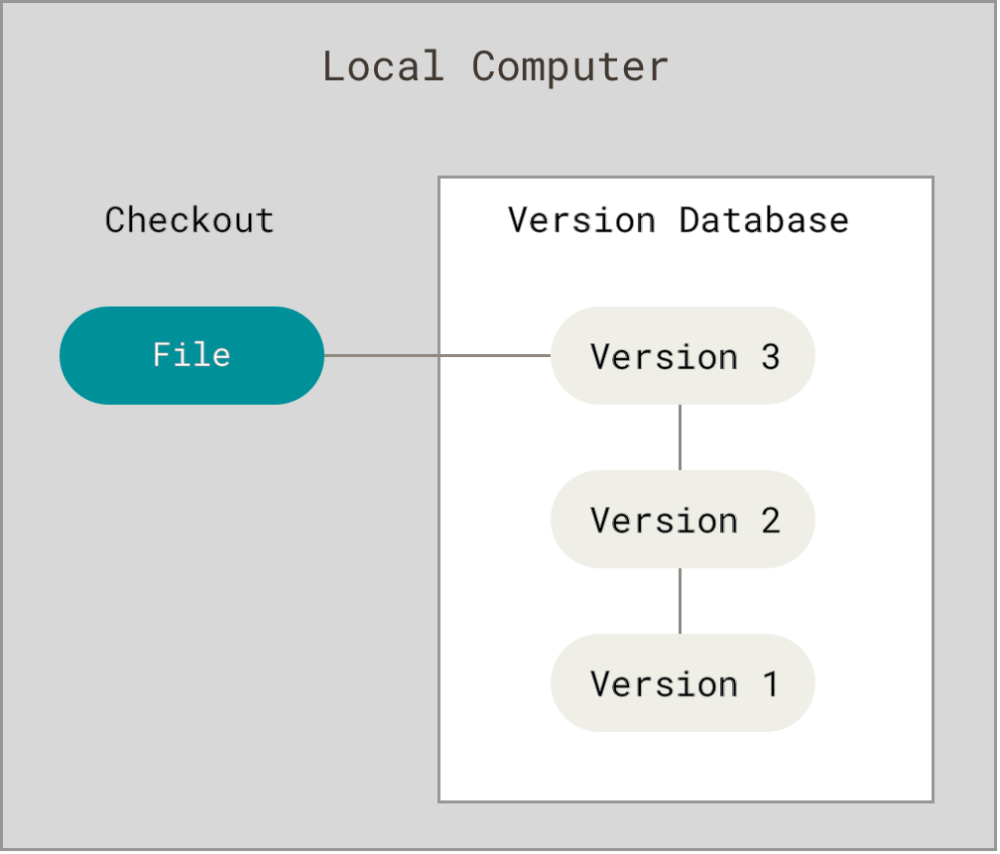
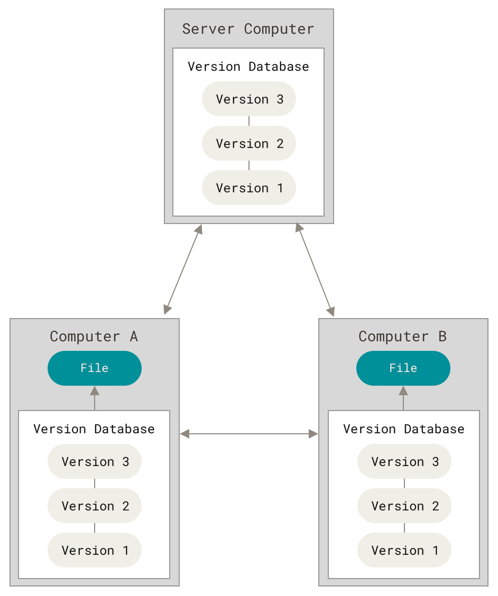
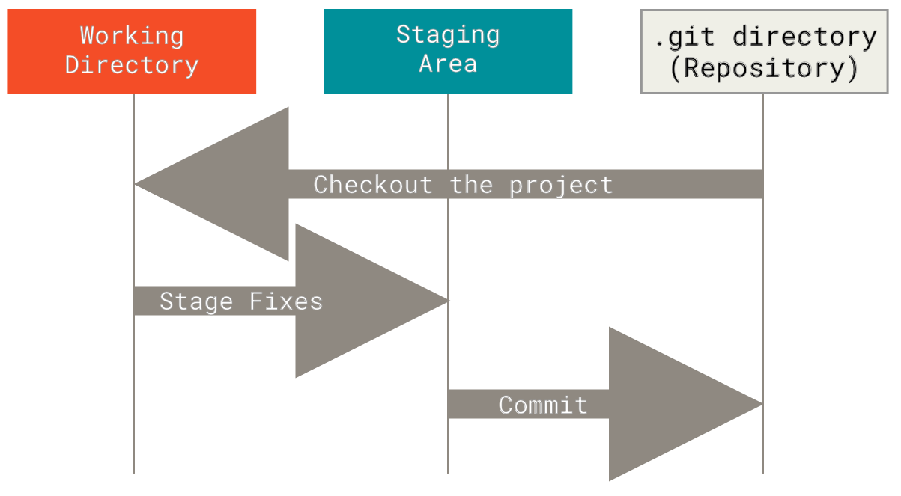
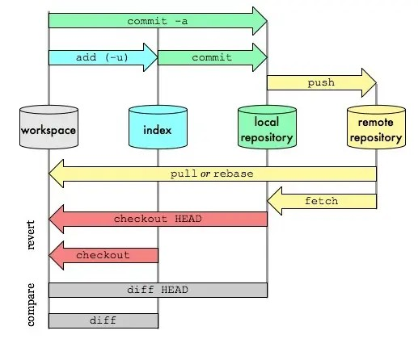
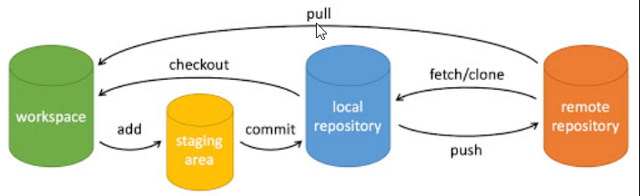
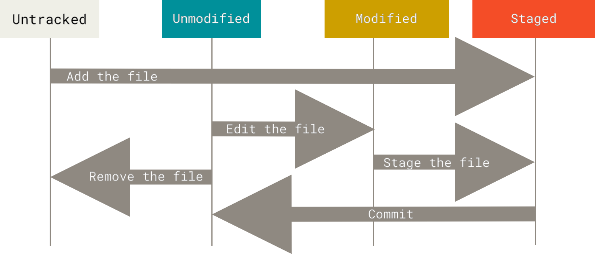

## git学习

### 版本控制

版本控制（Revision control）是一种在开发的过程中用于管理我们对文件、目录或工程等内容的修改历史，方便查看更改历史记录，备份以便恢复以前的版本的软件工程技术。

- 实现跨区域多人协同开发
- 追踪和记载一个或者多个文件的历史记录
- 组织和保护你的源代码和文档
- 统计工作量
- 并行开发、提高开发效率
- 跟踪记录整个软件的开发过程
- 减轻开发人员的负担，节省时间，同时降低人为错误

> 简单说就是用于管理多人协同开发项目的技术。

#### 常见的版本控制工具

主流的版本控制器有如下这些：
- **Git**
- **SVN**（Subversion）
- CVS（Concurrent Versions System）
- VSS（Micorosoft Visual SourceSafe）
- TFS（Team Foundation Server）
- Visual Studio Online

#### 版本控制分类

1. **本地版本控制**
记录文件每次的更新，可以对每个版本做一个快照，或是记录补丁文件，适合个人用，如RCS。


2. **集中版本控制  SVN**
所有的版本数据都保存在服务器上，协同开发者从服务器上同步更新或上传自己的修改。

> 所有的版本数据都存在服务器上，用户的本地只有自己以前所同步的版本，如果不连网的话，用户就看不到历史版本，也无法切换版本验证问题，或在不同分支工作。而且，所有数据都保存在单一的服务器上，有很大的风险这个服务器会损坏，这样就会丢失所有的数据，当然可以定期备份。

3. **分布式版本控制 Git**
所有版本信息仓库全部同步到本地的每个用户，这样就可以在本地查看所有版本历史，可以**离线在本地提交**，只需在**连网时push到相应的服务器或其他用户**那里。由于每个用户那里保存的都是所有的版本数据，只要有一个用户的设备没有问题就可以恢复所有的数据，但这增加了本地存储空间的占用。



> 每个人都拥有全部的代码！安全隐患！

> 不会因为服务器损坏或者网络问题，造成不能工作的情况！

#### Git与SVN的主要区别

**SVN是集中式版本控制系统**，版本库是集中放在中央服务器的，而工作的时候，用的都是自己的电脑，所以首先要从中央服务器得到最新的版本，然后工作，完成工作后，需要把自己做完的活推送到中央服务器。集中式版本控制系统是必须联网才能工作，对网络带宽要求较高。

**Git是分布式版本控制系统**，没有中央服务器，每个人的电脑就是一个完整的版本库，工作的时候不需要联网了，因为版本都在自己电脑上。协同的方法是这样的：比如说自己在电脑上改了文件A，其他人也在电脑上改了文件A，这时，你们两之间只需把各自的修改推送给对方，就可以互相看到对方的修改了。Git可以直接看到更新了哪些代码和文件！

#### Git相关的配置文件

1. `Git\etc\gitconfig` ：Git 安装目录下的 `gitconfig --system` 系统级

2. `C:\Users\Administrator\ .gitconfig` ：只适用于当前登录用户的配置 `--global` 全局

> 这里可以直接编辑配置文件，通过命令设置后会响应到这里。

**设置用户名与邮箱（用户标识，必要）**
当你安装Git后首先要做的事情是设置你的用户名称和e-mail地址。

```bash
git config --global user.name "zhangsan"  #名称
git config --global user.email 123456789@qq.com   #邮箱
```

> 这是非常重要的，因为每次Git提交都会使用该信息。它被永远的嵌入到了你的提交中

只需要做一次这个设置，如果你传递了`--global` 选项，因为Git将总是会使用该信息来处理你在系统中所做的一切操作。如果你希望在一个特定的项目中使用不同的名称或e-mail地址，你可以在该项目中运行该命令而不要`--global`选项。
> 总之`--global`为全局配置，不加该条件则为某个项目的特定配置。

### Git基本理论

Git本地有三个工作区域：**工作目录（Working Directory）**、**暂存区(Stage/Index)**、**资源库(Repository或Git Directory)**。如果在加上远程的 **git仓库（Remote Directory）** 就可以分为四个工作区域。



- **Workspace**：工作区，就是你平时存放项目代码的地方
- **Index / Stage**：暂存区，用于临时存放你的改动，事实上它只是一个文件，保存即将提交到文件列表信息
- **Repository**：仓库区（或本地仓库），就是安全存放数据的位置，这里面有你提交到所有版本的数据。其中HEAD指向最新放入仓库的版本
- **Remote**：远程仓库，托管代码的服务器，可以简单的认为是你项目组中的一台电脑用于远程数据交换

本地的三个区域确切的说应该是git仓库中HEAD指向的版本：

- **Directory**：使用Git管理的一个目录，也就是一个仓库，包含我们的工作空间和Git的管理空间。
- **WorkSpace**：需要通过Git进行版本控制的目录和文件，这些目录和文件组成了工作空间。
- **.git**：存放Git管理信息的目录，初始化仓库的时候自动创建。
- **Index/Stage**：暂存区，或者叫待提交更新区，在提交进入repo之前，我们可以把所有的更新放在暂存区。
- **Local Repo**：本地仓库，一个存放在本地的版本库；HEAD会只是当前的开发分支（branch）。
- **Stash**：隐藏，是一个工作状态保存栈，用于保存/恢复WorkSpace中的临时状态。

#### 工作流程

git的工作流程一般是这样的：

1. 在工作目录中添加、修改文件；
2. 将需要进行版本管理的文件放入暂存区域；
3. 将暂存区域的文件提交到git仓库。

> 因此，git管理的文件有三种状态：**已修改（modified）**,**已暂存（staged）**,**已提交(committed)**



#### Git项目搭建

> **创建工作目录与常用指令**

**工作目录（WorkSpace）** 一般就是你希望Git帮助你管理的文件夹，可以是你项目的目录，也可以是一个空目录，建议不要有中文。


> **本地仓库搭建**

创建本地仓库的方法有两种：一种是*创建全新的仓库*，另一种是*克隆远程仓库*。

**创建全新的仓库**

1. 创建全新的仓库，需要用GIT管理的项目的根目录执行：

```bash
# 在当前目录新建一个Git代码库
$ git init
```

2. 执行后可以看到，仅仅在项目目录多出了一个.git目录，关于版本等的所有信息都在这个目录里面。

**克隆远程仓库**

1. 另一种方式克隆远程目录，是将远程服务器上的仓库完全镜像一份至本地！

```bash
# 克隆一个项目和它的整个代码历史(版本信息)
$ git clone [url]  # https://gitee.com/kuangstudy/openclass.git
```

2. 去 gitee 或者 github 上克隆一个搜索并输入上述指令即可克隆。

#### Git文件操作
>
> 文件的四种状态

版本控制就是对文件的版本控制，要对文件进行修改、提交等操作，首先要知道文件当前在什么状态，不然可能会提交了现在还不想提交的文件，或者要提交的文件没提交上。



- **Untracked**: 未跟踪, 此文件在文件夹中, 但并没有加入到git库, 不参与版本控制. 通过`git add` 状态变为Staged.
- **Unmodify**: 文件已经入库, 未修改, 即版本库中的文件快照内容与文件夹中完全一致. 这种类型的文件有两种去处, 如果它被修改, 而变为Modified. 如果使用 `git rm` 移出版本库, 则成为Untracked文件
- **Modified**: 文件已修改, 仅仅是修改, 并没有进行其他的操作. 这个文件也有两个去处, 通过git add可进入暂存staged状态, 使用 `git checkout` 则丢弃修改过, 返回到unmodify状态, 这个git checkout即从库中取出文件, 覆盖当前修改 !
- **Staged**: 暂存状态. 执行`git commit`则将修改同步到库中, 这时库中的文件和本地文件又变为一致, 文件为Unmodify状态. 执行`git reset HEAD filename`取消暂存, 文件状态为Modified

> 查看文件状态

上面说文件有4种状态，通过如下命令可以查看到文件的状态：

```bash
#查看指定文件状态
git status [filename]

#查看所有文件状态
git status

# git add .                  添加所有文件到暂存区
# git commit -m "消息内容"    提交暂存区中的内容到本地仓库 -m 提交信息
```

> 忽略文件

有些时候我们不想把某些文件纳入版本控制中，比如数据库文件，临时文件，设计文件等。

在主目录下建立`.gitignore`文件，此文件有如下规则：

1. 忽略文件中的空行或以井号（#）开始的行将会被忽略。
2. 可以使用Linux通配符。例如：星号（*）代表任意多个字符，问号（？）代表一个字符，方括号（[abc]）代表可选字符范围，大括号（{string1,string2,...}）代表可选的字符串等。
3. 如果名称的最前面有一个感叹号（!），表示例外规则，将不被忽略。
4. 如果名称的最前面是一个路径分隔符（/），表示要忽略的文件在此目录下，而子目录中的文件不忽略。
5. 如果名称的最后面是一个路径分隔符（/），表示要忽略的是此目录下该名称的子目录，而非文件（默认文件或目录都忽略）。

```
#为注释
*.txt        #忽略所有 .txt结尾的文件,这样的话上传就不会被选中！
!lib.txt     #但lib.txt除外
/temp        #仅忽略项目根目录下的TODO文件,不包括其它目录temp
build/       #忽略build/目录下的所有文件
doc/*.txt    #会忽略 doc/notes.txt 但不包括 doc/server/arch.txt
```

### git常见命令
>
> 初始化

```bash
git init //创建
git clone /path/to/repository //检出
git config --global user.email "you@example.com" //配置email
git config --global user.name "Name" //配置用户名
```

> 操作

```bash
git add <file> // 文件添加，A → B
git add . // 所有文件添加，A → B
git commit -m "代码提交信息" //文件提交，B → C
git commit --amend //与上次commit合并, *B → C
git push origin master //推送至master分支, C → D
git pull //更新本地仓库至最新改动， D → A
git fetch //抓取远程仓库更新， D → C
git log //查看提交记录
git status //查看修改状态
git diff//查看详细修改内容
git show//显示某次提交的内容
```

> 撤销操作

```bash
git reset <file>//某个文件索引会回滚到最后一次提交， C → B
git reset//索引会回滚到最后一次提交， C → B
git reset --hard // 索引会回滚到最后一次提交， C → B → A
git checkout // 从index复制到workspace， B → A
git checkout -- files // 文件从index复制到workspace， B → A
git checkout HEAD -- files // 文件从local repository复制到workspace， C → A
```

> 分支相关

```bash
git checkout -b branch_name //创建名叫“branch_name”的分支，并切换过去
git checkout master //切换回主分支
git branch -d branch_name // 删除名叫“branch_name”的分支
git push origin branch_name //推送分支到远端仓库
git merge branch_name // 合并分支branch_name到当前分支(如master)
git rebase //衍合，线性化的自动， D → A
```

> 冲突处理

```bash
git diff //对比workspace与index
git diff HEAD //对于workspace与最后一次commit
git diff <source_branch> <target_branch> //对比差异
git add <filename> //修改完冲突，需要add以标记合并成功
```

```java


> 其他

```bash
gitk //开灯图形化git
git config color.ui true //彩色的 git 输出
git config format.pretty oneline //显示历史记录时，每个提交的信息只显示一行
git add -i //交互式添加文件到暂存区
```